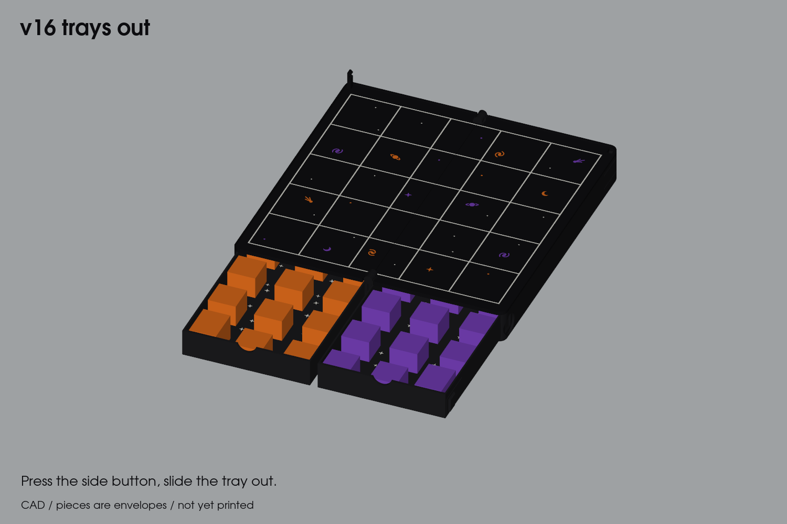

# Tak box

A 3D-printed travel case for a 5 × 5 game of Tak, with interchangeable themed piece sets for custom gifts. The original pieces are Team Cat / Team Witch. Printed in PLA on an Elegoo Centauri Carbon 2.

## V25 filament-hinge trial

The user selected ordinary 1.75 mm filament axles and rounded underside board clearance after reporting loose V24 joints and printed-pin failures. Open [the V25 coupon guide](v25/START-HERE.md) for three bore fits, two curved board-edge samples and three broad lip trials. This is a separate local test, not a complete case or a drop-in replacement. V24 stays intact; physical firmness and loaded retention remain unverified.

## Current print kit: V24

[Download V24](v24/V24-PRINT-KIT.zip) and read [START-HERE](v24/START-HERE.md). Following the reported V23 hinge-support break, this revision uses broader full-height supports and two removable loaded player trays. The full 180 mm field remains; closed size is **102.5×200×35 mm**, adding 1.5 mm at the larger hinge barrels and 2.4 mm thickness for independent tray floors. Open **v24/FULL-PRINT** for the four sliced projects; **02-FULL-SIZE-FOUR-COLOUR-inlaid-boards-CC2-PLA.3mf** is the full board pair. Small tests are together in **v24/SMALL-TRIALS**. Four CC2 PLA plates include the **four-colour inlaid boards** (black, white and two silk accents), about **17 h 1 min / 327 g** with placeholder silk profiles; select actual silk profiles and reslice before printing. Separate hinge, tray-access and colour trials are included; physical durability and fit remain pending.

Replace both bases, both boards and the hook; add both trays. Existing original flats, supplied flat capstones and hook collar retain their geometry. The accepted celestial artwork is now adapted to V24 corner geometry and included in its default board project and assembled previews. See [the V24 checkpoint](docs/V24_CHECKPOINT.md).

V24 retains the previously delivered V23 R2 mechanics; this surface integration changes its board material geometry and slicing. The [V23 R2 kit](v23-r2/release/tak-v23-r2-print-kit.zip) remains preserved.

## Preserved V23 baseline

[Download the V23 print kit](v23/release/tak-v23-print-kit.zip), then open **v23/START-HERE.md**. Three CC2 PLA projects are together in **v23/PRINT**, with eight parts estimated at **11 h 38 min / 272 g**.

V23 is the accepted seamless-exterior design: centered recessed hook/catch/pivot, recessed board finger wells and rounded integrated hinge ends. It is a version-identity correction of the already checked design; geometry, printer settings and print behavior are unchanged. Closed envelope: **101×200×32.6 mm**, with the full 180 mm field, original 42 flats and solid 8 mm Cat/Witch capstones beneath sliding boards. Main hinges print captive; only the hook uses a filament pivot.

Replace both bases, both boards, hook and collar relative to original V22; flat capstones are unchanged. Prior CAD/motion/slice results are reused with equivalence evidence and a fresh package audit. Physical comfort, snag resistance, release, fit and loaded transport remain untested. The kit includes separate 26-minute hinge and 53-minute closure trials. See the [guide](v23/START-HERE.md) and [checkpoint](docs/V23_CHECKPOINT.md).

[Original V22](v22/START-HERE.md) is restored to the 111.8×220.2×32.6 mm corner-hook design; its [ZIP](v22/release/tak-v22-print-kit.zip) is unchanged. The previously V22-labelled seamless delivery is [archived](v22/release/archive/README.md). [V21](v21/START-HERE.md), [V20](v20/START-HERE.md), [V19](v19/START-HERE.md) and [V18](v18-case/README.md) remain historical and intact.

## Historical v17 architecture study: [four leaves on one common hinge](v17-four-leaf)

Two drawer housings and two board leaves share one hinge axis. Covered
sliding drawers keep flats enclosed while the leaves rotate. Board leaves
snap implementation was completed in v18; the [two-piece squeeze buckle](v17-squeeze-latch)
is historical. The 180 mm field and 36 mm pitch remain.

This is a CAD motion study, **not a full-print release**. Paired folding,
independent board rotation, original-flat envelopes, solids and exported
meshes pass the recorded sampled checks. Board snaps, drawer releases,
rear capstone hatch and case-closure integration remain unfinished. The
previous four-part draw-latch trial was rejected as confusing.
The main body is provisionally 101×236×32.6 mm, excluding closure hardware;
it is thinner but longer than v16. No final size saving is claimed yet.

The [screw-clamped draft](v17-compact-folio) was rejected and is history only.
The later pin/sleeve idea was also rejected; it is not the selected closure.

## Previous travel prototype: [v16 field book](v16-field-book)

The separate [full-size pagoda foundation](full-size-pagoda-v1/README.md) uses
25 × 25 × 10 mm weighted flats, scaled existing Fox/Cat capstones and a lift-out
5×5 board above two stacked trays. It is the new premium printed exploration;
v16 remains the travel prototype. Digital geometry and local slicing pass;
physical fit and transport retention remain untested.

The board folds in half with its face inside, and there's a snap-in piece tray under each half.
- **Closing:** a buckle at the far edge. Squeeze the side of the case to open it.
- **Board:** 5 × 5 at 36 mm cells, black with an inlaid white grid and subtle star, galaxy, planet, moon and comet inlays. A raised lip protects paint.
- **Assembly:** the board plates drop onto locating pegs and glue into shallow wells, so they line up without a jig.
- **Size:** 101 × 202 × 51 mm closed.

It has four multi-colour print plates. The user reports physical piece-retention
and closure failures; the exact printed component revisions are unknown.
See the [v16 README](v16-field-book/README.md) for retained plates and source;
its blanket unprinted statement is historical and superseded by those reports.

## Pieces: [pieces](pieces)

Piece designs live in separate packages so custom sets can share the box. Check each package's dimensions and tray compatibility before printing; the packages currently use different stone sizes.

The Cat and Witch flats and capstones, with CAD source, STLs and one CC2 print plate per team in [pieces/plates](pieces/plates).

The [weighted stone prototype](pieces/weighted-v1/README.md) adds 20 × 20 × 6 mm two-part stones for post-print ballast and epoxied floors, with a three-clearance fit coupon and one complete geometry plate per team. Physical fit and feel remain untested.

The [fox knurled flats](pieces/fox-knurled-v1/README.md) add 21 fox-themed 19.5 × 19.5 × 8 mm stones with recessed face emblems and diamond-textured sides. Sample and full-set CC2 plates are included. Geometry fits the current tray insert; physical fit and grip await a sample print.

The [reference-based Fox and Cat capstones](pieces/fox-cat-capstones-v4/README.md) follow a continuous carved nose-to-tail curl. This package contains the fuller Fox tail and the Cat's corrected neck/shoulder, printable STLs, a labeled two-object 3MF, retained reconstruction sources and large labeled previews. Digital v16 compatibility and dry slicing pass; physical fit and tactile acceptance remain untested.

## Archive

- [archive/v15-field-book](archive/v15-field-book): 28 mm cells. Too small to play on: you couldn't grab a stack once the board filled up.
- [archive/v14-field-book](archive/v14-field-book): the first field book, with 24 mm cells. A paper play test showed it was too cramped.
- [archive/v13-book](archive/v13-book): the first two-leaf book, with the M3 clasp.
- [archive/v5-v7](archive/v5-v7): the earlier open-wells, pin-board, hinge-coupon and center-closure designs, with their scripts, coupons and plates. Its [README](archive/v5-v7/README.md) describes v5.

Versions v11 (smooth case) and v12 (chest) live on their own branches: `feat/tak-v11-smooth-case` and `feat/tak-v12-chest`.
