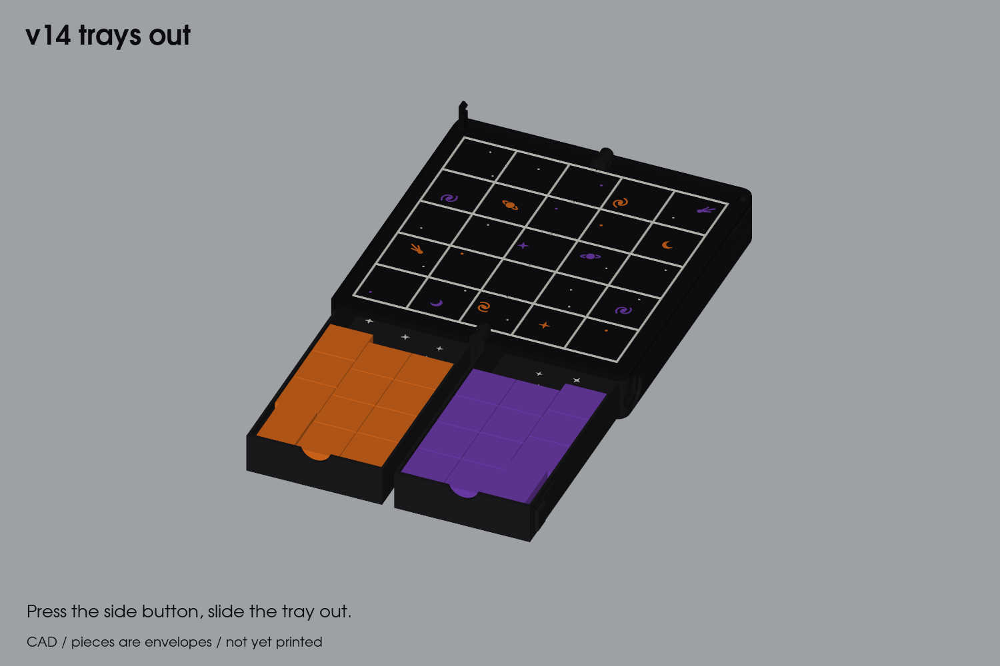

# Tak box

A 3D-printed travel case for a 5 × 5 game of Tak, plus the Team Cat / Team Witch pieces. Printed in PLA on an Elegoo Centauri Carbon 2.

## Current design: [v14 field book](v14-field-book)

The board folds in half with its face inside, and there's a snap-in piece tray under each half.
- **Closing:** a buckle at the far edge. Squeeze the side of the case to open it.
- **Board:** black with a raised white grid and subtle star, galaxy, planet, moon and comet inlays. A raised lip protects paint.
- **Size:** 71 × 142 × 48 mm closed.

It has four multi-colour print plates and has not been printed yet. See the [v14 README](v14-field-book/README.md) for plates, assembly and checks.

## Pieces: [pieces](pieces)

The Cat and Witch flats and capstones, with CAD source, STLs and one CC2 print plate per team in [pieces/plates](pieces/plates).

## Archive

- [archive/v13-book](archive/v13-book): the first two-leaf book, with the M3 clasp.
- [archive/v5-v7](archive/v5-v7): the earlier open-wells, pin-board, hinge-coupon and center-closure designs, with their scripts, coupons and plates. Its [README](archive/v5-v7/README.md) describes v5.

Versions v11 (smooth case) and v12 (chest) live on their own branches: `feat/tak-v11-smooth-case` and `feat/tak-v12-chest`.
