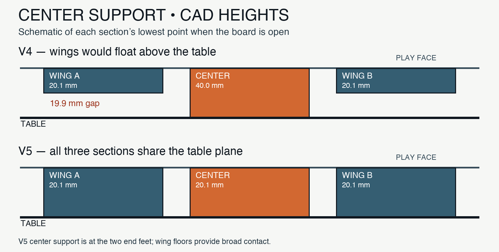
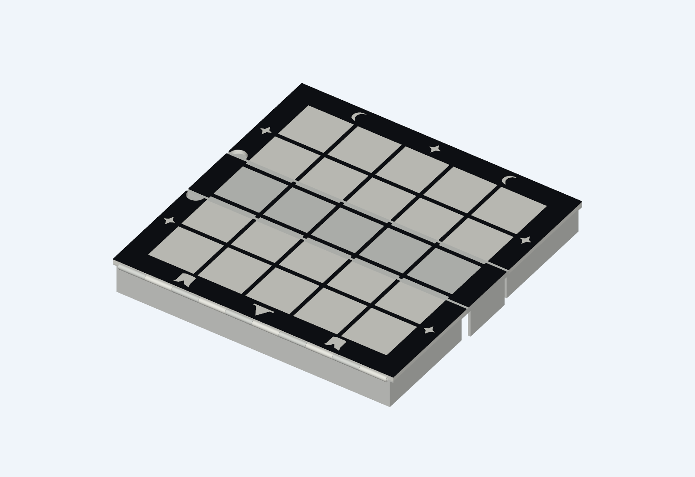
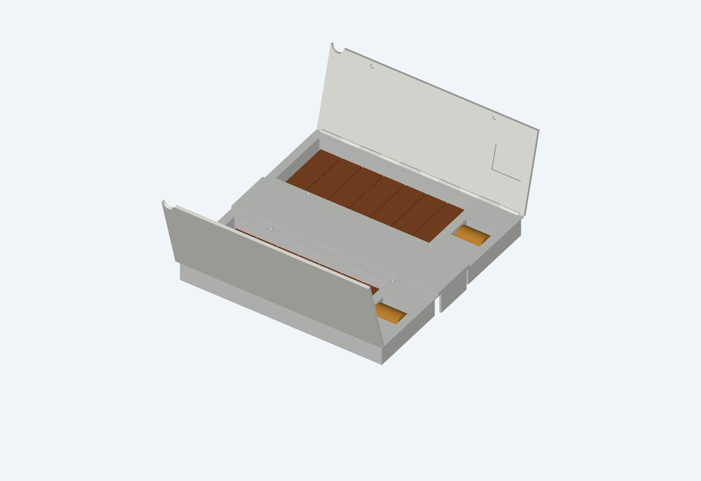

# Tak board with lift-up storage lids — CAD prototype

**Filament-pin center shell correction (2026-09-26):** The center now fills the
4 mm closed roof gap with a 3.6 mm underside skin, leaving 0.4 mm clearance.
Wider end skirts use hinge-concentric round relief. Wings, lids, playing face,
hinge centers and validated 1.90 / 2.20 / 1.70 mm holes are unchanged. Start with
the [30 mm closure coupon and revised center](center-closure-coupon/README.md).
The older `pin-board/center-row.stl` and plate `80` below remain historical
exports; use `center-closure-coupon/center-row-revised.stl` for this correction.
Digital checks pass; physical fit is pending.

**v5 level-base correction:** The former center end walls reached 40 mm below the playing face while the storage wings reached 20.1 mm. The center walls now reach 20.1 mm too, so all three structural sections contact the same plane when open. The printed v4 center row must not be combined with this set.

The 205 × 205 mm board still folds in a 2 + 1 + 2 row arrangement. Its two outer playing panels lift on pinned hinges. Each panel covers one broad, open well for 21 loose flat stones and a separate sideways recess for one rook-shaped keystone. A thumb notch in the border opens each lid; inset magnets hold it shut. The pieces can be scooped out from above, rather than fed through a channel.

The white playing face has a black 5 × 5 grid and the existing cat, witch-hat, moon, and star border. The main folding seams and the two lift-up lids interrupt a few millimetres of black line; the CAD image shows those gaps. This is a mechanical prototype, not a finished decorative surface.

## Files

- `tak_case.py`: editable CadQuery model. `tak_box_base.py` is a local copy of the established dimensions and decoration it imports; no earlier output folder is needed.
- `export_validate.py`: collision, piece-envelope, and solid checks; STEP and STL export.
- `export_fit_coupon.py`, `export_3mf.py`, and `validate_3mf.py`: fit sample and printer projects.
- `render_cad.py`: renders the two CAD views above.
- `tak-open-wells-v5-play.step`: 5 × 5 board with lids closed.
- `tak-open-wells-v5-access.step`: lids lifted, all 42 flats and both keystones shown.
- `tak-open-wells-v5-closed.step`: folded case.
- `*-print.stl`: individual printable shells, lids, grid accents, and hinge pins.
- `validation.json`: measured digital checks.
- `centauri-carbon-2-3mf/`: five separate 3MF projects and `package-validation.json`.

## Measured CAD layout

- Open playing face: 205 × 205 mm.
- Open underside resting plane: Z = −20.1 mm for the center and both wings. The center has two end feet; the broad wing floors also contact the table.
- Folded shell envelope before decorative overlay: approximately 205 × 49 × 88 mm.
- Two flat-stone wells: 152 × 64 × 19.1 mm inner space each.
- Two keystone recesses: 29 × 24 × 21.2 mm inner space each.
- Inventory modeled: 21 flats of 20 × 20 × 8 mm and one keystone of Ø19.8 × 25.4 mm per side.
- The hinge sweeps checked clear from 0–90° for the main fold and 0–110° for each playing lid, sampled every 5°.

## Print order and assembly

1. Open `centauri-carbon-2-3mf/tak-open-wells-v5-cc2-00-fit-coupon.3mf` in ElegooSlicer. It contains a real 45 mm wide section of the well end, playing lid, and lid hinge pin. Print this **first** in white PETG. Fit the actual keystone, seat a Ø4 × 2 mm magnet in each half, and check the hinge and magnetic lid closure by hand.
2. If that fit works, print the three white structural projects `01`, `02`, `03`, then the black raised-grid project `04`. Each file is a separate plate. The black overlays are separate printed parts that attach to the white playing face after the hinges move freely.
3. Install two main folding pins and two lid pins. Install **eight opposite-polarity magnet pairs** (16 Ø4 × 2 mm magnets total): four pairs retain the folded case and two pairs hold each playing lid down. Test polarity before bonding.
4. Load 21 flats and one keystone in each side, close both lids, fold the case, and test normal carrying over a soft surface before trusting it with the full set.

The 3MF files use the locally saved **Elegoo Centauri Carbon 2, 0.4 mm nozzle** profile, 0.20 mm layers, PETG, and a textured PEI plate. Verify that ElegooSlicer shows the correct printer, loaded PETG, and plate on your machine before printing. Three white plates use 35% gyroid infill and four walls for the structural parts; the small-parts plate uses three walls. The black grid is a separate black PETG print.

The exports have passed CAD solid and collision checks, including the level resting plane. All five packaged 3MFs reopen as manifold objects; their actual transformed meshes sit within the 256 × 256 mm plate. The identical v4 coupon geometry sliced in the ElegooSlicer UI with the expected CC2/PETG/textured-PEI settings; the slicer warned of overhangs on the well-end shell. The v5 coupon and four full-size plates have **not** had their toolpaths verified. Inspect each preview before printing. This revision has not been physically printed. Level resting, center stiffness, lid grip, magnet retention, hinge endurance, actual keystone fit, and the loose-stone carrying test remain physical checks. The existing v3 and v4 3MFs belong to earlier geometry and must not be mixed into this revision.

## Team Cat / Team Witch pieces

Each team has 21 flat stones (20 × 20 × 8 mm, emblem recessed 0.6 mm on both faces) and one **pawn capstone**: a revolved chess-pawn silhouette (foot, waist, collar, head) that fits the Ø19.8 × 25.4 mm keystone envelope in any roll. The cat pawn has a round head with two conical ears and an engraved sleepy face; the witch pawn's waist flares into a 45° brim under a tall crown with a bent tip, with an engraved band and star.

- `tak_pieces.py`: CadQuery model (`flat`, `cat_capstone`, `witch_capstone`; the old slab capstones remain as `*_slab`). `export_pieces.py` writes `pieces/*.stl`, `pieces/*.step` and the print plates; `render_pieces.py` writes the previews.
- `export_pieces_3mf.py`: builds `centauri-carbon-2-3mf/tak-pieces-cc2-10-cat-orange.3mf` and `...-11-witch-purple.3mf`, 21 flats plus the pawn each, one object per piece. Profiles are in `profiles/` (orange and purple PETG; `process-pieces.json`: 0.20 mm, 4 walls, **100% infill** so the pieces are solid and weigh about 4 g each, no supports). `validate_3mf.py` covers them too.
- Sliced in ElegooSlicer (CC2, 0.4 mm, PETG, textured PEI): about 80 g and 3 h per plate, no supports. The pawn bodies stay at or above 45° from the bed; only the 0.5 mm engraving roofs bridge. Not yet physically printed: check the ear and hat-tip detail and the pawn's fit in the keystone recess.
- `meshy_output/` holds the Meshy reference variants used for the pawn look (not needed to build anything).

## Hinge alternatives (test strips)

The v5 hinge bores are walled shut at both ends of every hinge (nothing is open from x = 0–4.75 mm or x = 200.75–205 mm), so a filament pin cannot be fed in. `tak_hinges.py` models two pin-free replacements as 59 mm strips with three Ø6 knuckles, printed flat with the axis horizontal and no supports:

- **PIP (print-in-place):** each A knuckle grows a Ø3 pin with a 45° tip that sits in a conical socket in the neighbouring B knuckle (0.4 mm clearance). `hinge-coupons/pip-hinge-strip.stl` prints already hinged.
- **Snap:** the A knuckles carry two Ø3 stub axles; B is a C-clip barrel (Ø3.4 bore, 2.5 mm mouth, lead-in flare, cut into three flexing fingers). `snap-hinge-a-stubs.stl` and `snap-hinge-b-clip.stl` print separately. Press B straight down onto the stubs, mouth toward the bed; it clicks on.

`export_hinge_coupons.py` writes the STL/STEP files and `centauri-carbon-2-3mf/tak-hinge-coupons-cc2-20.3mf` (all three parts, one plate, about 45 min, 25 g). Digital checks: valid solids, zero A/B overlap folded 0–110° in 10° steps, manifold 3MF, and a clean ElegooSlicer slice. Nothing here has been printed; clearances and snap force are the things to feel out. The Ø6 barrels are larger than the v5 case's Ø4, so moving the full case to either hinge is a separate step.

**Hinge tuning coupon:** `export_hinge_tuning.py` writes `centauri-carbon-2-3mf/tak-hinge-tuning-coupon-cc2-21.3mf`, one plate (about 1 h 36 m, 46 g, no supports) with three variants of each hinge in three columns: snap stubs, snap clip, and PIP strip. Dimples on the plate top identify the variant: 1 dimple = PIP clearance 0.3 mm / snap mouth 2.3 mm, 2 = 0.4 / 2.5, 3 = 0.5 / 2.7. STLs are in `hinge-coupons/tuning/`.

## Pin-free case hinges (real-geometry coupon)

`tak_case_pip.py` rebuilds the v5 shells with pin-free hinges (v5's own bores are walled shut at both ends): the two main folds become **print-in-place cone-pin hinges** (Ø5 barrels, Ø2 pins, 0.4 mm clearance, 10 knuckles of 19.0 mm with 0.4 mm gaps) and each lid gets a **snap-on hinge** (Ø6 barrels, Ø3 stub axles on the wing, C-clip barrels on the lid, 2.5 mm mouth, three flexing fingers). Otherwise the geometry is `tak_case.py`'s.

Digital checks on the full parts: valid solids; zero overlap of each wing against the center row for folds 0–90° (10° steps); zero overlap of each lid against its wing for 0–110°.

`export_case_hinge_coupons.py` crops a 58 mm slice (knuckles 2–4) and writes `centauri-carbon-2-3mf/tak-case-hinge-coupon-cc2-30.3mf` (one plate, about 2 h 40 m, 59 g, auto tree supports):

- **Frame slice:** center row plus both wing edges with the print-in-place seams, printed **face down**. The wells become bridged roofs, so the slicer fills them with supports; they are reachable through the open well because the lid is a separate part. The play face lands on the textured PEI.
- **Lid slice:** wing edge with stubs (printed face up) and the matching lid (face down). Press the lid straight down onto the stubs, C-clip mouth toward the wing.

Why not one closed print? With lids in place each well is a sealed cavity with a 152 × 64 mm roof, so its supports would be trapped. Not yet physically printed. The Ø5 barrels are 1 mm larger than v5's Ø4, so the folded-case envelope has not been re-verified.

## Flat print halves, print-in-place everywhere

The v5 case in `tak_case_pip.py` now prints as **two flat halves** that come off the bed already hinged (`export_halves.py`, output in `halves/` and `centauri-carbon-2-3mf/tak-case-half-A-cc2-40.3mf`, `...-half-B-cc2-41.3mf`):

- **Half A:** lid 0 (opened 180°, lying flat) + wing 0 + front half of the center row. **Half B:** back half of the center row + wing 2 + lid 2 (opened 180°).
- Both print **face down** (play face on the textured PEI), about 205 × 186 × 24 mm, roughly **203 g and 7 h 15 m each**, slicer profile `profiles/process-halves.json` (0.20 mm, 4 walls, 35% gyroid, *normal* auto supports with `bridge_no_support` on).
- Lid hinge and the main seams are print-in-place cone-pin hinges (lid: Ø6 barrel, Ø3 pin, as tested on the strips; seam: Ø5 barrel, Ø2 pin, 0.4 mm clearance). A lid can only be printed open at 180°; that leaves it 3 mm above the bed, so it gets a thin sheet of support.
- The center row is split on its centerline (y = 102.5) so each half carries its own hinge counterpart. Join the halves with the three Ø2.4 alignment nipples and glue, pressed together face down on a flat surface so the play faces stay flush.
- **Wells:** the tile well is now three lanes (20.6 mm wide, one row of 7 flats each) split by 1.6 mm dividers and 10.7 mm deep (was one 19.2 mm-deep pocket, 101 cm³ vs 187 cm³). Each lane roof spans about 21 mm and bridges without support; the underside below the wells is an open pan. The keystone pocket has a semicircular bottom (Ø21.2) for the pawn, which prints as a self-supporting arch.
- Digital checks: all solids valid; wings against their own center half, folds 0–90°, zero overlap; lids 0–180°, zero overlap; center halves and nipples clear (0 mm³). Not yet printed.

**Center-joint coupon:** `export_joint_coupon.py` writes `centauri-carbon-2-3mf/tak-center-joint-coupon-cc2-50.3mf` (about 1 h 31 m, 42 g, same profile as the halves): piece A (wing 0 edge with a bridged lane, pan and print-in-place seam, plus the front center half with its nipple) and piece B (back center half with the hole, plus the wing 2 edge). Glue A to B at the center seam, play faces down on a flat surface, then fold both seams. The few support strips it shows are at the cropped lane ends only; the real halves close those lanes with end walls.

**Coupon adhesion (fix):** in the face-down pose only the center plate touches the bed; wing rims sit 3 mm above it and an opened lid floats, so wings and lids depend on their support. The first hinge coupon used tree supports (about 170 mm of thin lines on the first layer) and its wing slices were cropped through a lane divider, leaving a one-sided shelf that the slicer held up with a thin support wall. Both are fixed: the coupons now crop on the outer faces of full dividers (lane roofs are anchored on both sides and print as real bridges) and print on a 3-layer raft (`profiles/process-coupon-raft.json`, coupon only: it roughens the underside). The real halves keep the dense normal supports; if they need a firmer bond, options are a lip-and-rebate rim or printing one wing first as a test.

## Filament-pin hinges (direction change)

Print-in-place hinges are off the table, so the hinge pin is a length of **1.75 mm filament**, never printed: snug (friction) in one part's knuckles, free-turning in the other's, with a small press-in plug at each end. Consequences: the wings, lids and center row print as separate parts (no flat halves, no glued center split), and the v5 bores must be open at the ends with a lead-in (v5's were walled shut).

`export_pinfit_coupon.py` (`tak_pinfit.py`) writes `centauri-carbon-2-3mf/tak-filament-pin-fit-coupon-cc2-70.3mf`: two bore ladders (round and teardrop, Ø1.70 to 2.30 mm, small end = notched corner), three hinge strips with real 19 mm knuckles (1 dimple: fixed 1.80 / free 2.10, 2 dimples: 1.90 / 2.20, 3 dimples: 2.00 / 2.30) and four press-in plugs (filament hole 1.60 / 1.70 / 1.75 / 1.80). Push real filament through and report which bore is snug and which turns freely.

### Full board with filament pins

`tak_case_pin.py` is the v5 case rebuilt for 1.75 mm filament pins: separate center row, two wings and two lids. The center row holds the pin snugly on the main seams, and the wing holds it snugly on the lid hinges. Both board edges have a Ø4.4 feed channel, and the outer knuckles have a Ø3.2 × 1.5 counterbore for a press-in plug. The wells use the three-lane layout. The underside pan is dropped because the wings now print bottom down, with their wells open upward.

`export_pin_board.py` writes `pin-board/*.stl` and four plates in `centauri-carbon-2-3mf/` (profile `profiles/process-board-pin.json`: tree supports on the build plate only, so no support grows inside a bore):

- `tak-pin-board-cc2-80-white-center-row-plugs.3mf`: center row (face down) and 10 plugs. About 1 h 35 m, 38 g.
- `...-81-white-wing-a-lid-a.3mf` / `...-82-white-wing-b-lid-b.3mf`: wing bottom down and lid face down. About 8 h 27 m, 207 g each. Supports appear only under the hinge barrels that hang past the walls.
- `...-83-black-raised-grid.3mf`: v5 overlays, with the lid pieces notched clear of the wing's lid knuckles. About 38 m, 14 g.

Cut four pins of about 195 mm from filament. **Bores are confirmed by the printed pin-fit coupon:** strip 2 (fixed Ø1.90 / free Ø2.20) fit correctly, and the plates use those values. The Ø1.70 plug hole also grips best on the coupon. Digital checks: every part is a single valid solid, and each filament runs through all ten knuckles and both channels without touching anything. Zero overlap for lids opening 0–110° (including overlays), wings plus lids folding 0–90°, and both sides folded together. Sliced in the ElegooSlicer CLI; the full board is not yet printed.

## v6 design sketch: corners, lid lip, finger scoop, stone stop

`tak_case_v6.py` layers four small refinements onto v5's shell/lid geometry, digitally checked by `export_validate_v6.py` but not yet sliced or printed. The hinge mechanism itself is untouched (a separate thread, above).

- **Corner radius (3 mm):** the four true outer corners of the closed case (where a wing shell and its lid meet at the board's real edge) are rounded by subtracting a corner wedge, not by filleting the fused solid — robust regardless of how complex the boolean history is.
- **Lid registration lip:** a 1.2 mm ridge fused to each wing shell along both long (x = 0 / x = 205) edges, with a matching 0.7 mm groove cut into the lid's underside. Self-centers the lid and hides the seam line. Kept 1.5 mm clear of the center row's end feet (x < 2 mm / x > 203 mm) on purpose: that strip is where the folded wing has to pass, and an X-disjoint ridge can never collide with it at any fold angle since the fold rotates only in Y/Z.
- **Finger scoop:** a Ø4 mm rounded bite into the well wall next to each lid's thumb notch, so a fingertip can curl under the stone stack once the lid is off.
- **Stone stop:** a low 0.8 × 1.5 mm ridge on the well floor next to the main-hinge wall, corralling the stones away from that edge. Sized to fit inside the 1 mm margin before the first row of flats, so it can't touch a stone at rest.

**Reverted:** a center-row stiffening rib (the 205 mm center slab is only supported at its two extreme end feet, and visibly could sag). Any rib fused below the slab collides with the folded wings from 80-90 deg in the main fold sweep — that space is reserved for the wings' own thickness when the case closes, not just at the feet. A real fix would have to stiffen from the topside, under the removable black grid, which is out of scope for this pass.

Digital checks (`export_validate_v6.py`): valid single solids, the shell/lid clear each other and the lid's own open sweep (0-110 deg), the main fold sweep (0-90 deg) stays collision-free between all three sections and both lids, and all 42 flats plus both keystones stay clear of the new well features. All six pass. `tak-v6-sketch-access.step` is the exported check model. Rendering a preview PNG needs a GPU/display VTK doesn't have in a headless container; `render_v6.py` mirrors `render_cad.py` for use on a machine with one.
