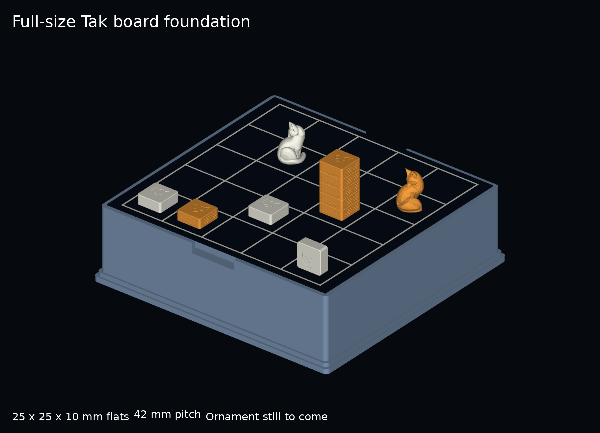
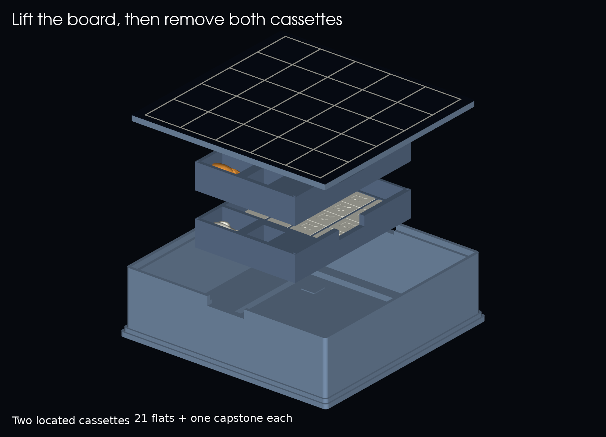
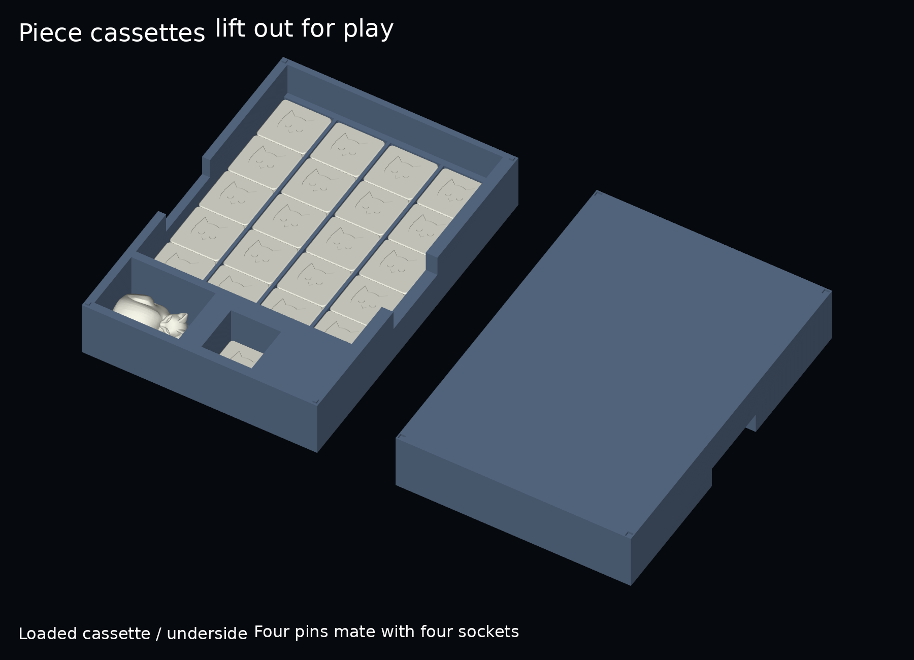
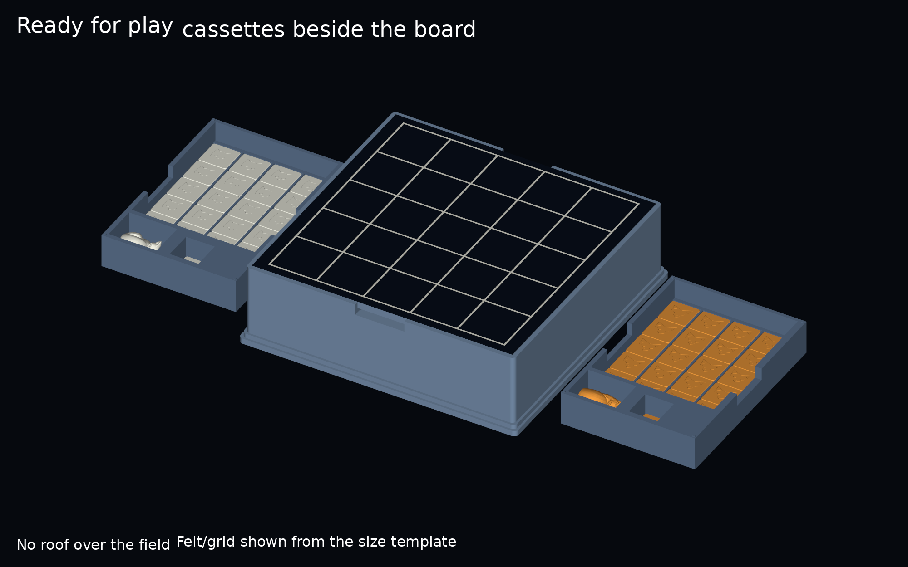

# Full-size Tak — pagoda foundation

An additive board-and-storage foundation for the exceptionally ornate printed
direction: **a clear 5×5 board above two removable, stacked piece cassettes**.
Existing v16 parts and all older piece packages are unchanged. This is the shape
to constrain future witch-and-cat, energy-vine and galactic ornament.



## Dimensions

| Component | Dimensions in mm | Status |
| --- | --- | --- |
| Cat, Fox and optional Witch flats | 25 × 25 × 10 finished envelope | Exact CAD envelope; body, closure and felt allowance included |
| Playing field | 210 × 210; 5×5 at 42 mm pitch | 17 mm between adjacent centered 25 mm flats |
| Lift-out board backing | 232 × 224 × 6 | 0.3 mm seat clearance per side; broad front/back grips |
| Each player cassette | 120 × 174 × 30 body; 31 including locating pins | 21 flats and one sideways capstone; print twice |
| Printed platform | 248 × 240 × 72 | Three low stepped terraces; removable board above storage |
| Felt playing surface | 1 mm allowance; top at 73 mm | Measure actual felt plus adhesive before assembly |
| Cat capstone | 21.785 × 25 × 33.809 | Uniformly scaled final Cat v4 sculpture |
| Fox capstone | 22.694 × 24.782 × 35 | Uniformly scaled final Fox v3 sculpture |

The capstones retain their carved looking-back curl and remain taller than
the square flat stones. Their proportions are preserved by uniform scaling;
their existing solid construction remains. Capstone ballast cavities are a
separate unresolved design step.

## Pieces and closure

The Cat/Witch emblems come from `pieces/tak_pieces.py`. The Fox emblem and side
knurl come from `pieces/fox-knurled-v1/source/flats.py`, scaled to the new size.
All three regular stones use the weighted package's two-part closure approach,
adapted to 25 mm width and 10 mm finished height. The Fox knurl remains recessed,
so it adds no width. The cavities accept post-print ballast. Select fill and
adhesive using handling samples; kinetic sand is the requested material.

The nominal stone has a 1 mm closure floor starting 0.7 mm above the base,
a 0.6 mm felt patch, and 0.1 mm adhesive allowance. The body rim and felt finish
at z=0; the top finishes at z=10. Minimum roof below the 0.5 mm emblem recess
is 1 mm. The floor locates with **0.2 mm clearance per side** and a 0.1 mm
shoulder adhesive gap. These are CAD allowances, not measured printed fits.

Print bodies broad top down and cavity up using `*-body-print.stl`; the
`*-body-assembly.stl` files are upright assembly references. Floors print flat,
locating tongue up. Do not print the felt or assembled STEP references as a
single fused object.

## Files and first sample

- [Closure coupon](plates/closure-coupon.3mf): three Cat bodies and three floors
  with 0.15, 0.20 and 0.25 mm side clearance, labeled in the 3MF object names.
  Keep each printed floor associated with its object label.
- [21 Cat bodies](plates/cat-flats-21.3mf) and [21 Fox bodies](plates/fox-flats-21.3mf).
- [21 floors](plates/floors-21.3mf): print two copies for the full Cat/Fox set.
- [Fox/Cat capstones](plates/fox-cat-capstones.3mf): two scaled existing sculptures.
- [Piece cassette](plates/tray.3mf): print two copies; the existing `tray` filename is retained.
- [Platform](plates/platform.3mf).
- [Felt backing](plates/board-felt-backing.3mf): flat support for the felt surface.
- [Grooved board option](plates/board-grooved-option.3mf): separate alternative,
  with 1.4 mm wide, 0.6 mm deep grid grooves; finish them in a contrasting colour.
- [Full-scale grid](models/felt-grid-100-percent.svg): 232 × 224 mm, for a
  print/stencil/transfer onto the felt. Print at 100% and measure the 42 mm pitch.

These tracked 3MFs contain **named millimetre geometry**, without embedded print
settings or G-code. Local sliced proof projects are in ignored `.slicer-work/`.
Individual STL and editable STEP files are in `models/`; sculptural capstones
remain mesh source, as in their original package.

Start with the closure coupon, two Fox bodies, one capstone pair and one tray.
Check the finished felt thickness, fill retention, grip, stacking, standing-wall
stability, capstone pocket fit and support cleanup. Check full five-stone carries
on the 42 mm printed paper grid before committing to the platform.

## Setup and reserved space



Lift the board using the two 44 mm front/back grip openings, remove the upper
then lower cassette, set them beside the platform and reseat the board for play.
Each cassette carries one player's 21 flats and capstone. **These are open
carriers in this revision**, covered by the upper cassette and board when
packed; they do not have separate lids.

The lower cassette rests on four 16 mm square supports within a low locating
frame. The frame leaves 0.4 mm clearance per side. The upper cassette rests
on the lower perimeter rim, with four 2 mm square, 1 mm high pins entering
2.8 mm square, 1.2 mm deep sockets in its underside. These locate the stack
without a latch; both cassettes lift straight up. There is no cushioning yet.

Both capstones lie below the next cassette floor, leaving at least 5.3 mm
modeled headroom. The upper rim is 2 mm below the board backing, and its
locating pins remain 1 mm below it. All pieces remain 25 × 25 × 10 mm.





Future ornament must stay outside the board seat, lift openings, loaded-tray
volume and removal paths. Keep all artwork below the playing surface, with no
roof above the field. Prefer broad cat/witch reliefs, thick energy vines and
large galactic forms. The stepped shell is intentionally plain in this pass.

**Transport retention remains unresolved:** there is no latch, transport lid,
cassette lock or spill-free carrying claim. Treat this as a stationary prototype
until those details and physical handling are tested.

## Verification and cost

[Geometry/mesh/3MF report](reports/verification.json): 13 valid watertight,
consistently wound, single-component mesh parts; 9 named millimetre 3MFs with
matching dimensions, object names and volumes. All 21 exact Cat and Fox body,
floor and felt solids have zero tray overlap. Actual capstone mesh bounds are
fully contained by their carved pockets. Stacked trays and seated board have
zero CAD overlap. Nine vertical offsets check board-first, then tray removal.
Capstone source hashes and uniform scale factors are recorded. Additional
checks establish lower-support and stacked-rim contact, pin/socket clearance,
and zero collision at four sideways offsets of ±0.39 mm within the 0.4 mm
allowance. Physical registration and release still need a cassette pair test.

[Slicer report](reports/slicing.json): the changed cassette/platform plates were
freshly sliced; seven unchanged plates reuse prior successful evidence with
matching committed input hashes. All 9 local checks pass using the
repository Centauri Carbon 2 / 0.4 mm nozzle profiles. Flat bodies/floors use
PETG, 0.2 mm layers and 100% infill; structural parts use PLA, 0.2 mm layers,
four walls and 20% infill; the scaled capstones use PLA, 0.12 mm layers and tree
supports. Every object is on the bed with no outside-bed condition. Only the
capstone plate uses supports. Do not reuse profiles blindly for another printer.

The unornamented platform alone is estimated at **491 g PLA and 9 h 30 min**.
Each tray is estimated at 150 g and 3 h; the felt backing at 185 g and 3 h.
These are slicer estimates, not measured prints. The shell is a stiffness-first
foundation; material reduction should be considered during ornament design.

All five previews were rendered from the exported meshes. Felt and its grid
are dimensioned visual references to the SVG template. Rendered labels are
large and high contrast. Digital verification does not establish physical
fit, rigidity, tactile readability, release, retention, wear or comfort.

## Rebuild

From the repository root, with Python 3.12 and
`full-size-pagoda-v1/source/requirements.txt` installed:

```sh
python full-size-pagoda-v1/source/build.py
python full-size-pagoda-v1/source/render.py
python full-size-pagoda-v1/source/slice_check.py
```

The slice command requires installed macOS ElegooSlicer and never sends a job
to a printer. Build/render reuse tracked source files from `pieces/` and
`v16-field-book/source/mesh_export.py`; retain those paths when copying this
package. Source revision, dependency environment and commands are recorded in
[provenance](reports/provenance.json).
