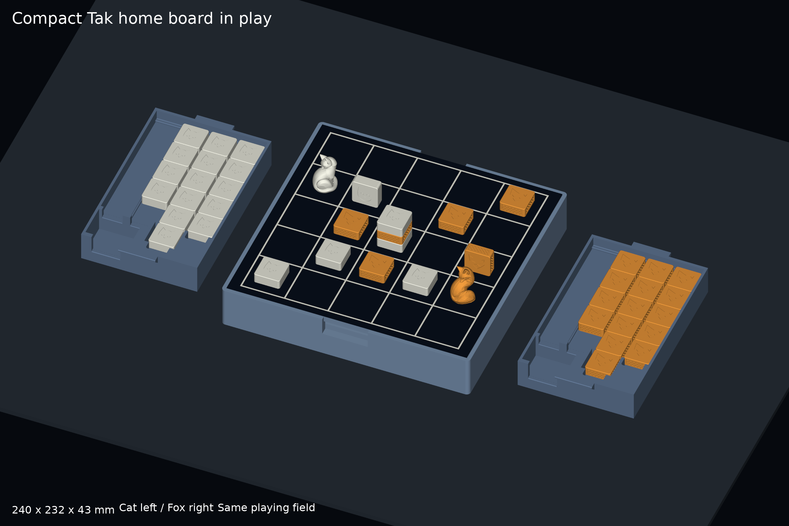
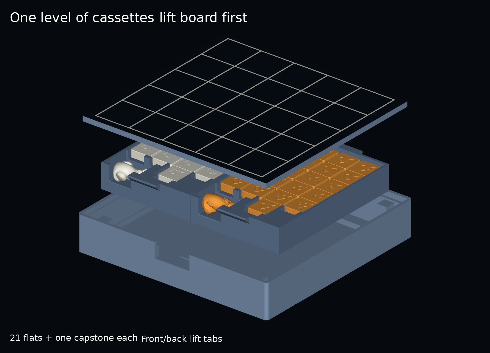
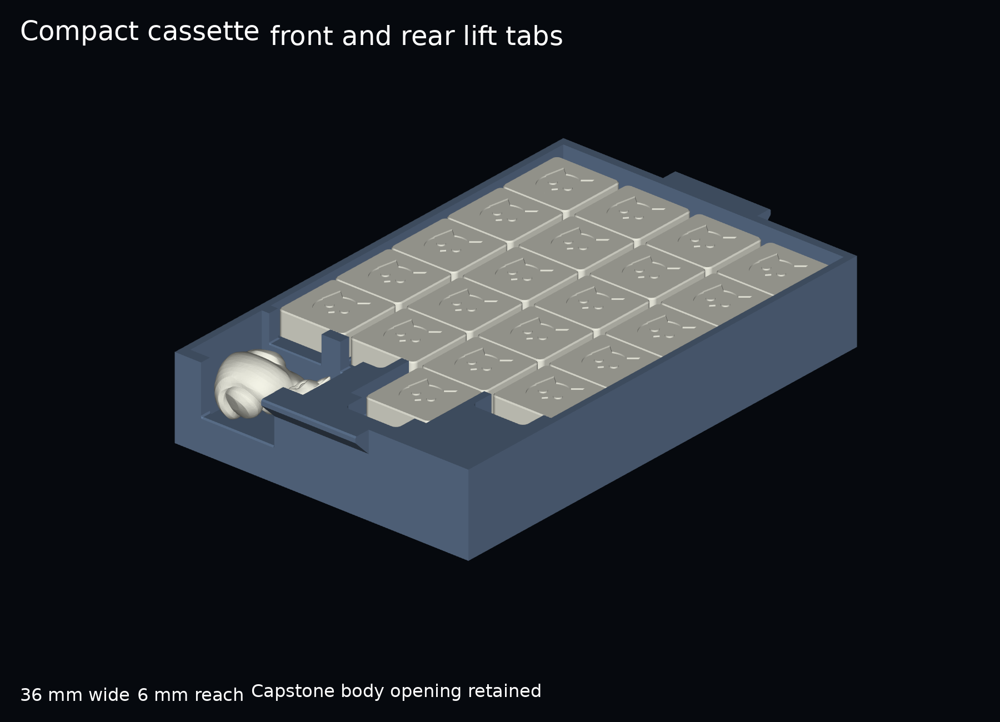
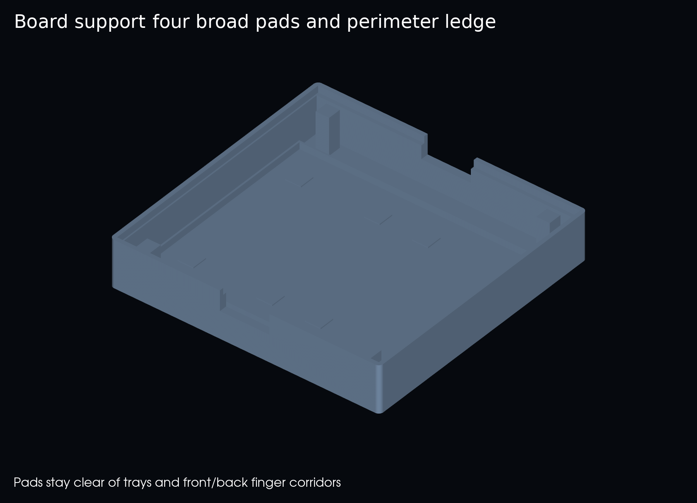
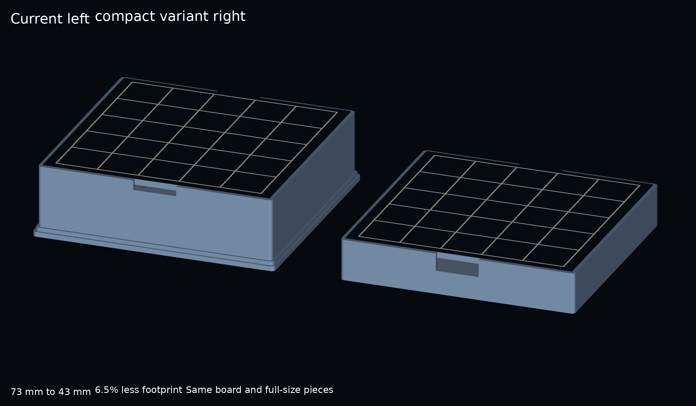

# Compact Tak home board

A separate **240 × 232 × 43 mm** home-board variant, with two removable
cassettes side by side beneath the same lift-out playing board. Compared with
the stacked version, its packed footprint is 6.5% smaller and its height is
41.1% lower. The 210 × 210 mm playing field, 42 mm cells and existing full-size
25 × 25 × 10 mm pieces stay unchanged.



## Dimensions and compatibility

| Component | Dimensions in mm | Evidence |
| --- | --- | --- |
| Platform | 240 × 232 × 42 | Valid CAD, watertight mesh and local slice |
| Packed height with felt allowance | 43 | Existing 1 mm surface allowance; measure actual felt/adhesive |
| Playing field | 210 × 210; 42 mm pitch | Exact existing backing and grid dimensions |
| Shared board backing | 232 × 224 × 6 | Byte-identical STEP/STL/3MF to the full-size package |
| Each cassette body | 112.2 × 174 × 30 | Two cassettes on one level; 0.8 mm middle gap |
| Cassette including lift tabs | 112.2 × 186 × 30 | Tabs add 6 mm at front and rear |
| Each lift tab | 36 wide, 6 projection | Sloped underside; 2 mm tip before 0.5 mm chamfer |
| Capstone pocket | 43 × 32; seat at z=5 | Existing chamber dimensions and sideways sculptures retained |
| Capstone front opening | 28 wide; bottom at z=12 | Existing body-grasp opening with 0.5 mm edge chamfer |

Use the [existing full-size piece package](../full-size-pagoda-v1/README.md),
including its weighted Cat/Fox flats, closure coupon and scaled capstones.
The shapes, ballast construction and proportions are unchanged. These pieces
do not fit v16's older travel-tray lanes.

The existing full-size board fits this new platform digitally. The new
platform and narrower cassettes are a separate geometry set; they do not
replace the stacked-cassette interfaces. Older packages remain intact.

## Packing and access



Lift the board using the 44 mm front/back openings, which now reach **12 mm
below its underside**. Grasp a cassette's front and rear tabs, lift it straight
out, then remove the other cassette. Set both beside the box and reseat the
board for play. Repack by lowering either cassette into the low locating frame,
then the other, then replacing the board. No component rotates while loaded.

Each cassette holds 21 flats in rows of **5 + 5 + 6 + 5**, plus one capstone.
Rows retain 0.3 mm side clearance per stone and 1 mm total end allowance.
Flat seats remain at z=18, with 8 mm of each flat above the lowered dividers.
Row-front openings remain 20 mm wide. Divider/front-notch edges use a 0.4 mm
chamfer; the narrower geometry failed the previous 0.5 mm chamfer, so the
smaller bevel was independently checked. The approved capstone opening and
its 0.5 mm bevel retain their dimensions.

The side grips are replaced by front/back tabs because side finger space is
unavailable in the compact packing arrangement. Each tab has a 45-degree
underside for printing without a horizontal bridge and a softened outer lip.
It leaves a nominal 16 mm end corridor inside the shell. There are no stack
pins in this single-level variant.



Four **12 × 12 mm support pads**, together with the perimeter ledge, contact
the board. They stand outside the cassette footprints and finger corridors.
The board is 4 mm above the loaded flats; Cat/Fox capstones have respectively
5.2/4.3 mm modeled clearance below it. Nominal fit allowances are not measured
printed fits.



**Transport retention remains unresolved.** The board and cassettes are open,
lift-out parts with no latch, enclosing lid or cushioning. Vertical repacking
checks do not establish spill-free carrying.

## Files and small first trial

- [Grip coupons](plates/grip-coupons.3mf): actual sections of the new front and
  rear tab geometry, with distinct object names. Print these first to assess
  contact edges, under-lip access and print quality. Estimated together at
  **19 g PLA / 31 minutes**. Coupon success does not establish full loaded strength.
- [Cassette](plates/tray.3mf): print one for a loaded-lift trial before its mate.
- [Platform](plates/platform.3mf).
- [Shared felt backing](plates/board-felt-backing.3mf).
- [Shared grooved option](plates/board-grooved-option.3mf).
- [Existing full-size flat/capstone plates and closure trial](../full-size-pagoda-v1/README.md#files-and-first-sample).
- [Exact-size felt grid](../full-size-pagoda-v1/models/felt-grid-100-percent.svg).

These are named, millimetre geometry 3MFs, without embedded settings or G-code.
STL and editable STEP files are in `models/`. The sideways `*-storage-reference`
meshes illustrate packing; print the existing upright capstone files instead.
Sliced proof projects and logs stay in ignored `.slicer-work/`.

## Verification

[Verification report](reports/verification.json): 8 valid, watertight,
consistently wound, single-component meshes and 5 named geometry 3MF readbacks.
All 21 exact Cat and Fox body/floor/felt solids fit their new seats with zero
overlap; contact probes confirm support. Conservative actual-mesh capstone
bounds fit the chambers. All 21 flat envelopes clear three vertical positions.

The board and both cassettes have zero seated overlap with the shell or one
another. Support contact, four lateral samples and nine vertical positions
pass, including removal of either cassette while its neighbour remains packed.
Two simultaneous inward shifts leave the centre gap clear. Solid tab-join
witnesses pass; this is a CAD connectivity check, not a strength result.

The board openings and cassette end corridors clear **28 × 14 × 12 mm geometric
finger proxies**. Cassette proxies approach the tab lips, enter 2 mm underneath,
and move with the cassette through the sampled lift path. These proxies do not
establish actual hand fit, comfort or a secure grasp.

[Slicing report](reports/slicing.json): all three changed plates pass fresh
local ElegooSlicer checks with the repository CC2 0.4 mm PLA profile, 0.2 mm
layers, four walls and 20% infill. No supports were used; all objects are on the
bed. The two unchanged board plates reuse exact input-hash-matched evidence.
The shell estimate is **343 g / 6 h 47 min**, each cassette **168 g / 3 h 8 min**.
These are estimates, not print results.

Six actual-mesh previews were inspected for complete framing, readable labels
and visible geometry. Cat/Fox names identify the teams beyond colour. The play
view conserves 21 flats and one capstone per player: six flats and the capstone
on the field, fifteen flats in each cassette. It is an illustrative arrangement.

Physical fit, comfort, rail/tab strength, board deflection, quiet storage and
transport retention remain unchecked in [ACCEPTANCE.md](ACCEPTANCE.md).



## Reproduction

Retain this package, `full-size-pagoda-v1`, its `pieces/` sources and the v16
mesh exporter. Use Python 3.12 and `source/requirements.txt` in the existing
project environment. No new runtime or local printer connection is needed.

```sh
python home-board-compact-v1/source/build.py
python home-board-compact-v1/source/render.py
python home-board-compact-v1/source/slice_check.py
```

The slice command requires installed macOS ElegooSlicer and never starts a
printer job. Source revision, dependencies, commands and source/input hashes
are retained in [provenance](reports/provenance.json). See the compact
[checkpoint](CHECKPOINT.md) for the next bounded trial.
