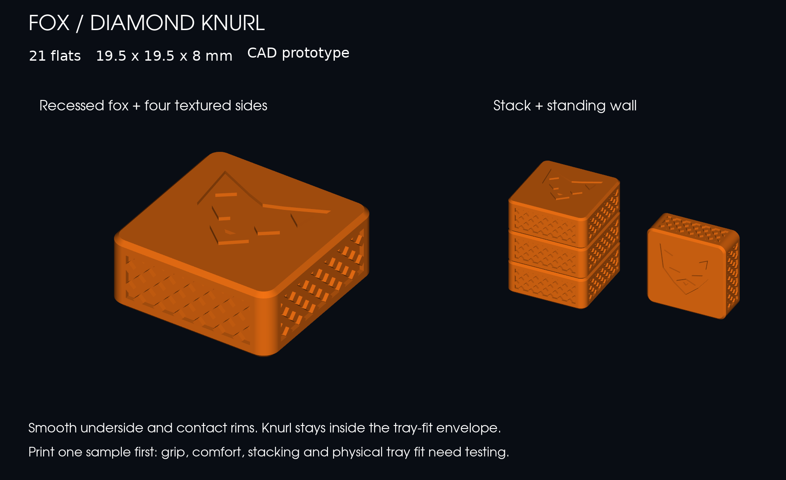

# Fox knurled flats



**21 fox-themed flats, each 19.5 × 19.5 × 8 mm.** A bold recessed fox has tall ears, angled eyes, long cheeks and a pointed muzzle. All four sides have diamond knurling. The underside, stacking rim and side contact rims remain smooth. This package covers the textured flats; the Fox and Cat capstones are separate work.

This is one themed flat set in a growing collection of custom gift sets for the box. Each design keeps its own source, print files and fit evidence. The fox package supplies one player's 21 flats; pair it with another player's set and the separately planned capstones for a complete game.

## Print files

- [Download the complete package](../fox-knurled-v1.zip), including shared rebuild sources and profiles
- [One-flat sample, sliced CC2 project](plates/fox-sample-first-cc2.3mf)
- [21-flat set, sliced CC2 project](plates/fox-21-flats-cc2.3mf)
- [Single flat STL](models/fox-flat.stl) and [editable STEP](models/fox-flat.step)
- Geometry-only 3MFs: [sample](plates/fox-sample-first.3mf) and [set](plates/fox-21-flats.3mf)

The sliced projects use the existing **Elegoo Centauri Carbon 2, 0.4 mm nozzle, 0.2 mm layers, orange PETG** profiles, with a Textured PEI bed and 100% infill. Print broad smooth face down, fox up. Both plates sliced without supports; every object is on the bed. The slicer's estimates are **12 minutes / 3.93 g** for the sample and **2 hours 37 minutes / 71.9 g** for 21 flats. These are estimates, not measured prints. For a different material, select its profile and reslice.

## Texture and fit

The crosshatch grooves are **0.4 mm deep and 0.8 mm wide**, with **2.4 mm horizontal pitch**, cut into a 15 mm wide band on each side between z=1.4 and 6.6 mm. The diamond lands sit at the original surface, so the knurl adds no width. Rounded corners and 0.5 mm edge chamfers keep the sharp pattern away from the outer edges. The fox is recessed 0.4 mm below the stacking plane; face details do not project above it.

The current v16 insert uses 20 mm wide × 98 mm long lanes. Five flats occupy 97.5 mm, leaving 0.5 mm total end slack and 0.25 mm clearance per side. The CAD check places all 21 actual solids in four lanes plus the extra pocket, then checks the insert, tray and board plate for collisions. All overlaps are zero. This deliberately uses the insert's **19.5 mm printed-flat size**, rather than the 20 mm weighted prototype.

## Current evidence and physical acceptance

[Geometry report](reports/verification.json): exact CAD envelope; valid single CAD solid; closed, consistently oriented single mesh; 21-object 3MF readback; zero stack overlap; four standing-wall orientations; actual 21-stone tray-placement collision checks.

[Slicer report](reports/slicer-verification.json): successful sample and full-set slicing, object counts, on-bed status, no supports, G-code and project hashes. The preview depicts CAD geometry, not a printed result.

Print the sample before the full set. Check the fox's readability, knurl grip and edge comfort, actual tray insertion/removal, and wear against existing stones. Print another sample to check flat-on-flat stacking and standing-wall stability. Physical fit, tactile feel and print quality are **not tested yet**.

## Rebuild

From the repository root, use the existing `.venv` with dependencies from `pieces/weighted-v1/requirements.txt`:

```sh
.venv/bin/python pieces/fox-knurled-v1/source/build.py
.venv/bin/python pieces/fox-knurled-v1/source/render.py
.venv/bin/python pieces/fox-knurled-v1/source/slice_check.py
```

The build reads the current v16 tray source and uses its shared STL exporter. Slicing requires the installed macOS ElegooSlicer and the existing `pieces/profiles` files. Source dimensions and texture settings live in `source/flats.py`.
