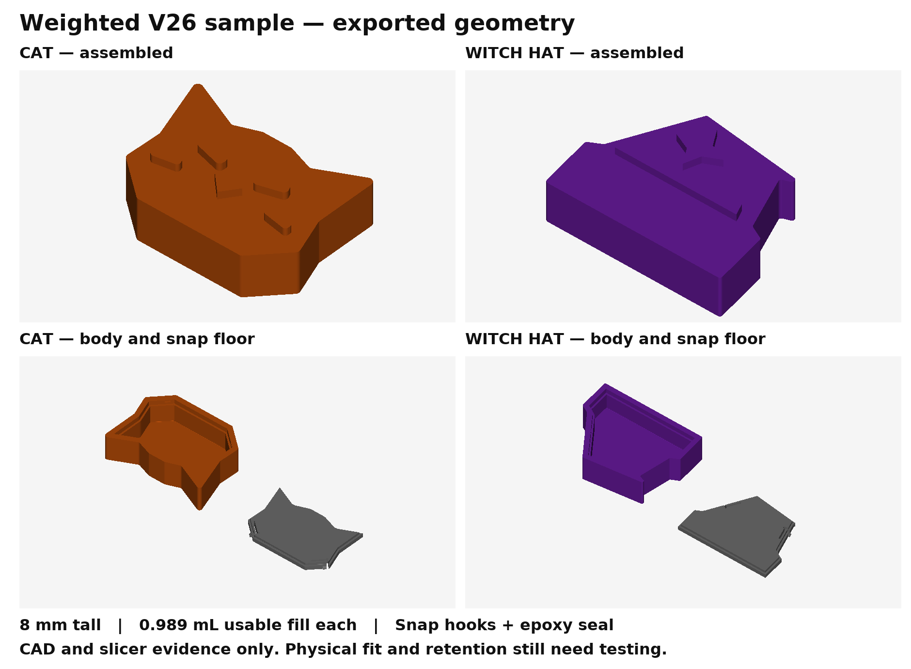

# Weighted Cat / Witch sample for the printed V26 case

Open [the eight-part sample plate](PRINT/Tak-SAMPLE-WEIGHTED-Cat-Witch-slots-3-4.3mf). It contains one regular flat, one flat capstone and their two separate snap floors for each team. Cat uses filament slot **3**, Witch uses slot **4**. The saved slice estimates **2h 7m 34s / 26.87 g**, including supports and the prime tower, on Centauri Carbon 2 with a 0.4 mm nozzle and 0.2 mm layers.

The user's existing printed V26 case controls the design. Regular pieces remain **20 × 20 × 8 mm**; capstones stay within **26 × 20 × 8 mm**. The Cat silhouette is unchanged. The redesigned Witch hat has a broad brim, wider crown, bent point and raised star. Its roof is **1.538 mm**, compared with the Cat's **0.8 mm**. Extra ballast space comes from the hat's wider footprint, with no increase in height.



| Piece | Usable shot/sand space | Complete closed void | Height |
|---|---:|---:|---:|
| Cat capstone | 0.988819 mL | 1.094064 mL | 8 mm |
| Witch hat capstone | 0.988819 mL | 1.094064 mL | 8 mm |
| Cat regular flat | 0.900000 mL | See generator solution | 8 mm |
| Witch regular flat | 0.900000 mL | See generator solution | 8 mm |

Equal volume does not establish equal weight: use the same shot/sand mixture and weigh the finished pieces. The usable volume excludes tongue insertion space and headroom. Some remaining closed void is occupied by epoxy.

## Fill and close

1. Check the empty body in its printed V26 guide. Confirm the floor aligns with the opening before pushing its hooks through; the snap is intended for one-time assembly.
2. With the body opening upward, add shot and sand. Leave the fill surface **1.90 mm below the Cat capstone rim**, **1.85 mm below the Witch capstone rim**, or **1.90 mm below a regular flat's rim**. Keep loose grains off the seat and hook pockets.
3. Apply epoxy to the mating seat and perimeter. Turn the floor so its tongue enters the cavity, then press it home evenly. Both opposing hooks must engage and the underside must sit flush.
4. Let the epoxy cure according to its instructions. Check the assembled piece in the actual case and check the closure before making a complete set.

The **wedge hooks snap behind internal retaining lips**. They obstruct straight outward withdrawal and back up the epoxy bond. Epoxy seals the floor perimeter and the cantilever slots against fine sand. The slots are not a dry sand seal. CAD demonstrates capture and insertion clearance; permanent retention, printed arm strength, assembly force and leakage remain physical tests, especially with the user's silk PLA. The next small trial is this sample plate, followed by filling, snapping, curing and checking the four pieces in the printed case.

## Material and print orientation

The user confirmed **Elegoo silk PLA** for slots 3 and 4. Included profiles use 220 °C nozzle, 55 °C Textured PEI bed, 40 mm/s outer walls and a conservative 6 mm³/s flow ceiling. These are starting settings, not spool-specific calibration. Elegoo lists a 35–65 °C bed range for [PLA Silk](https://www.elegoo.com/en-gb/collections/elegoo-product-ex-s3-s4-m5/products/elegoo-silk-pla-filament-1-75mm-colored-1kg). Display colours are provisional; the numeric slots are authoritative.

Bodies print with openings upward; separate floors print with tongues upward. Build-plate-only support is enabled under the capstones' face-down raised details. Keep supports clear of the cavities and closure slots when cleaning. The slice retains the observed `bed_temperature_too_high_than_filament` warning because the inherited profile's vitrification metadata is 45 °C while the bed is 55 °C. That metadata was not replaced with an invented material property.

## Evidence and reproduction

[Geometry](reports/geometry.json) verifies valid single-solid bodies/floors, zero seated overlap, horizontal barb shoulders, deflected-hook throat clearance, positive withdrawal collisions, matching cavity volumes, STEP round trips and eight watertight single-body STL meshes. [V26 fit](reports/v26-fit.json) passes **115 checks** against the unchanged exported V26 housings and boards: every storage position, sampled cover withdrawal and sampled folding. The assembled tops remain Z11.4 mm beneath the nominal Z11.8 mm board underside. This qualifies only this piece package in nominal CAD, not other weighted pieces or older inserts. The exact revision and tolerances of the user's physical V26 print are unknown.

[Saved plate readback](reports/slicing.json) confirms eight named objects, geometry within 0.002 mm of the source meshes, slots 3/4, the material/process settings, supports, bed containment and G-code tools T2/T3 only. [UI evidence](reports/ui-load.json) records the project visibly loaded in ElegooSlicer. A subsequent native Slice request timed out; native slice completion is not claimed. No printer job was sent. Physical fit and acceptance remain unverified.

The snap generator was recovered from `origin/feat/piece-generator-v1` at `863055fd146396925e2d05461b3e4696bf0c9ac4`. The [reference manifest](source/vendor/reference.json) identifies verbatim vendor files. Regulars use its default closure; the capstones adapt those hooks to their silhouette edges. Historical `pieces/weighted-v1` has an adhesive floor without snaps and remains unchanged.

Run from the repository root with Python 3.12 and [the pinned requirements](requirements.txt):

```sh
python pieces/weighted-flat-capstones-v1/source/build.py
python pieces/weighted-flat-capstones-v1/source/verify_case.py
python pieces/weighted-flat-capstones-v1/source/plate.py
python pieces/weighted-flat-capstones-v1/source/verify_plate.py
python pieces/weighted-flat-capstones-v1/source/render.py
```

The build records its base revision and working-file hashes; the base revision is not a claim that this new package already existed in that commit. Dependency versions are in [dependencies.json](reports/dependencies.json). Reproduction uses the repository's V26 reference capstones/case, `pieces/tak_pieces.py`, the V16 mesh exporter and this package's included profiles. `plate.py` currently targets the installed macOS ElegooSlicer 2.4.2 path and an isolated data directory. CAD wire orientation and fillet failures were fixed before export; the earlier failed withdrawal assertion is retained as [attempt history](reports/attempt-01-pull-path.log).
