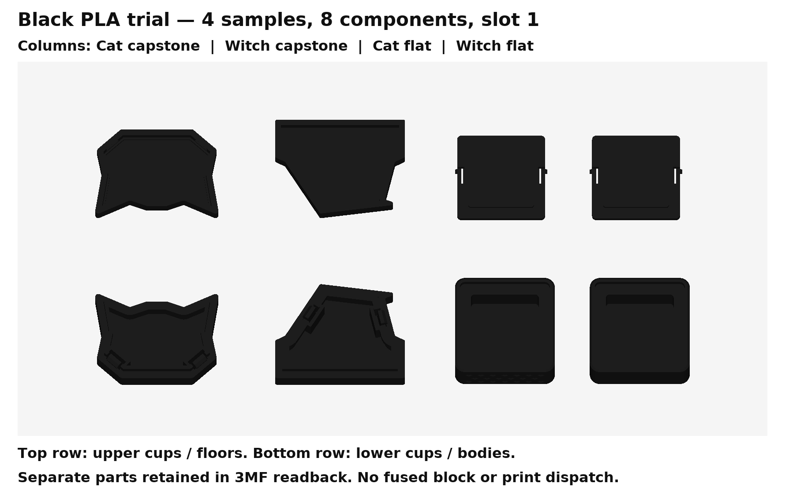

# Black PLA four-piece trial — sliced, awaiting device verification

Open [the separate black project](PRINT/Tak-FOUR-PIECE-SAMPLE-MIDPOINT-BLACK-SLOT-1.3mf). It contains the same four sample pieces as eight independent components: Cat/Witch capstone halves and Cat/Witch regular bodies/floors. Geometry and V26 fit evidence are unchanged. The silk project is preserved.

Saved estimate: **36m 32s / 9.57 g**. Stored generic black PLA profile: **210 °C nozzle, 60 °C Textured PEI bed, 0.2 mm layers**, CC2 0.4 mm nozzle, 40 mm/s outer walls, 21 mm³/s maximum flow. Supports remain build-plate-only; no prime tower or filament switches. All eight objects use project slot 1 / G-code T0. **The user confirms black regular PLA in physical slot 1.** Material and mapping match the saved slice; no settings changed and no reslice is required. The inherited bed/vitrification metadata warning remains.

Named mesh readback and all 32 snap-path probes pass. Source surfaces match within 0.002 mm and all objects are separate, watertight and on the bed. Physical retention, fill sealing and case fit remain untested.

The user authorized starting this sample, but native ElegooSlicer control timed out before the connected printer and ready state could be checked. The native UI load is unverified and **no printer job was submitted**. No other job was cancelled and unknown unsaved slicer work was left intact.

Reproduce with the retained pinned environment: run `source/plate.py --black`, `source/verify_plate.py --black`, `source/verify_snap_slice.py --black` and `source/render_plate.py --black` from the parent package. See [readback](reports/slicing.json), [snap paths](reports/snap-slice.json) and [provenance](reports/verification.json).
