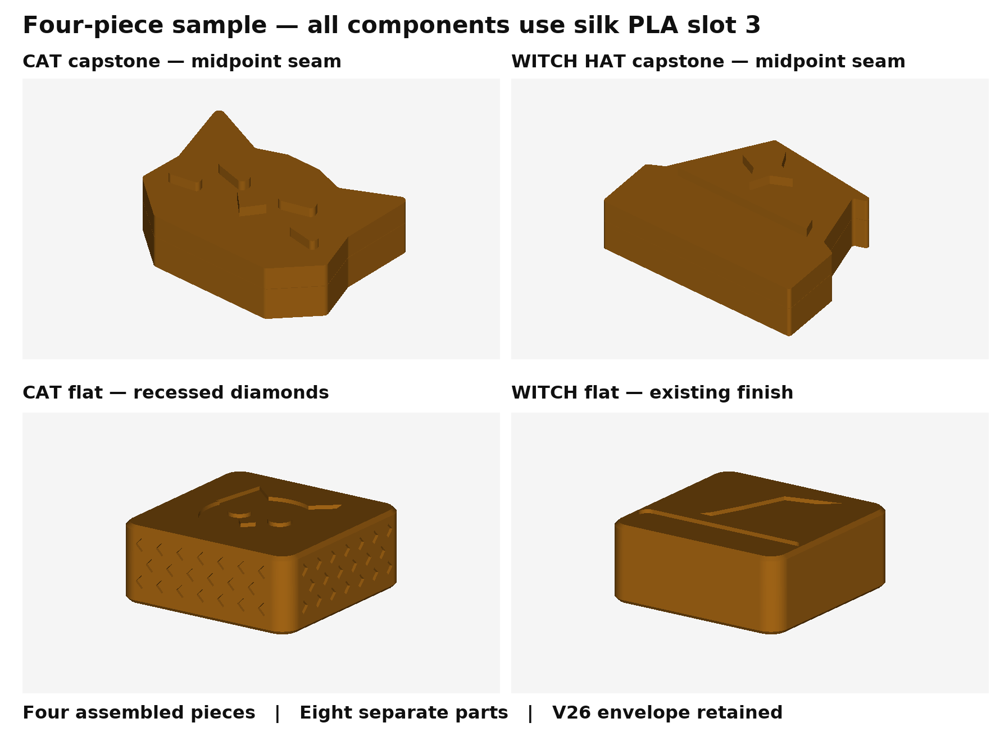
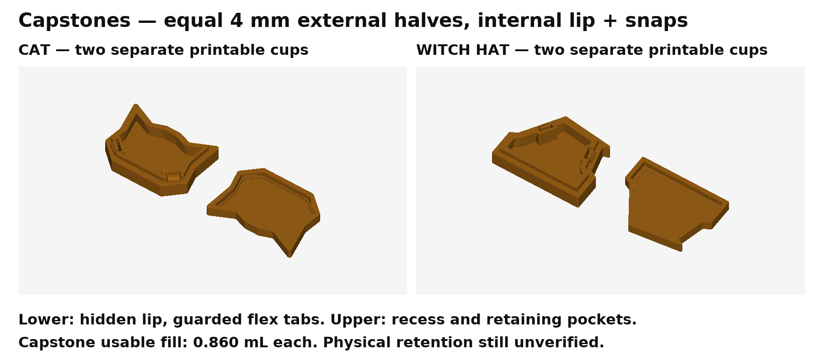
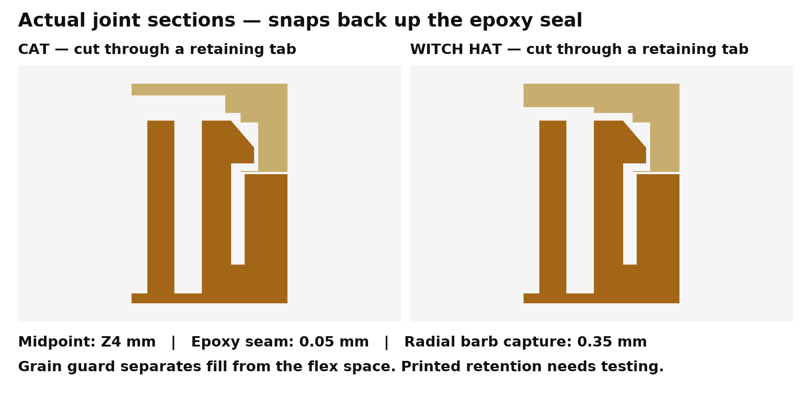

# Four-piece print block: midpoint capstones and Cat recess texture

Open [the ready-to-print 3MF plate](PRINT/Tak-FOUR-PIECE-SAMPLE-MIDPOINT-SLOT-3.3mf). It contains **one Cat capstone, one Witch capstone, one Cat regular flat and one Witch regular flat**, as **eight separate printable components**. Every component and support uses **Elegoo silk PLA in slot 3**. This is one sample plate, not complete teams and not a fused block. Unused slots 1/2 remain in the project only to preserve physical slot numbering.

The verified saved slice estimates **40m 26s / 9.57 g**, with Centauri Carbon 2, 0.4 mm nozzle, 0.2 mm layers, 220 °C nozzle, 55 °C Textured PEI bed, 40 mm/s outer walls and 6 mm³/s maximum flow. Build-plate-only support remains enabled under the upper capstones' face-down raised details. There is no prime tower or filament switching. No printer job was dispatched. The inherited bed/vitrification metadata warning remains; the confirmed material/process basis was preserved.



[See the eight separate components on the print plate](previews/print-block.png).

## What changed

Both capstones now have **two nominally 4 mm deep external halves meeting at Z4 mm**. A symmetric **0.05 mm epoxy bond gap** keeps the finished height at 8 mm. The lower half's hidden aligning lip extends 1.375 mm above its external seam into the upper half's recess. Two upright flex tabs have **2.8 mm wide retaining shoulders**, **0.35 mm radial capture** and a **0.4 mm thick plateau**. Guard walls separate loose fill from the fingers' deflection spaces. The internal lip is an overlap feature, so the lower printable component is taller than its 4 mm external share.

V2 capstones require both new matching cups. Existing V1 regular floors remain geometrically reusable. External silhouettes are unchanged from the V1 sample. Capstones remain within **26 × 20 × 8 mm** and regular flats remain **20 × 20 × 8 mm** for the user's printed V26 case. Both capstones have **1.165934 mL closed void before adhesive** and **0.860346 mL usable fill**. Usable capacity reserves the internal overlap, protected snap spaces, at least 0.25 mm headroom and another 0.03 mL glue allowance. It is lower than V1's 0.988819 mL usable capacity; the two teams still match. Equal volume does not establish equal finished weight.

The regular-flat body/flat-floor snap and epoxy architecture is retained. Both regular floors are geometrically identical to V1. The Witch regular finish is unchanged. Cat regular sides have **0.3 mm deep recessed diamond pockets**, 1.4 mm wide/high, spaced 2.4 mm apart in three staggered rows on all four sides. No material is added beyond the original envelope; the closure region and broad stacking faces retain their original surfaces.





## Assembly and physical evidence

The user reports that regular snaps work in their test. They printed only the **V1 Cat capstone**, which either seats without a click or clicks then separates. **Witch capstone retention is untested.** That component-specific report supersedes any implication that V1's straight-pull CAD checks established retention. This V2 joint is a replacement architecture, not another thin-floor tuning. Its physical retention remains unverified.

Before filling, check the empty parts in the actual V26 guides and check lip alignment without fully engaging the barbs. The snap is intended for one-time assembly; a fully snapped empty pair may become a consumed fit trial. Fill the lower cup, keeping grains out of the guarded mechanism. Leave the surface **at least 0.41 mm below the Cat lip rim** or **0.69 mm below the Witch lip rim**. Regular-flat fill remains 0.90 mL with a surface 1.90 mm below the open rim.

Apply epoxy to the continuous mating perimeter/lip, keep the flex slots free, and seat both hooks. Hold the halves at their intended seam while the epoxy cures. Epoxy provides bonding and sealing; the hooks back it up. Sand and varnish the outside after assembly, then check finished case fit and tactile contrast. Dry retention, steel-shot fit, leakage, stacking, handling and the finished texture remain physical gates. Shot diameter and its packing density are unknown; the user's planned arrival on October 9 does not qualify those properties.

## Evidence and reproduction

- [Geometry](reports/geometry.json): valid single solids; zero assembled overlap; all hidden joint features contained inside the unchanged silhouette; deflected-hook and guard clearance; positive straight-pull interference; equal closed/usable capstone volumes; STEP round trips; eight watertight single-body STL meshes; unchanged regular floors and stacking/closure regions.
- [V26 fit](reports/v26-fit.json): **115 checks** against unchanged exported V26 housings and covers, every storage position and sampled slide/fold motion. Exact revision/tolerances of the physical case are unknown.
- [Saved plate readback](reports/slicing.json): eight independent named components, source-surface agreement within 0.002 mm, all assigned slot 3, correct profiles/supports, bed containment and G-code **T2 only**. T2 is the zero-based feed-slot command.
- [Sliced snap checks](reports/snap-slice.json): **32 probes** of actual G-code bead paths/widths. All sampled rear/side/guard spaces remain free and both retaining plateaux carry plastic at Z4.4 and Z4.6. Minimum sampled probe-to-bead-edge distance is 0.1745 mm. The verifier includes the retained CC2 physical-nozzle XY offset of 0 × 1.5 mm. These are predicted bead envelopes, not measured physical beads or retention force.

Use Python 3.12 with [the pinned requirements](requirements.txt), from the repository root:

```sh
python pieces/weighted-flat-capstones-v2/source/build.py
python pieces/weighted-flat-capstones-v2/source/verify_case.py
python pieces/weighted-flat-capstones-v2/source/plate.py
python pieces/weighted-flat-capstones-v2/source/verify_plate.py
python pieces/weighted-flat-capstones-v2/source/verify_snap_slice.py
python pieces/weighted-flat-capstones-v2/source/render.py
python pieces/weighted-flat-capstones-v2/source/render_plate.py
```

The package depends on the preserved V1 source/vendor generator and silhouettes, V26 STEP references, `pieces/tak_pieces.py` and the V16 mesh exporter. Profiles travel with V2. The plate builder uses the installed macOS ElegooSlicer path and an isolated data directory. [Verification provenance](reports/verification.json) records source/profile/output hashes, commands, dependency versions, failures and remaining physical gates. V1 source, sample plate and printed parts remain unchanged.
