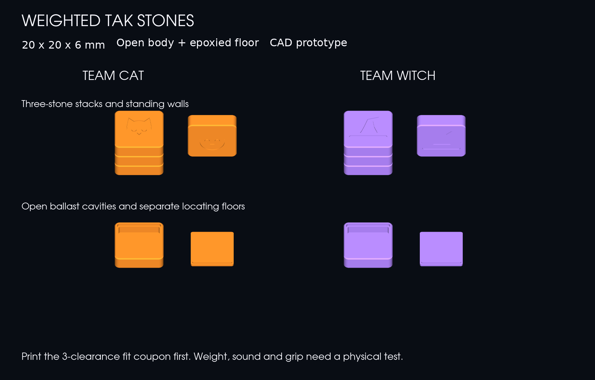

# Weighted Tak stones — first prototype



Two teams of **21 stones**, each **20 × 20 × 6 mm assembled**, with the existing Cat and Witch sculptural capstone designs. Each regular stone has an open body and a separate locating floor. Add bonded ballast after printing, then epoxy the floor into place. The capstones retain their current solid construction.

Based on the final body-plus-floor direction in [Designing a Tak Stone](https://chatgpt.com/share/6abcafaa-25d0-83ea-8db4-6eb9e879bb69), retrieved September 30, 2026. The conversation's mass, sound and material suggestions are experiment targets, not measured results.

## Start here

Print **[fit-coupon-first.3mf](plates/fit-coupon-first.3mf)** before the full set. It contains three Cat bodies and three floors:

For the existing CC2 **PETG** setup, use [fit-coupon-first-cc2.3mf](plates/fit-coupon-first-cc2.3mf), which also contains slicer settings and a completed slice preview. Inspect and reslice for your actual filament before printing; it has not been sent to a printer.

| Inside floor label | Clearance per side | Total width clearance |
| --- | --- | --- |
| 1 | 0.15 mm | 0.30 mm |
| 2 | 0.20 mm | 0.40 mm |
| 3 | 0.25 mm | 0.50 mm |

Try each floor in its body without forcing it. It should locate easily, sit flush when held against a flat surface, and leave space for adhesive. The full plates use **floor 2**. If another clearance fits better, change `CLEARANCE` in `source/stones.py` and rebuild before printing the team sets.

## Full set files

- [Team Cat](plates/cat-complete-set.3mf): 21 bodies, 21 floors, one Cat capstone.
- [Team Witch](plates/witch-complete-set.3mf): 21 bodies, 21 floors, one Witch capstone.
- `models/`: individual STL and editable STEP solids, coupon floors, and assembled STEP references.
- `reports/verification.json`: current geometry, mesh and 3MF readback evidence.

The three 3MFs listed above are **unsliced geometry projects in millimetres**, with separate named objects already positioned within a 256 × 256 mm bed. Choose the CC2 machine, filament and print settings in your slicer. Import as separate objects; keep the supplied orientations. The geometry projects contain no printer commands. Assembled reference STEP files show the glued position and must not be printed as a combined object.

The additional **`-cc2.3mf`** projects include settings and slice data from the repository's existing **PETG**, 0.4 mm nozzle, 0.2 mm layer profiles on Textured PEI:

| CC2 project | Objects | Slicer time estimate |
| --- | --- | --- |
| [Fit coupon](plates/fit-coupon-first-cc2.3mf) | 6 | 18 minutes |
| [Team Cat](plates/cat-complete-set-cc2.3mf) | 43 | 2 hours 2 minutes |
| [Team Witch](plates/witch-complete-set-cc2.3mf) | 43 | 1 hour 57 minutes |

These are slicer estimates, not observed print times. The native projects contain generated printer instructions; review their machine/material settings and reslice if your setup differs. No printer transfer or print job was initiated.

Bodies print **broad face down, opening up**. Floors print flat with the locating tongue up. This avoids a closure bridge, support inside the stone, or pausing to insert ballast. Use the project's existing 0.4 mm nozzle / 0.2 mm layer piece profile as the starting point, and inspect the preview before printing. The original capstone silhouettes still need their own overhang review.

## Construction and feel

| Feature | Dimension |
| --- | --- |
| Rounded square envelope | 20 × 20 × 6 mm |
| Corner radius / perimeter chamfer | 2.0 / 0.4 mm |
| Ballast cavity | 16.8 mm rounded square |
| Main side wall | 1.6 mm |
| Roof / remaining roof under emblem | 1.2 / 0.8 mm |
| Floor plate / locating tongue height | 1.0 / 0.6 mm |
| Floor rabbet depth | 1.2 mm |
| Axial adhesive gap at shoulder | 0.2 mm |
| Nominal lateral adhesive clearance | 0.2 mm per side |
| Recessed Cat / Witch emblem | 0.4 mm deep |

The broad upper face carries the team's recessed emblem; the underside is smooth. The markings stay below the stacking plane. The corner radius makes the stones comfortable to pinch; the chamfer keeps layer boundaries distinct. Each assembled stone stands on a 20 × 6 mm edge, and a three-stone stack is 18 mm tall. These are geometry properties, not a physical stability verdict.

The planned fill line is **1.9 mm above the finished underside**: keep the 0.6 mm tongue and another 0.3 mm of headroom clear. This leaves approximately **0.82 mL of usable ballast space**. Large BBs may not fit the shallow cavity; check actual particle or insert dimensions against the CAD before filling.

## Assemble and compare

1. Dry-fit the coupon floors. Remove brim or first-layer flare that obstructs the fit without changing the locating walls.
2. Compare the same body geometry with an empty control, bonded sand, and bonded fine steel shot. Keep a simple record of fill, cured mass, grip, stacking, and sound.
3. With each body face-down and opening up, add your selected ballast. Bond granular fill into one cured mass to prevent rattling. Use your adhesive's specified mix ratio, working time, surface preparation and full cure time; no universal epoxy ratio is assumed here.
4. Keep both adhesive shoulders clean and stay below the fill line. Dry-fit again after the ballast cures.
5. Apply adhesive to the locating seam, seat the floor, and use a flat reference surface across the surrounding body rim to keep the floor flush while it cures. The clearances allow glue; they are not a friction-fit closure. Keep squeeze-out off exterior contact faces.
6. After full cure, stack, separate, slide and stand the stones. Shake each stone and inspect the seam. Reject rocking floors, audible loose fill, separating seams or tacky contact faces before batch assembly.

**5–7 g is a target from the conversation**, not a guaranteed result. Weigh the cured coupons first. Thin rigid floors are the supplied baseline; TPU, cork, felt and coatings would change stack friction, sound or height and need a separate fit/feel test. Avoid covering the contact faces before that test.

## Evidence and limits

The build checks exact CAD envelopes, one valid solid per printable part, closed oriented meshes, body/floor clearance, stacked contact geometry, standing orientation, plate bounds and object counts after reading back each geometry 3MF. Eight printable meshes pass. The large labelled preview is inspected separately for legibility and construction visibility.

ElegooSlicer also successfully sliced all three plates. `reports/slicer-verification.json` records successful exits, 6 / 43 / 43 unskipped objects, no objects outside the bed, generated layer data and file hashes. Support is disabled in the inherited profile; successful slicing does not establish overhang print quality.

The new Cat capstone export removes one zero-area pole triangle from the existing CAD tessellation; it does not reshape the capstone. The original files remain available.

**Not yet verified:** printing, adhesive bonding, actual weight, rattle, sound, grip, wear, wall/stack stability and case retention. No board or tray redesign accompanies this prototype. The new stones are thinner than the old ones; that does not establish safe transport retention in the existing trays.

**Known insert mismatch:** the current tray insert is designed for 19.5 mm flats, with 98 mm lanes holding five pieces. Five of these 20 mm weighted stones need 100 mm before clearance, so they do not fit that packing arrangement. A matching insert revision is separate work; keep the original flats with the current insert.

## Rebuild

From the repository root:

```sh
uv venv --python 3.12 .venv
uv pip install --python .venv/bin/python -r pieces/weighted-v1/requirements.txt
.venv/bin/python pieces/weighted-v1/source/build.py
.venv/bin/python pieces/weighted-v1/source/render.py
.venv/bin/python pieces/weighted-v1/source/slice_check.py
```

The build uses the existing emblem and capstone CAD in `pieces/tak_pieces.py` and numerical vertex welding in `v16-field-book/source/mesh_export.py`. Slicer verification requires the installed ElegooSlicer application on macOS. The downloadable ZIP retains repository-relative paths and includes these shared sources and the existing machine/filament profiles.
