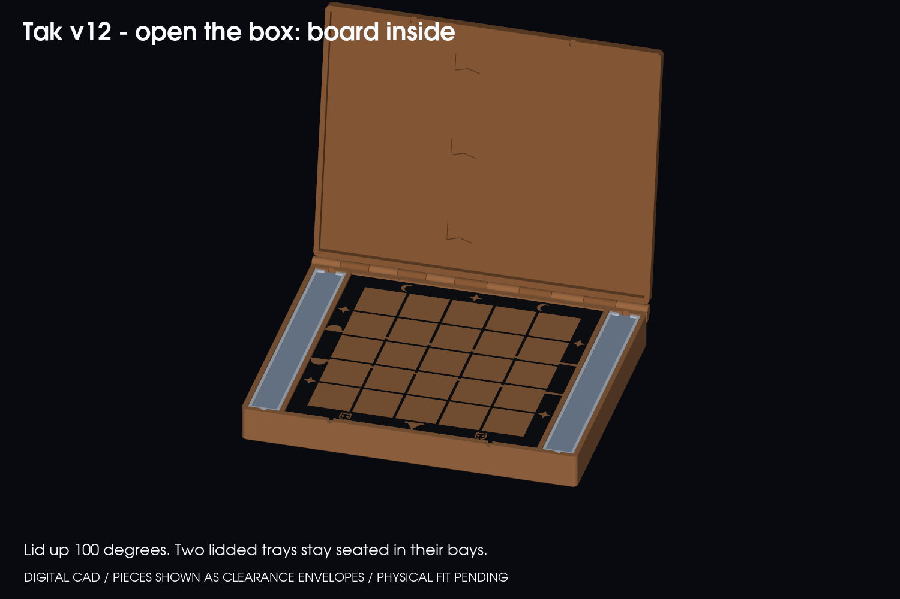
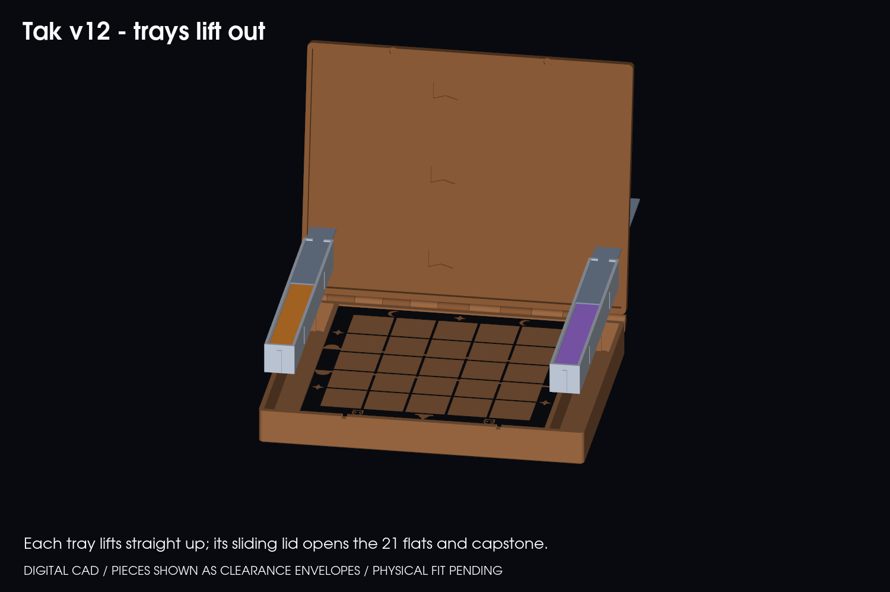

# Tak v12 — the chest (board inside, two lift-out player trays)

**Prototype. CAD is verified digitally; nothing has been printed, sliced or physically tested.**

Flip of v11: instead of a board on a platform, you open a hinged box and the board is *inside*, like backgammon or Jumanji. Two tall bays flank the board. In each bay sits a lidded player tray holding 21 flats (on edge) and one capstone. Each tray lifts straight up out of its bay. Slide its lid back and the player has a personal piece tray to set beside them. Going from "open the box" to "play" is one lift per player.





## How it works

- **Chest.** Base and lid are hinged along the back with a 11-knuckle print-in-place hinge (Ø3 cone pins, 0.4 mm clearance, opens past 100°). Closed: **272 × 215 × 38 mm**, plus about 8 mm of hinge at the back.
- **Board.** The 205 × 205 mm playing field is recessed 1.5 mm below the rim, so the lid never touches it. The existing grid/decoration is inlaid flush as separate bodies for multicolour printing.
- **Trays.** 25.2 × 205 × 25.6 mm. Flats stand on edge in a 172 mm lane; the capstone lies in a 27 mm lane behind a divider. The lid slides in grooves in the tray walls, opens toward the back, and has a finger relief in the end rim.
- **Seating.** End ribs run in slots in the bay end walls. Two pairs of crush ribs on each tray's long faces give friction. Fit A/B/C sets the crush at 0.10 / 0.20 / 0.30 mm over the 0.2 mm side clearance; **B is provisional**. Lid fit A/B/C sets 0.20 / 0.30 / 0.40 mm per side.
- **Closure.** Four 6 × 2 mm magnets (two in the base front wall, two in the lid) plus a thumb scoop in the front wall.
- **Look.** Chunky wooden-chest cues: rounded corners, bevelled rim, raised lid panel and four corner studs. The style is deliberately light: it needs a decision from you before more ornament goes on.

## Print pieces

The bed limit (256 mm) is the reason for the splits. Base and lid are each printed as two halves that meet at **x = 82 mm**, which is a black grid line and hides the seam. Hourglass keys join the halves.

| Part | Size (mm) | Notes |
|---|---|---|
| Base left, base right | 116 × 223 × 33, 157 × 223 × 33 | Floor down. Solid in CAD; use sparse infill. |
| Lid left, lid right | 116 × 223 × 15, 160 × 223 × 15 | Print top-down, so the exported STL is already flipped. |
| Tray (A/B/C) and tray lid (A/B/C) | 26 × 207 × 26; 22 × 202 × 1.2 | Choose one fit. |
| Grid inlays | 6 STLs | Black, separate bodies. |
| Seam keys | 3 base, 3 lid | Glue in. |

STLs are in [stl/full](stl/full). STEP models are in `models/`, including three assembly STEPs (closed, open, trays out).

## Trial sequence

Print [stl/trials](stl/trials) first:

1. **Tray end and lid A/B/C.** Real end wall, lid grooves, slot rib and one crush-rib pair. Pick the fit with a lid that slides with light finger pressure and does not rattle.
2. **Bay + hinge (base and lid).** Bay end with rib slot, back wall and the first hinge knuckle, and the matching lid corner. Free the hinge and check swing, then check that a tray end drops into the slot.
3. **Seam sample and key.** Both halves near x = 82 with the key pockets.

Then complete [ACCEPTANCE.md](ACCEPTANCE.md). Full parts follow the trials.

## Digital checks

`source/verify_chest.py` (all pass, see [reports/geometry-verification.json](reports/geometry-verification.json)):

- All parts are valid single solids.
- Closed pose has zero overlap between every part pair.
- Trays lift 0–60 mm in bays with no overlap (5 mm steps).
- Lid sweeps 0–110° with no overlap against base or trays (5° steps).
- Pieces (envelopes of the real flats and capstones) clear the tray body and lid; 0.8 mm under the lid.
- Seam keys clear their pockets. All parts fit the 256 mm bed.

`source/verify_meshes.py` confirms every released STL is closed, consistently oriented and positive-volume ([reports/mesh-verification.json](reports/mesh-verification.json)).

## Not done

- **No slicing.** No 3MF, G-code or print-time/filament estimate. Slice in your own profile.
- **No physical tests:** fit, hinge strength, magnet pull, tray retention when the open box is tipped, lid slide force, crush-rib wear.
- **Tray retention.** With the lid open and the box held upright, nothing but friction holds a tray in its bay. The crush ribs are the only detent.
- **Weight.** The base is a solid block in CAD (about 1.3 L of base halves); expect a heavy box unless infill is low.
- **Bulk.** At 272 × 215 mm it is a table box, not a purse case like v11.
- **Board-relative orientation.** Trays sit on the board's left and right sides. The players sit at the front and back, so each tray is beside one player's hand rather than in front of them.

## Rebuild

Requires the CadQuery env with NumPy and VTK. From this folder:

```sh
python source/build_models.py
python source/verify_chest.py
python source/verify_meshes.py
python source/render_chest.py
```

Main source: [tak_chest.py](source/tak_chest.py).
