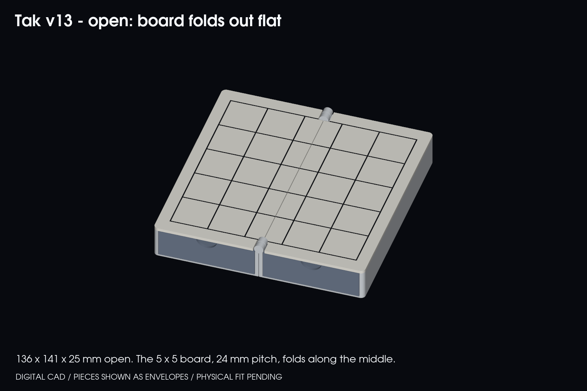
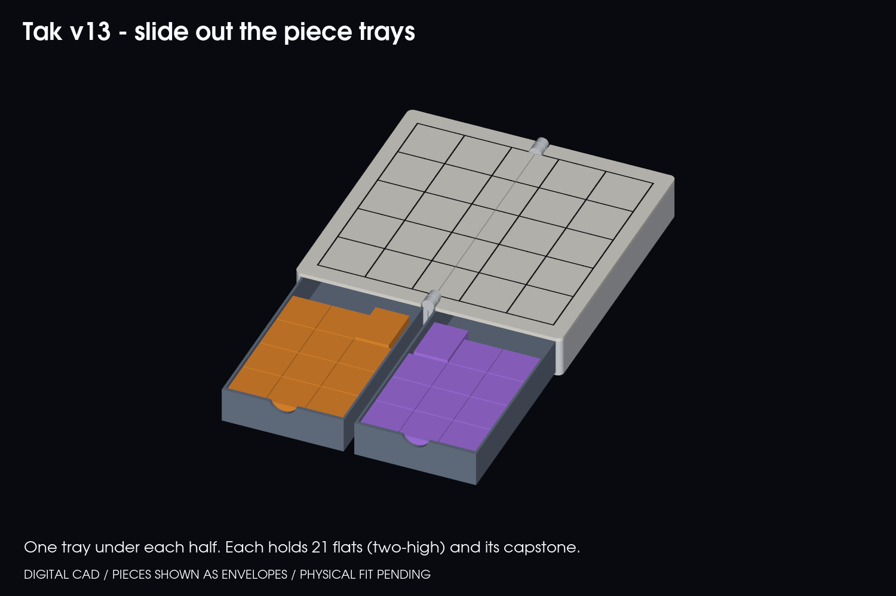

# Tak v13 — the book (board folds inside, two slide-out trays)

**Prototype. Verified in CAD only; nothing has been sliced, printed or physically tested.**

The board folds in half like a book, with the playing face inside. There is a piece tray under each half. Open the book flat and each player slides a tray out of the front edge. The book is held shut by one clasp on an M3 screw.

## Size

| | mm |
|---|---|
| Closed | 71 × 141 × 44 (68 × 138 body, plus the spine knuckles and clasp) |
| Open | 136 × 141 × 25 |
| Board | 5 × 5 at 24 mm pitch (120 mm field) for 19.5 mm flats |

Two things set the size:
- **Tray width:** three 19.5 mm stacks across each tray.
- **Leaf height:** the capstone lying down (17.3 mm).

## How it works

- **Leaves:** each half is a base (floor, fore wall, seam wall, back wall) plus a glued 2 mm face plate. The plate holds half the board with a 0.8 mm inlaid grid for a second colour.
- **Fold:** the fold line runs down the middle of the centre column, so those five cells each have a 0.4 mm seam through them.
- **Hinge:** print-in-place knuckles sit at both ends of the spine (Ø3 cone pins, 0.4 mm clearance, same approach as v11). Each end has two small hinge barrels in the border, 3 mm proud of the board. The seam walls give an open stop at about 1–2° past flat.
- **Trays:** 62 × 132 × 18.6 mm each. They slide out of the front end (y = 0) with a finger notch in the front. A side detent on the fore wall holds each tray in either orientation. It needs about 0.4 mm of wall flex, which matters because leaf B's tray is upside down when the book is closed. Each tray holds 21 flats as 11 two-high stacks, plus the capstone lying down, with 0.9 mm clearance under the board.
- **Clasp:** an M3 × 8 button-head screw goes into a 2.6 mm pilot in leaf A's back wall. The clasp swings up and hooks a stud on leaf B, and swings down to rest flat along the back face.

## Print pieces ([stl/full](stl/full))

| File | Orientation | Qty |
|---|---|---|
| `bases-hinged-print-in-place.stl` | as exported: both bases open flat, hinge in place | 1 |
| `plate-a.stl`, `plate-b.stl` + `grid-inlay-a/b.stl` | face down; inlays as a second colour | 1 each |
| `tray.stl` | upright | 2 |
| `clasp.stl` | flat | 1 |
| M3 × 8 button-head screw | — | 1 |

Glue each plate onto its base after freeing the hinge. Keep glue away from the knuckle notches.

## Trial prints first ([stl/trials](stl/trials))

1. `trial-hinge-pair`: one spine end, print-in-place. Free it and check the swing.
2. `trial-detent-base` + `trial-detent-tray`: the back corner with the side detent.
3. `trial-clasp-base-a`, `trial-clasp-base-b`, `trial-clasp`: pilot hole, stud and hook.

Then complete [ACCEPTANCE.md](ACCEPTANCE.md).

## Digital checks ([reports](reports))

`source/verify_book.py` passes all of these:
- **Parts:** all are valid single solids.
- **Open flat:** no overlap between any parts.
- **Fold:** the sweep from 0 to 180° is clear, in 5° steps.
- **Open stop:** engages by 2° past flat.
- **Closed:** faces meet with the board inside.
- **Clasp:** locked clear, holding leaf B, and it swings clear from 0 to 90°.
- **Trays:** removable, interfering only at the detent (first 2–8 mm of pull).
- **Pieces:** fit each tray.
- **Bed:** every part fits a 256 mm bed.

`source/verify_meshes.py` confirms all 13 STLs are closed and correctly oriented.

## Not done / open questions

- **Not built yet:** no slicing, no G-code, no print-time estimate, no physical tests.
- **Seam through the centre column:** five cells have the fold seam through them.
- **Hinge barrels:** 3 mm bumps at the spine ends, in the border.
- **Clasp:** stands about 3 mm proud of the back face.
- **Grid:** the sketch's "internal raised grid" is not modelled. The grid here is a flush inlay.
- **Rebuild:** `python source/build_models.py`, `verify_book.py`, `verify_meshes.py`, `render_book.py`. The source is [tak_book.py](source/tak_book.py).
