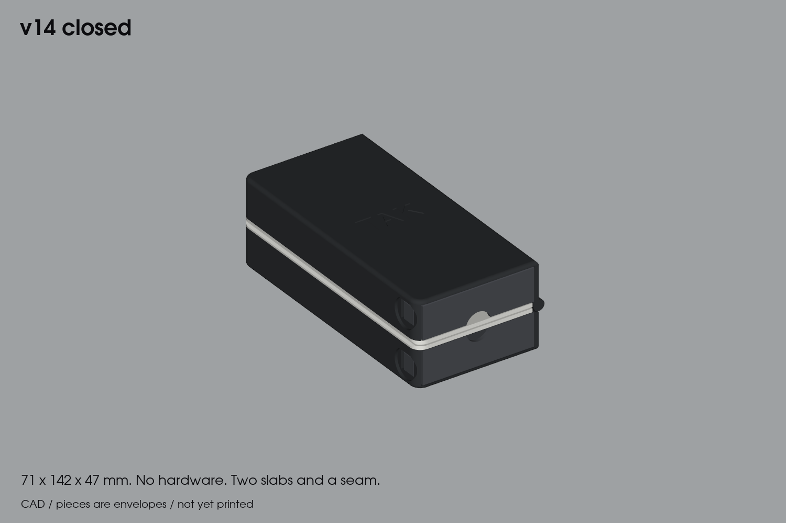
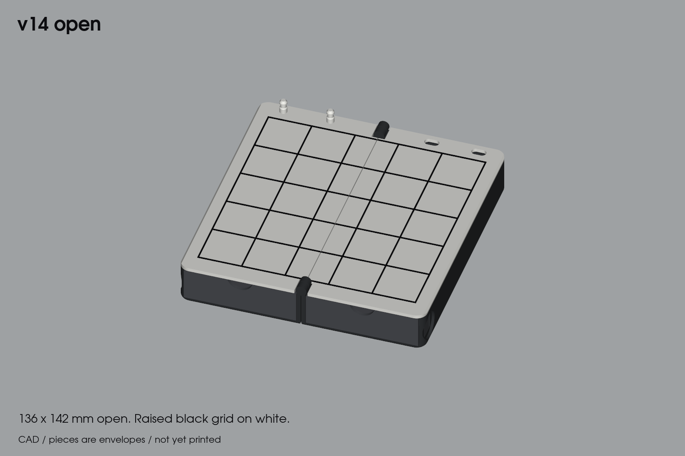

# Tak v14 — field book

**Prototype. Verified in CAD only; nothing has been sliced, printed or physically tested.**

A tough little brick for a bag. The board folds in half with its face inside, and there's a snap-in piece tray under each half. It uses no screws, magnets or other hardware. Closed, it's two dark slabs meeting at a seam.

## Size

| | mm |
|---|---|
| Closed | 71 × 142 × 47 |
| Open | 136 × 142 × 24, plus the closure posts |
| Board | 5 × 5 at 24 mm pitch (120 mm field), for 19.5 mm flats |

## What changed from v13

- **Closure:** the M3 clasp is gone. The book shuts on **two hidden snaps**. Two posts on leaf A's back border enter holes in leaf B. Inside B's back wall, a flexible arm springs into a neck on each post and holds it with a 60° shoulder.
  - **Opening:** pry the halves apart at the thumb groove along the fore edge.
  - **Print strength:** every flexing part bends within the print layers, not across them.
- **Tougher shell:**
  - The floor skin is 2 mm, up from 1.
  - Plan corners have a 6 mm radius, and every bottom edge has a 2 mm fillet.
  - The back wall is 10 mm deep, to house the snap arms.
- **Cover:** a debossed **TAK** on the cover, 0.7 mm deep.
- **Renders:** plain matte charcoal and white.

## Carried over from v13

- **Board:** the grid is 0.6 mm inlaid plus 0.4 mm raised, in a second colour. Print a white plate with a black grid.
- **Fold:** the axis sits at the top of the grid, so when closed the two grids meet with the faces 0.8 mm apart.
- **Trays:** a push-button latch in each tray's outer wall. Push the tray in to snap it. To release, press the button 1.45 mm into a 16 mm finger dish in the book's side. The button sits 1.6 mm below the surface.
- **Pieces:** each tray holds 21 flats as 11 two-high stacks plus the capstone, with 0.9 mm under the board.
- **Hinge:** print-in-place knuckles at both ends of the spine.

## Print pieces ([stl/full](stl/full))

| File | Orientation | Qty |
|---|---|---|
| `bases-hinged-print-in-place.stl` | as exported: both bases open flat, hinge in place | 1 |
| `plate-a.stl` (with posts), `plate-b.stl` | face up | 1 each |
| `grid-inlay-a.stl`, `grid-inlay-b.stl` | with their plates, in black | 1 each |
| `tray.stl` | upright | 2 |

Free the hinge first, then glue each plate on. Keep glue out of the knuckle notches and the snap holes.

## Trial prints first ([stl/trials](stl/trials))

1. `trial-hinge-pair`: a spine end, printed in place.
2. `trial-snap-post-plate` with `trial-snap-socket-base` + `trial-snap-socket-plate`: check that the snap clicks shut, holds against a shake, and opens by hand.
3. `trial-latch-base` + `trial-latch-tray`: the tray latch.

Then complete [ACCEPTANCE.md](ACCEPTANCE.md).

## Digital checks ([reports](reports))

`source/verify_book.py` passes all of these:
- **Fold sweep:** 0–180° is clear. Only the snap arms touch the posts, in the last 6° of closing.
- **Snap hold:** the snaps hold when the halves are pulled 0.5 mm apart.
- **Strain:** snap-arm strain is 0.54%, and tray-arm strain is 0.75%.
- **Trays:** a locked tray can't be pulled out, and a released tray slides fully out.
- **Pieces:** they fit each tray and clear the pressed arm.
- **Bed:** every part fits a 256 mm bed.

`source/verify_meshes.py` confirms all 12 STLs are closed and correctly oriented.

## Known limits

- **Hinge barrels:** they still sit about 3 mm proud at the spine ends. Hiding them inside the outline would need a ridge across the middle of the board.
- **Closure posts:** when open, the two posts (Ø4.2 × 7.8 mm) stand up from the back border.
- **Centre column:** the fold seam runs through its cells.
- **Snap force:** set by 0.4 mm of arm deflection. It's a guess until the trial is printed.
- **Not built yet:** no slicing, G-code or print-time estimate.

Rebuild with `python source/build_models.py`, `verify_book.py`, `verify_meshes.py` and `render_book.py`. The source is [tak_book.py](source/tak_book.py).
