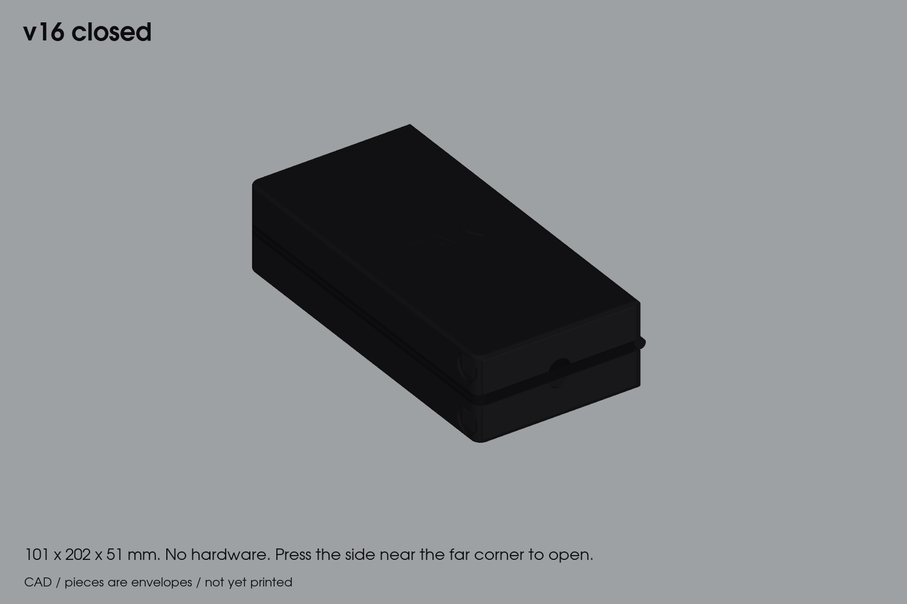
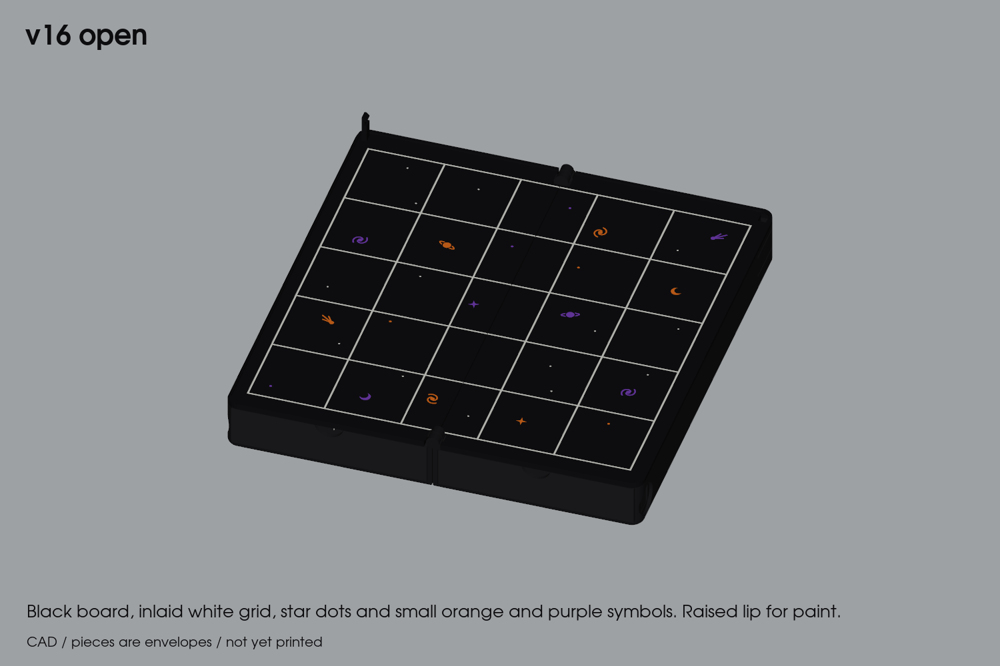
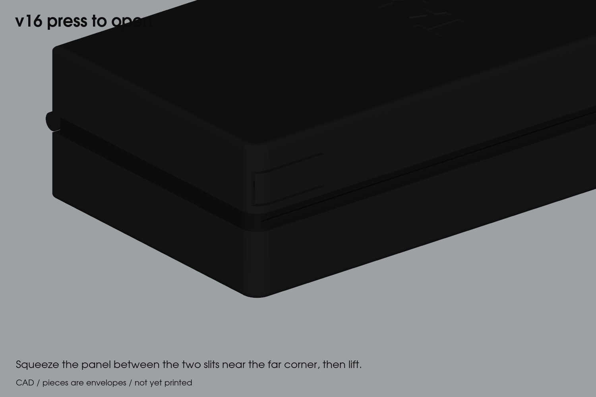
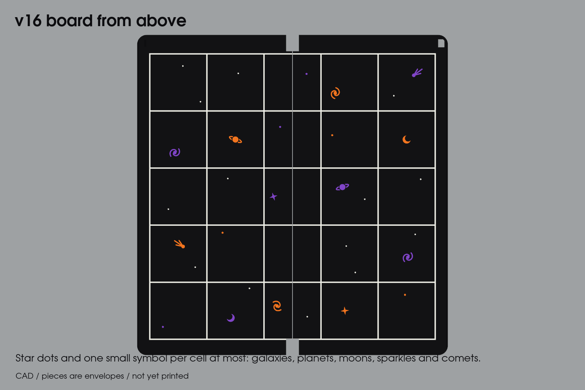
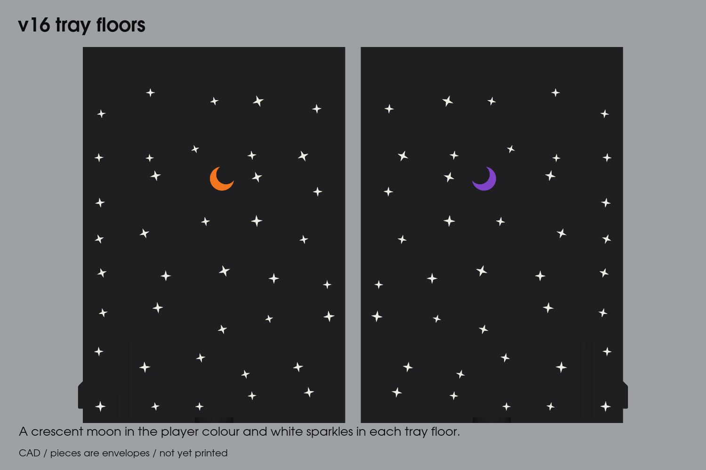

# Tak v16 — field book

**Prototype. Verified in CAD and sliced; nothing has been printed or physically tested.**

A tough little brick for a bag. The board folds in half with its face inside, and there's a snap-in piece tray under each half. It uses no screws, magnets or other hardware. Closed, it's two dark slabs meeting at a seam.

## Size

| | mm |
|---|---|
| Closed | 101 × 202 × 51 |
| Open | 196 × 202 × 38 (includes the closure tab) |
| Board | 5 × 5 at 36 mm pitch (180 mm field), for 20 mm flats: 16.0 mm between neighbouring stones |

## What changed from v15

v15 was too small to play on: with 8.5 mm between stones you couldn't get fingers around a stack once the board filled up.
- **Flush white grid.** The grid is now inlaid flush with the face, not raised 0.4 mm.
- **Bigger board.** The cells grew from 28 mm to **36 mm**, so neighbouring stones are **16.0 mm** apart (was 8.5 mm), enough for a fingertip on each side of a stack. `verify_book.py` now fails if that gap drops below 15 mm.
  - The book is 20 mm wider and 40 mm longer. The board art keeps its place in each cell; the symbols are the same size, so they look smaller on the bigger cells.
- **Capstone cradle.** The real pawn capstones (Ø19.4 mm, which can't get lower than 19.4 mm in any pose) did not fit v15's trays; the model used a stale envelope. Each tray floor now has a 0.4 mm cradle groove that holds the pawn on its side, and the trays are 1.4 mm taller. The closed book is 51 mm thick. `verify_book.py` now fits the real STEP pieces, not envelopes: the pawn sits 0.4 mm under the plate. The flats are the real 20 mm, not 19.5 mm.
- **Roomier trays.** The stacks stand at least 12 mm apart, so you can pinch one out. The trays are 132 mm long instead of full length, which leaves the back of each cavity empty and saves plastic.
- **Cross ribs:** two 1.2 mm ribs (y = 152 and 170 mm) span each chamber behind the tray, from the floor up to the plate seat. The plate rests on them, and they break the 92 mm floor and plate spans into bays about 20 mm long. They stay clear of the tray and of leaf B's buckle panel. The board plates did not change, so plates already printed still fit; only plate 01 (the bases) needs reprinting.
- **Glue wells:** one more along each wall to cover the longer walls. The pegs are unchanged.
- **Plates:** re-positioned for the bigger parts and the prime tower; all four still fit the 256 mm bed. Plate 01 is now about 4 h 58 min and 171 g, with the ribs.

## Carried over from v15

- **Closure:** a **buckle at the far edge**, opposite the hinge. No hardware.
  - **Closing:** a tab on leaf A's back corner pushes into a slot in leaf B and clicks under a catch.
  - **Opening:** the catch hangs on a spring panel cut into B's outer side wall, near the far corner. Squeeze that panel (about 4.5 N, 1.4 mm of travel) and lift.
  - **On the case:** the panel shows only as two fine slits on the side.
  - **Purse-proof:** pressing alone doesn't open it; the halves also have to be pulled apart.
  - **Print strength:** every flexing part bends within the print layers, not across them.
- **Shell:** a 2 mm floor skin, two cross ribs behind each tray, 6 mm plan corners, 2 mm bottom fillets, and a 10 mm back wall that houses the buckle.
- **Cover:** plain. The debossed TAK was cut: its 0.7 mm text caused print problems.
- **Board:** the grid is a 0.6 mm inlay flush with the face, in a second colour.
- **Fold:** the lips meet exactly at the hinge axis when closed.
- **Trays:** a push-button latch in each tray's outer wall. Push the tray in to snap it. To release, press the button 1.45 mm into a 16 mm finger dish in the book's side. The button sits 1.6 mm below the surface.
- **Pieces:** each tray holds 21 flats as 11 two-high stacks plus the pawn capstone.
- **Hinge:** print-in-place knuckles at both ends of the spine.

## Colours and art

Orange and purple are used sparingly, about 1 g of each per print plus purge.

- **Board:** black, with a **white grid inlaid flush** (0.6 mm deep).
- **Cells:** kept subtle. A sparse field of star dots (a few in orange and purple) and one small symbol per cell at most: two-arm galaxies, ringed planets, crescent moons, four-point sparkles and comets, split evenly between orange and purple.

- **Tray floors:** a crescent moon in the player colour (orange for the cat tray A, purple for the witch tray B) and a scatter of white four-point sparkles.
- **Tray fronts and case:** plain black.

All art is flush 0.6 mm inlay with strokes of at least 0.8 mm, so stones slide over it. It stays clear of the grid, fold seam, hinge notches, buckle, lip, thumb groove and tray latch. `verify_book.py` checks this.

## Protective lip (for paint)

Each board half has a **1.0 mm raised lip** on its three outer edges, 1.6 mm wide and not across the fold. The hinge axis sits at the top of the lip, so when the book closes the lips meet and nothing else does:
- **Painted faces:** 2.0 mm apart.
- **Grids:** 2.0 mm apart, flush with the faces.

Keep acrylic paint (and any varnish) below the lip top. The thumb groove is cut into the lip edge.

## Tray insert (add-on, printed after the trays)

The trays are already printed, so the insert is a separate part: a **pan** that drops onto each tray floor and lifts out with its flats. Nothing about the tray, bases or plates changed. It is built for how the flats are actually loaded: **lying flat in one layer, 4 across and 5 deep**, with the pawn and the 21st flat in the front strip.

- **One floor:** a 0.8 mm floor runs under the four lanes and the whole front strip beside the pawn, and every wall is fused to it or to a thick neighbour, so no feature hangs off by a thin wall.
- **Four lanes:** each is 20.0 mm wide and 98 mm long (5 flats plus 0.5 mm). The printed flats are 19.5 mm (0.5 mm under the real 20 mm for fit), so a flat has 0.25 mm each side. Drop a flat in anywhere along its lane and slide it up to the last one. The walls are 3.5 mm tall (under half a flat, so you can pinch one out) with a lead-in chamfer: 1.2 mm outside, 1.6 mm dividers, and the right wall runs the full length of the pan.
- **Pawn saddle:** the capstone stays in the tray's own cradle groove. A 1.6 mm, 9 mm tall stop wall sits behind it, with a 1.6 mm wall on the right and a 1.2 mm wall on the left, both 6 mm tall and 0.35 mm clear of its widest point. The left wall starts 17 mm back: the pressed latch arm swings out to 6.5 mm from the wall at the front and would hit it.
- **21st flat:** its own pocket beside the pawn, on the same floor, sharing the saddle's right wall.
- **Lifts out for play:** the back wall is 16 mm tall and full width, with a 28 mm finger slot (45 degree sides, so it prints without support). Slide the tray out, hook two fingers in the slot and lift: the insert comes out with all 21 flats and can sit beside the board as a play tray. The pawn stays in the tray's own groove (it has only about 0.1 mm of headroom under the plate, so it can't ride on a floor); take it out separately. To put away, drop the pan back in and the flats are already loaded.
- **Fit:** 0.15 mm off each tray wall, drops in with no force. The back wall tops out 3.4 mm under the board plate.
- **Two inserts:** A and B are mirror images (the pawn cradle is off-centre), so print one of each.
- **Print:** [plate 04](plates/plate04-tray-inserts-black.3mf), one slot-1 filament (any colour works; a light one shows the flats well), about 17 g each, no supports.

`verify_book.py` checks 21 flats of 19.5 x 19.5 x 8 mm (packed to the front and to the back of every lane) and the real pawn against the insert (`tray-insert-fits`). `FLAT` in `tak_book.py` stays 20.0 on purpose: the printed tray's cradle position is derived from it. The earlier tray notes above describe 11 two-high standing stacks; that is a capacity figure, not how it is loaded.

The [weighted stone prototype](../pieces/weighted-v1/README.md) uses 20 mm flats. Five need 100 mm before clearance, so they do not fit this insert's 98 mm lanes. This pan remains for the existing 19.5 mm printed flats; the weighted set needs a matching insert revision.

## Stiffer base (for the case print; trays and plates unchanged)

The board plates that were printed came out warped. Only the bases had not been printed yet, so the stiffening is all in the base and nothing about the trays, plates, pegs, glue wells or plate seat height changed. `stl/full` for every printed part is byte-identical to before.

- **Tray end bulkhead:** a 1.2 mm wall 1.6 mm behind the tray's end, from the fore wall to the seam wall and from the floor up to the plate seat. With the walls and floor it closes the box section behind the tray, so the two long walls can't spread or twist.
- **Spine rib:** a 1.2 mm rib down the middle of the chamber behind the tray, tying the bulkhead to the two cross ribs. The plate's bays behind the tray drop from about 92 mm wide to about 46 mm.
- **Clear of everything:** the tray still slides fully home with 1.6 mm to spare, leaf B's buckle panel keeps its 3.6 mm, and the new ribs sit clear of the plate's glue wells and peg sockets, so no glue can get under a rib. All are checked in `cross-ribs`.
- **Cost:** plate 01 grows from about 4 h 58 min and 171 g to 5 h 18 min and 178 g.
- **Not possible:** the tray channel itself (the first 132 mm). The tray sits 0.2 mm off the floor and 0.3 mm off each wall, so nothing can be added there, and the printed plates have no other seats to glue to.

## Print plates ([plates](plates))

Four ready-to-open 3MFs for the Elegoo Centauri Carbon 2 with its **4-colour filament system**, with G-code in [gcode](gcode). Every project uses the same filament slots:

| Slot | Colour |
|---|---|
| 1 | black |
| 2 | white |
| 3 | orange |
| 4 | purple |

Settings: PLA, 0.4 mm nozzle, 0.2 mm layers, 4 walls, 20% infill, **no supports**, textured PEI, 210 °C / 60 °C. The prime tower sits in the back-right corner.

| Plate | Contents | Colours | Time | PLA | Colour changes |
|---|---|---|---|---|---|
| [00](plates/plate00-fit-trials-black.3mf) | Fit trials: hinge pair, buckle (with a plate peg and socket), tray latch | black | 58 min | 21 g | 0 |
| [01](plates/plate01-hinged-bases-black.3mf) | Both bases, open flat, hinge printed in place | black | 5 h 18 min | 178 g | 0 |
| [02](plates/plate02-trays-4colour.3mf) | Trays A and B with moon and sparkle floors | black, white, orange, purple | 2 h 14 min | 62 g | 9 |
| [03](plates/plate03-board-plates-4colour.3mf) | Board plates A and B, face up, with lip, grid, stars and symbols | all four | 2 h 42 min | 97 g | 9 |

The full set (01–03) takes about 9 h 54 min and 330 g, including purge: 1.9 g orange and 1.8 g purple. Print **plate 00 first**. The times are slicer estimates.

**Assembly**
1. Free the print-in-place hinge on the bases.
2. Glue the board plates on (see **Gluing the board**

The lips meet exactly at the hinge axis, so any glue *under* a plate would hold the book open. Each plate therefore sits plastic-on-plastic on the wall tops, located by two pegs, and the glue goes in eight shallow wells in its underside.

Use **CA gel or 5-minute epoxy**. Don't use the original polyurethane Gorilla Glue: it foams and will lift the plate and glue the tray shut.

1. Lie the book open flat and take the trays out.
2. **Dry fit first.** Drop both plates onto their pegs. They should sit flat without forcing and not slide or rock. Close the book: the lips should meet flush and the tab should click.
3. Lift plate A off and put a thin bead of gel into each well, about half full. Keep glue off the pegs and out of the knuckle notches and the buckle slot.
4. Drop plate A back onto its pegs and weight it flat with a book or board across the whole plate.
5. Do plate B the same way.

Multi-colour parts are exported as one STL per colour ([stl/full](stl/full), `<part>.<colour>.stl`), all in the same frame, and `package_plates.py` reassembles them.

## Trial prints first ([stl/trials](stl/trials))

1. `trial-hinge-pair`: a spine end, printed in place.
2. `trial-buckle-tab-plate` with `trial-buckle-socket-base` + `trial-buckle-socket-plate`: check that the tab clicks in, can't be pulled out, and releases when you squeeze the panel. The socket pair also carries plate B's back peg and socket: the plate piece should drop on without forcing and not rock.
3. `trial-latch-base` + `trial-latch-tray`: the tray latch.

Then complete [ACCEPTANCE.md](ACCEPTANCE.md).

## Digital checks ([reports](reports))

`source/verify_book.py` passes all of these:
- **Fold sweep:** 0–180° is clear. Only the catch touches the tab, in the last 1° of closing.
- **Buckle:** it holds with 0.8 mm engagement when the halves are pulled apart. Squeezing the side panel frees the tab through a 12 mm lift.
- **Strain:** panel strain is 0.6%, and tray-arm strain is 0.75%.
- **Trays:** a locked tray can't be pulled out, and a released tray slides fully out.
- **Pieces:** they fit each tray and clear the pressed arm.
- **Cross ribs:** they clear the tray and the buckle panel, and they reach the plate seat.
- **Glue-up:** each plate sits clear on its pegs, and a 0.3 mm shift or a 0.3° twist is blocked. Every glue well sits over solid wall.
- **Bed:** every part fits a 256 mm bed.

`source/verify_meshes.py` confirms all 21 STLs are closed and correctly oriented.

## Known limits

- **Hinge barrels:** they still sit about 3 mm proud at the spine ends. Hiding them inside the outline would need a ridge across the middle of the board.
- **Buckle tab:** when open, the tab (2.4 × 4.4 × 10.8 mm) stands up at leaf A's far back corner.
- **Centre column:** the fold seam runs through its cells.
- **Squeeze force:** about 4.5 N, from beam theory. It's a guess until the trial is printed.

Rebuild with `python source/build_all.py` (needs ElegooSlicer for the last step). It runs `build_models.py`, `verify_book.py`, `verify_meshes.py`, `render_book.py` and `package_plates.py` in order, timestamps every line, writes a copy to `logs/build-<time>.log`, and stops at the first failure. Use `--from <step>` to resume or `--only <step>` for one step. The source is [tak_book.py](source/tak_book.py).
