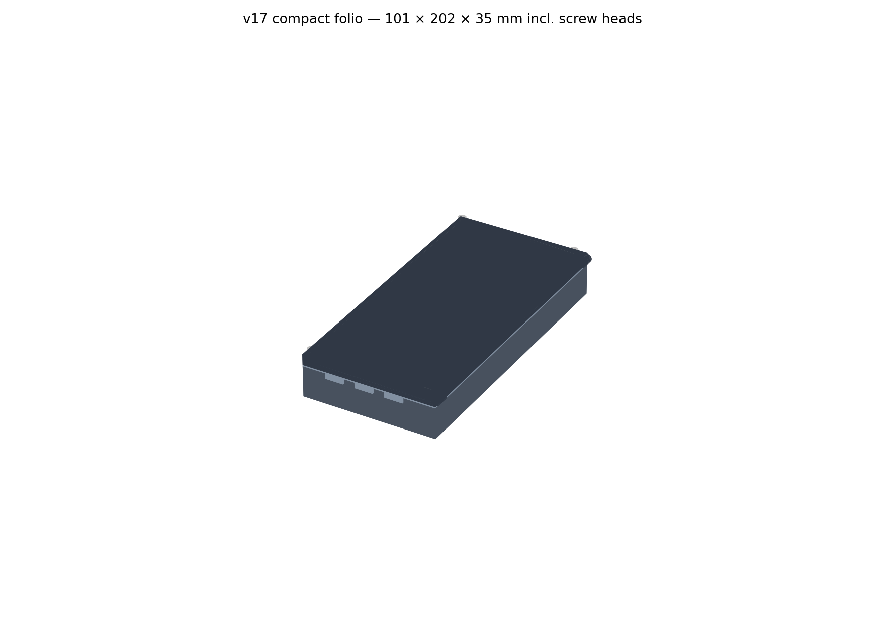
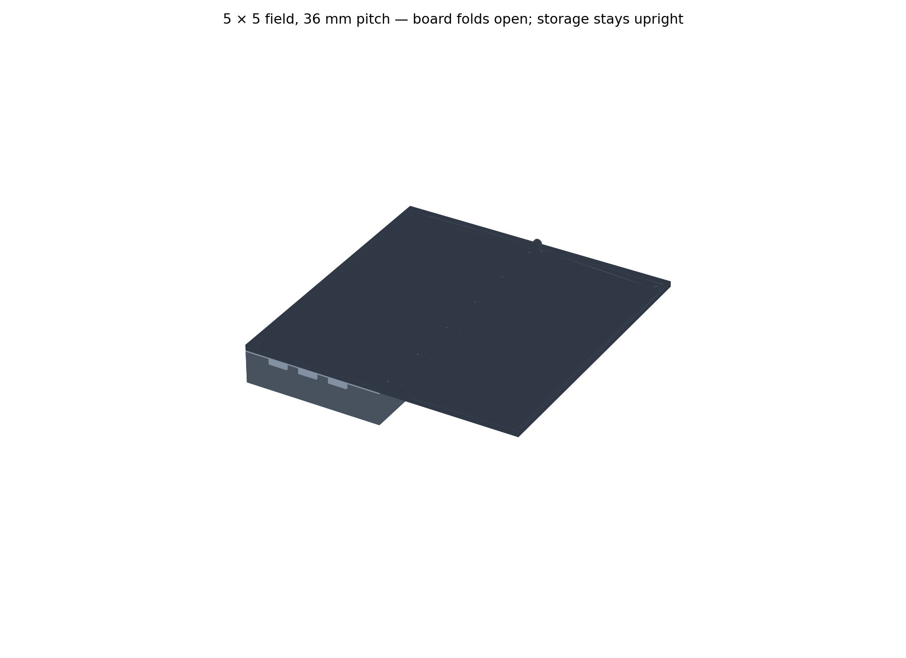
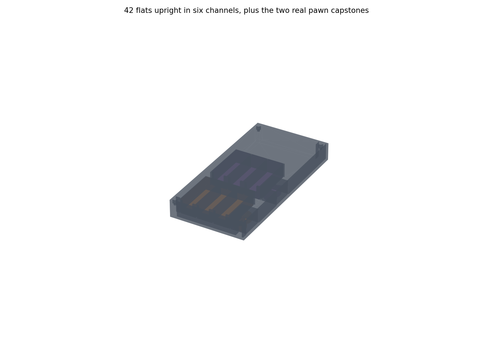
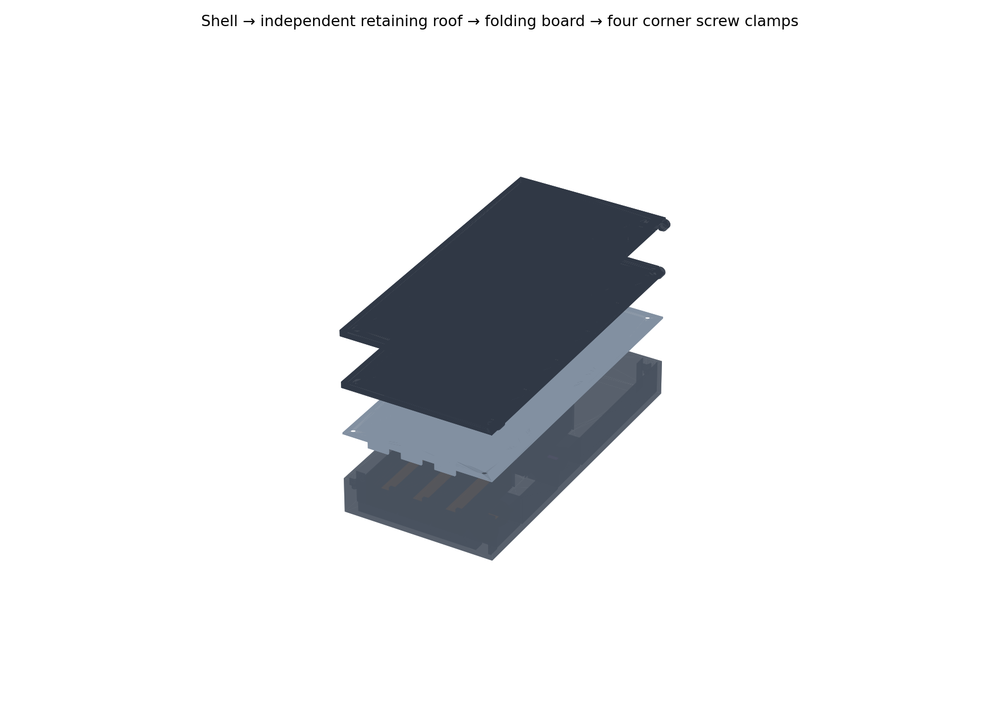

# Tak v17 — compact retained folio

**REJECTED DRAFT.** The user rejected having to unscrew storage to play.
Use [v17 tool-free](../v17-tool-free/README.md). This package is retained only
as design history; its print plates are not the current recommendation.

**Digital prototype. Not physically printed or accepted. Generic 3MFs are unsliced.**

The printed v16 did not retain its pieces, did not stay closed, and was too
large. v17 puts both teams in one shallow storage shell, closes that shell
with an independent roof, and clamps the roof and folded board with four M3
screws. There are no flexible transport latches. The 5×5 playing field stays
180 mm square at 36 mm pitch; the board is 3 mm thick instead of 2 mm.






| Envelope | v16 | v17 |
|---|---|---|
| Closed, including screw heads | 101 × 202 × 51 mm | 101 × 202 × 35 mm |
| Closed volume | 1.041 litres | 0.714 litres (31.4% less) |
| Open playing field | 180 × 180 mm | 180 × 180 mm |
| Board plate thickness | 2 mm | 3 mm |

The footprint follows the usable board. Most of the size reduction comes
from replacing two tall storage cavities with one storage layer. This is a
new assembly; **v16 bases, trays, inserts and board plates are incompatible**.
They remain untouched in the original package. This revision uses the plain
black/white flush grid; the astronomical inlays remain in v16.

## Pieces and retention

- Two banks of three channels; seven upright flats per channel, 21 per team.
- Primary fit: the existing **19.5 × 19.5 × 8 mm printed flats**. Each channel
  is 20.2 mm wide and 56.7 mm long: 0.35 mm each side, 0.7 mm total along
  seven pieces. Conservative **20 × 20 × 8 mm** flat envelopes also pass;
  their 0.1 mm side clearance needs a physical trial.
- Two separate 20.2 × 26.2 mm capstone cells fit the real original
  `pieces/cat-capstone.step` and `pieces/witch-capstone.step`, on their sides.
  This revision does not establish fit for the curled Fox/Cat or pagoda set.
- The roof sits 1.5 mm above the existing flats and 1.6 mm above the pawns.
  Dividers leave only 2.5 mm beneath the roof, below a flat's 8 mm minimum
  dimension. Flats cannot pass over the dividers while the roof stays seated.
- A 14.2 mm finger scallop exposes the leading flat in each channel. Roof
  tongues fill those scallops during transport, with 0.4 mm side/end clearance.
  Remove the roof to expose them; slide the remaining flats forward as used.
- Four corner screws clamp all three layers (folded board, roof, shell).
  Opening requires deliberate screw removal. Unlike the failed buckle,
  release does not depend on printed spring force or a small catch overlap.

The new arrangement constrains loose movement but does not promise silence.
Rattle, grip, roof stiffness and closure durability remain physical tests.
The 20 × 20 × 6 mm weighted prototype **is not the accepted piece package**:
its shorter channel loading leaves 14.7 mm slack and needs matching spacers.
The existing v16 insert's 98 mm lanes still do not fit five weighted flats.
The 25 mm pagoda pieces do not fit v17.

## Hardware and opening

Buy **four M3×16 socket-head screws and four M3 DIN934 hex nuts**; use a
2.5 mm hex key. The envelope assumes screw heads no larger than Ø6 × 3 mm.
The top-loaded nut traps are 5.7 mm across flats, with a ledge at z=18 mm.
Nuts have axial room to rise against the retaining roof during tightening.
Thread engagement, nut rotation resistance and safe tightening force need
the coupon. Screws are loose parts: they are not captive or printed thumbscrews.

1. Keep the case flat, shell underneath. Remove all four screws and place
   them somewhere safe. Do not tilt the unlocked case.
2. Lift the still-folded board off and unfold it on the table. The independent
   roof remains on the shell, so unfolding never rotates a loaded piece bank.
3. Lift the retaining roof straight up. Take stones from the scalloped ends.
4. Repack seven flats upright per channel and one original pawn in each cell.
5. Seat the roof without pressure, then stack the folded board, align the four
   holes and install the screws. Tighten only until seated; do not bow the lid.

## Small prints first

`plates/00-fit-trials.3mf` holds a nut block and two 3 mm plates. Stack both
plates on the 8 mm block and use an M3×10 screw: the block's roof-to-nut-seat
distance matches the full shell. Test free screw passage and a nut that
cannot spin. This coupon does not reproduce the full shell's bending loads.

`plates/00b-lane-retention.3mf` contains a two-stone section and its roof
tongue. Load two existing flats, seat the roof and temporarily clamp it.
Check pinching the front stone, sliding the second, roof fit and whether
stones can escape through the scallop when inverted. This partial lane has
an open cut end; block it during the inversion check.

The reused print-in-place hinge dimensions are still an untested physical
interface in this thinner board. The original v16 hinge coupon is a useful
starting point, but the new board root and underside need a slicer preview.
Print a board end section if that preview suggests a bridge/support problem.
Complete [ACCEPTANCE.md](ACCEPTANCE.md) before a loaded transport test.

## Deliverables and reproduction

- `models/`: assembled-coordinate STEP, including the two storage coupons.
- `stl/`: single-part print poses. Roof prints flat top down, tongues upward.
- `plates/01-shell-and-roof.3mf`: separate shell and roof on one 256 mm bed.
- `plates/02-folding-board.3mf`: hinged pair and both white grids in their
  shared frame. Import as one multicolour assembly; assign board objects
  black and grids white. The body/grid STLs are normalized separately:
  **do not assemble their individual STL origins without re-registering**.
- `previews/`: generated from the exported STEP readback.
- `reports/verification.json`: checks, environment, source and output hashes.
- `logs/build.log`: successful final build output.

```sh
python -m venv .venv-v17
. .venv-v17/bin/activate
pip install -r v17-compact-folio/requirements.txt
python -u v17-compact-folio/source/build.py
```

Run from a complete repository checkout: both original capstone STEP files
are required. The isolated work environment already had these dependency
versions installed; no dependency downloads were needed for this build.

Suggested initial slicing: CC2, 0.4 mm nozzle, PLA, 0.2 mm layers, four walls,
20% infill. Shell and upside-down roof have flat print surfaces; inspect the
hinge/pin overhangs on the board plate and add local supports only if needed,
avoiding the print-in-place clearances. **No ElegooSlicer is installed here;
these are generic, unsliced 3MFs, with no machine profile or G-code.** No print
time, mass, support-free claim or printer job is supplied.

Digital checks cover solid validity, sampled 0–180° folding, assembled part
clearance, 42 flat envelopes and both real pawns, representative escape
translations, screw envelopes, manifold/oriented STL readback, bed fit and
3MF geometry/name/unit readback. The geometric barriers do not establish
roof strength, clamping force, drop survival or physical spill resistance.

## Build notes

Baseline: `88bc668a1752b2dbc1a2edfc967dcbb525b6f4d0` (main, October 3).
Issue #18's thin board/rattle observations and this session's spill, closure
and excessive-size observations supersede v16's blanket “not printed” text.
Exact printed revisions, individual component history and material are still
unknown. No physical acceptance box has been marked complete.

The initial rim intersected a hinge barrel; adding the missing hinge-end
relief corrected the fold sweep. An initial coupon plate used indices from
the full part list and put a coupon off-bed; filtered enumeration corrected
the plate. The final build regenerates all affected outputs and passes.
