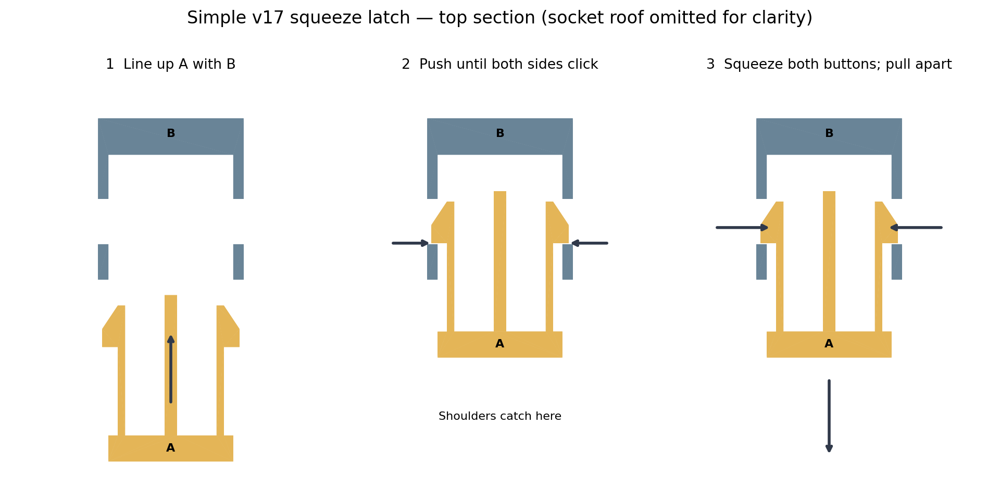

# Simple v17 squeeze latch — two-part hand trial

The prior four-part draw latch was rejected as confusing. This replacement
works like a backpack buckle: **push A into B until both side buttons click;
squeeze both buttons and pull apart to open.** There are two printed parts,
no separate hook, no pivot screws and no removable closure pin.



Print `plates/v17-simple-squeeze-latch.3mf`, which contains both labeled parts
on one small plate. A is the flexible clip; B is its socket. The proposed
trial material is PETG, especially for A; PLA spring life is not established.
The file is generic and unsliced. Check the socket's 24 mm roof bridge in
your slicer before printing; supports inside the socket must be removable.
Do not change XY scale independently because it changes the fit.

Hold the small root labeled A and the larger closed end labeled B. Insert
the two tapered arms and middle guide into B's open mouth. Push until both
buttons appear in its side windows. Pull gently without squeezing to check
that the shoulders lock. Squeeze both window buttons toward the middle,
then withdraw A. Stop if insertion requires force; record which surfaces bind.

The broad square shoulders carry withdrawal load; the spring arms position
the shoulders. This is a small hand-held fit trial, **not an integrated case
closure**. The four-leaf common-hinge case architecture remains selected.
Case attachments and loaded-case tests follow only after the clip works
comfortably. This does not fit existing v16 latch interfaces.

Checks pass for single valid solids, STEP readback, closed/oriented STL,
locked clearance, blocking 0.5 mm withdrawal, compressed-arm clearance in
1 mm steps, central-guide clearance, plate spacing and named-object 3MF
readback. Moving arm envelopes inward does not simulate elastic bending:
insertion force, strain, fatigue and retention remain physical tests.
No slicing or successful print is claimed.

Reproduce from repository root:

```
python v17-squeeze-latch/source/build.py
python v17-squeeze-latch/source/diagram.py
```

Dependencies are pinned in `requirements.txt`. Run provenance and source
hashes are in `reports/checks.json`; physical acceptance is unchecked.
