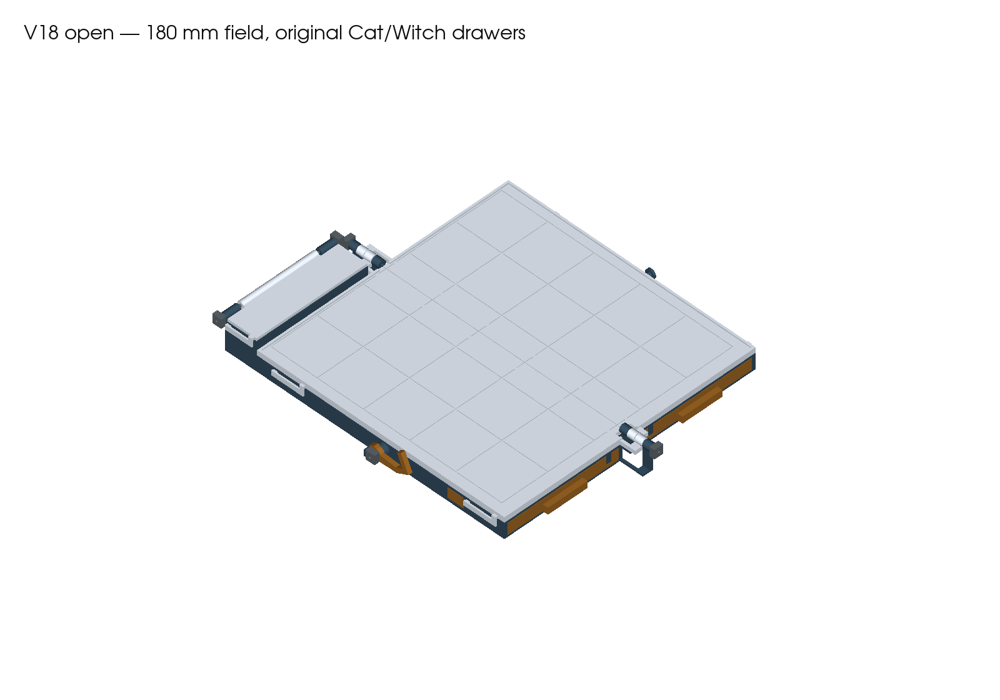
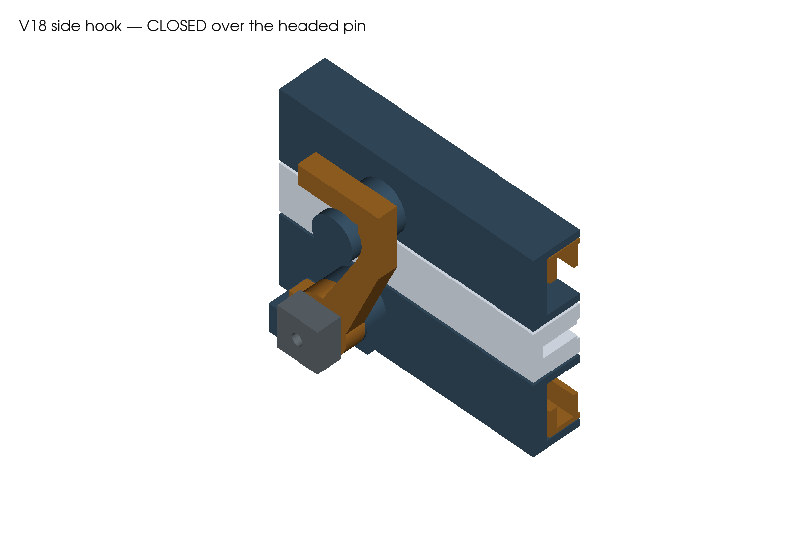
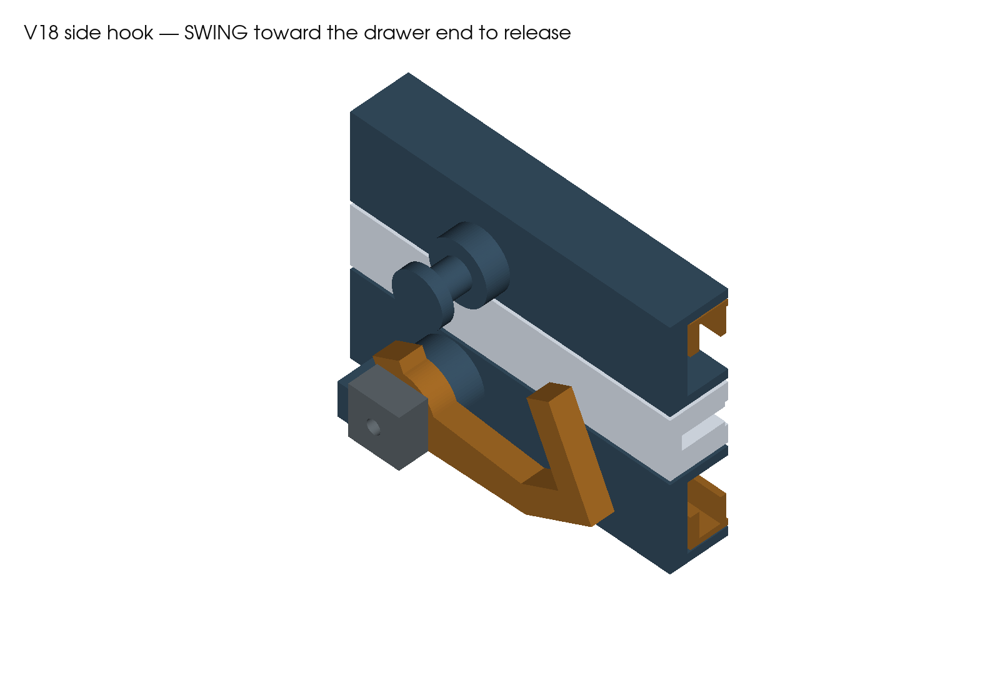

# V18 full build — side hook and filament hinges

**Print these five CC2-PLA projects for the complete case.** The user selected the simple side hook and pin on October 5. All four main leaves retain their common hinge axis and the full 180 mm playing field. [Download the complete kit](release/tak-v18-hook-and-pin-CC2-PLA.zip).

This is the first full print of this revision. The earlier clasp trial was printed; the new side hook and complete case have not been physically accepted. No printer job was started.

## Five print plates

| Plate | Contents | Orientation |
|---|---|---|
| [01 — Left housing](plates/01-left-housing-hook-pivot-and-cap-compartment-CC2-PLA.3mf) | Housing, hook pivot, capstone compartment and fixed hatch hinge | Rear end down |
| [02 — Right housing](plates/02-right-housing-and-hook-pin-CC2-PLA.3mf) | Housing and headed hook pin | Rear end down |
| [03 — Boards](plates/03-board-leaves-CC2-PLA.3mf) | Both board leaves and external release clips | Playing faces up |
| [04 — Drawers](plates/04-piece-drawers-CC2-PLA.3mf) | Both 21-flat drawers, catches, stops and grips | On their sides |
| [05 — Hatch and small parts](plates/05-hatch-hook-and-five-axle-caps-CC2-PLA.3mf) | Hatch, separate side hook and five axle collars | Hatch axis upright; hook flat; collar bores upright |

**13 printed parts, five plates.** Use this kit together: the previous clasp slider is not used. Existing v16 interfaces stay unchanged. The previous 3 mm axle kit remains archived.

## Printer settings

- **Elegoo Centauri Carbon 2, 0.4 mm nozzle**, 256 mm build volume.
- Retained starting material: **Generic PLA, 210 °C nozzle / 60 °C textured PEI**. Select the actual tested spool preset and reslice if it differs.
- **0.20 mm layers, four requested walls, 20% gyroid, 6 mm brim**, automatic normal supports, 30° support threshold, three upper interface layers and 0.20 mm contact gaps. Housing objects use 0.8 mm side clearance from supports; other parts use 0.35 mm. Preserve these object settings when reslicing. Thin spring sections resolve as solid narrow walls.
- Keep the supplied orientations. Housings print rear end down to keep supports out of the drawer tunnels. The hook prints flat. Do not scale the parts to adjust fit.
- The slicer retains a warning: Generic PLA has a 45 °C softening entry against a 60 °C bed. These are starting settings, not a qualified spool profile.

The retained profile estimates **32 h 18 min / 499 g** total, including support and brims. See [slicing.json](reports/slicing.json) for individual plates.

Fill the recessed grid with a high contrast finish, such as opaque white on a dark board. Keep paint within the 0.6 mm grooves so the playing surface stays flat.

## Cut four filament pins

Use straight, undamaged **1.75 mm PLA filament**. Cut square and remove burrs:

| Location | Length | Printed collars |
|---|---:|---:|
| Front main hinge | 24.9 mm | 1 |
| Rear main hinge | 24.9 mm | 1 |
| Capstone hatch | 92.0 mm | 2 |
| Side-hook pivot | 9.6 mm | 1 |

Main, hatch and hook bores are nominally **2.0 mm**; collar bores are **1.9 mm through holes**. These are design clearances, not measured printed fits. Check each bore with a short filament segment before assembly; it must pass without force.

## Assembly

1. Remove supports and brims. Check the drawer tunnels, board clips, pin bores, headed catch and hook throat. Deburr gently; do not round off retaining shoulders.
2. Arrange **left housing, left board, right board, right housing** flat, with their individual hinge knuckles interleaved along the common axis. Capstones go at the rear and drawer grips at the front.
3. Insert the two 24.9 mm main pins from the outside ends. Each outer collar receives approximately 2 mm of filament and sits about 0.5 mm clear of the barrel. The pins end short of the playing field. Dry-fit every leaf first. To stop withdrawal, bond each pin only at its exposed outer housing barrel: **left housing at the front, right housing at the rear**. Keep adhesive out of the other three moving leaves. Bond the collars to the pins. The passages have no hidden internal stops.
4. Fit the hatch between its rear ears, insert the 92 mm pin and bond that pin at one fixed housing ear only. Bond both collars to the pin with approximately 2 mm insertion and 0.5 mm clearance from the ears. The hatch must rotate freely.
5. Fit the side hook on the left housing pivot, with its mouth facing the rear when upright. Insert its 9.6 mm filament pin from outside and bond the inner end in the fixed mount. Fit the outer collar with approximately 2 mm insertion. Unlike the main hinges, this collar **lightly contacts the hook**: set it for smooth thumb movement with enough friction to hold its position, then bond it to the pin. Keep adhesive off the hook and bearing faces. There is no spring detent; check this friction after repeated use.
6. Insert each drawer from the front. Press its rear stop arm inward to pass the housing stop, then release it. Press the broad outer catch while seating the drawer fully; it must latch before folding.
7. Pull both external board clips outward while lowering each board onto its housing; release them into their pockets. Both playing faces must sit flat.
8. Test the empty case, then load the exact original Cat/Witch set. Use [ACCEPTANCE.md](ACCEPTANCE.md) to record fit, comfortable release and loaded retention. Do not force a sticking joint.



## Close and open

Seat both drawers, close the hatch and engage both boards. Swing the side hook toward the drawer end, fold the right housing and board closed together, then swing the hook upright over the headed pin. The pin's head keeps the hook from slipping off sideways; the hook shoulder blocks separation.

To open, gently squeeze the case halves together to unload the hook, then swing it **65° toward the drawer end** using the broad tab. Unfold the right pair. The hook has a reverse stop and an adjustable friction pivot. Physical testing must establish whether that friction reliably prevents accidental rotation during carrying; the digital opening check establishes geometric engagement only.




- **Drawers:** press the broad side button and pull the front grip. The stop at 168 mm exposes all 21 flats. Support the drawer on the table. To remove it deliberately, press the rear stop arm inward as it reaches the opening.
- **Board maintenance:** release both clips before rotating a board independently; leave them engaged during normal play and folding.
- **Capstones:** pull the external hatch clip outward and lift the hatch. Two 12 mm floor ports allow an upward finger push to aid retrieval.

## Pieces and compatibility

The field remains **5×5, 180 mm across, 36 mm pitch**. This build checks detailed original Cat/Witch CAD from `pieces/tak_pieces.py`: 42 flats at **20×20×8 mm**, 20.7 mm seats and 0.4 mm roof clearance. The original capstones lie in the rear compartment. The original Cat capstone STL has an open mesh, so its valid detailed CAD is used for fit checks. No piece exports changed.

Weighted flats and curled Fox/Cat capstones remain unverified here; the existing weighted-stone/current-insert mismatch stays explicit. V16 parts and the premium pagoda are separate. The earlier trial clasp is retained as history. New housings and filament-bore parts replace the previous integrated clasp/3 mm axle geometry; the drawers retain their dimensions.

Closed envelope including all hardware: approximately **112.3 × 245.8 × 32.6 mm**. The playing field has not been reduced.

## Evidence and reproduction

The reports check valid single solids, STEP/STL and named-object 3MF readback, original-piece fit, sampled loaded folding and releases, hook engagement, filament hardware clearances and actual sliced pin passages. Sampled motion is not a continuous sweep proof. Spring deflection poses do not establish force or fatigue. First-print fit, support removal, strength and transport retention remain physical tests.

Use Python 3.12 with [requirements.txt](requirements.txt), plus installed macOS ElegooSlicer:

```sh
python v18-case/source/build_case.py
python v18-case/source/verify_field.py
python v18-case/source/verify_hardware.py
python v18-case/source/package_case.py
python v18-case/source/slice_case.py
python v18-case/source/render_case.py
python v18-case/source/inspect_case_layers.py
python v18-case/source/verify_pin_toolpaths.py
python v18-case/source/record_provenance.py
python v18-case/source/package_release.py
python scripts/verify_v18_freeze.py
```

After rendering new toolpaths, review them and record observations in `reports/layer-inspection.json` before running the provenance check. Current commands, environment, limitations and repaired failures are in [BUILD-PROVENANCE.md](BUILD-PROVENANCE.md). Source and final payload hashes are pinned in the manifest. The original recessed-clasp package remains byte-for-byte frozen.
