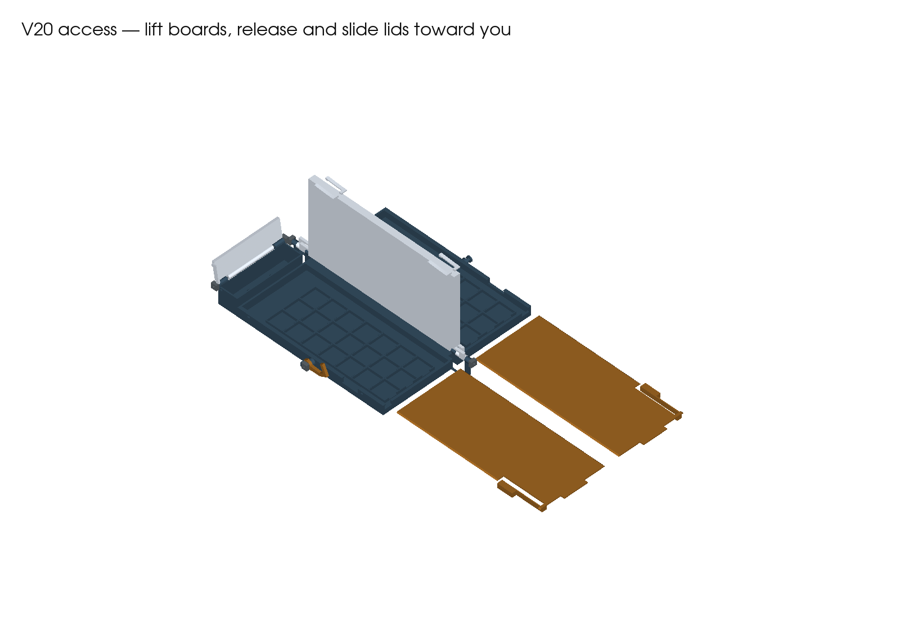
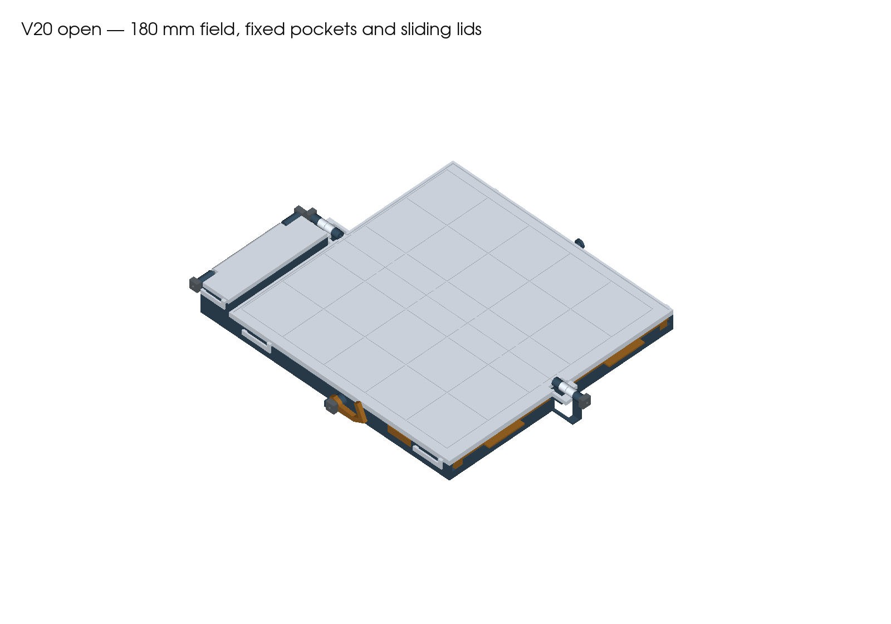
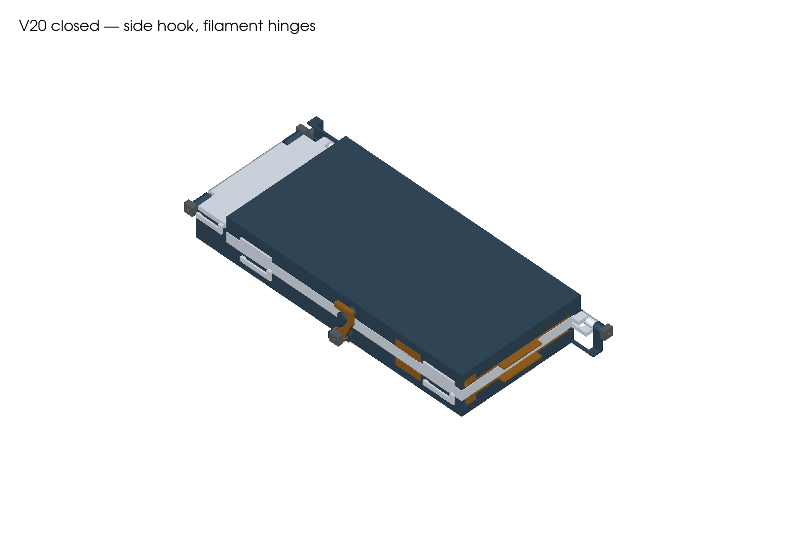

# V20 — flat-printing case with sliding storage lids

**Open the five files in PRINT.** Every part has a broad, low printing orientation. The two bases contain fixed pockets; the separate lids slide into rails and latch closed. There are no removable drawers and no glued storage roofs.

This is the first full-print kit for this design. Digital checks are recorded in reports; physical fit, thumb force, wear and loaded retention remain untested. No printer job has been started.

## What to print

| Plate | Parts | Supplied orientation |
|---|---|---|
| [01 — Left base](PRINT/01-left-housing-hook-pivot-and-cap-compartment-CC2-PLA.3mf) | Fixed pockets, lid rails, hook pivot and capstone compartment | Broad bottom down |
| [02 — Right base](PRINT/02-right-housing-and-hook-pin-CC2-PLA.3mf) | Fixed pockets, lid rails and hook keeper | Broad bottom down |
| [03 — Boards](PRINT/03-board-leaves-CC2-PLA.3mf) | Two hinged board leaves | Playing faces up |
| [04 — Sliding lids](PRINT/04-sliding-storage-lids-CC2-PLA.3mf) | Two lids with integrated thumb catches | Broad top faces down |
| [05 — Hatch and hardware](PRINT/05-hatch-hook-and-five-axle-caps-CC2-PLA.3mf) | Capstone hatch, side hook and five axle collars | Hatch broad top down; hook flat; collars bore up |

**13 printed parts across five plates.** The inherited filenames use “housing” for each fixed-pocket base. Geometry-only 3MFs are in plates; source and dependencies are in source. Use the kit together. Do not mix the V19 drawers or housings into V20.

## Opening and loading

1. Gently squeeze the closed case to unload the side hook. Swing the hook **65° toward the front**, then unfold the case. Keep both storage lids latched.
2. Pull a board's two outside clips outward and lift that board leaf to approximately **90°**. Support it while accessing storage; there is no hold-open detent.
3. Press the **20×5.6 mm lid button** on the outer wall inward until it clears the rail (nominal travel **4.5 mm**). Pull the broad front tab toward you. Keep the button pressed while it passes the end of the rail, then remove the lid fully and set it beside the case. There is no captive withdrawal stop.
4. Lift the pieces from their fixed pockets. Reverse the slide to close storage; press the button while inserting, seat the lid against the rear stop, then release the button into its window. Give the front tab a gentle pull to confirm engagement.
5. Lower the board with its clips pulled outward; release them into the base. Repeat on the other half. Keep the lids in place underneath the boards during play.
6. To repack, open one lid at a time, replace the pieces and relatch each lid before folding. Close the capstone hatch, fold the right half over the left and swing the outside hook over its headed pin.

The rails retain each lid vertically. The lid button blocks sliding withdrawal; the rear wall stops over-insertion. These are geometric engagements, not measured holding forces. Never force a sticking lid or button.

## Printer settings

Prepared for **Elegoo Centauri Carbon 2, 0.4 mm nozzle, 256 mm bed**, Generic PLA starting profile at 210 °C nozzle / 60 °C textured PEI. Use the actual tested spool preset and reslice if it differs.

0.20 mm layers; four requested walls; 20% gyroid; 6 mm outer brim. Automatic normal supports remain enabled, with three upper interface layers and 0.20 mm contact gaps. The board panels retain a broad removable support sheet underneath because their clips project below the panels; the playing faces print upward. Other support is local to hardware and clip details. Bases retain a 0.8 mm support side clearance; other parts use 0.35 mm. Inspect supports before removal. The sloped lid rails avoid the former broad enclosed roof, but the whole kit is not claimed support-free.

Preserve supplied orientations and scale. Remove brim carefully from lid edges and flex slots. Paint the board's recessed grid with a high-contrast finish and keep its playing surface flat.

**Full-kit estimate: 18 h 26 min / 402 g**, including support and brims. Tallest printed part: **25.8 mm**. Current slicer estimates and warnings are in [reports/slicing.json](reports/slicing.json). The retained PLA profile warns about its 45 °C softening entry versus the 60 °C bed; this is an unqualified starting spool profile.

## Optional short fit check

The complete build is already in PRINT. For a smaller check of the new rail/button fit, [FIT-CHECK](FIT-CHECK/README.md) contains front sections cut from the actual V20 base and lid. It is optional and does not replace any full-case part.

## Filament hinges and assembly

Use straight, undamaged **1.75 mm PLA filament**, with square, deburred ends.

| Pin | Cut length | Collars |
|---|---:|---:|
| Front main hinge | 24.9 mm | 1 |
| Rear main hinge | 24.9 mm | 1 |
| Capstone hatch | 92.0 mm | 2 |
| Side-hook pivot | 9.6 mm | 1 |

Main, hatch and hook bores retain a nominal **2.0 mm circular core**, with pointed reliefs on horizontal passages for printing. Collar bores are **1.9 mm**. Printed fit must be checked without forcing.

1. Remove supports. Dry-fit both sliding lids before installing boards. Check the base floor, pocket openings, rails, catch slots and hinge bores.
2. Interleave **left base, left board, right board, right base** on the common hinge axis. Insert the two main pins from the outside ends. Each collar receives approximately 2 mm of filament and stays about 0.5 mm clear of its barrel.
3. After dry movement checks, bond each main pin only at its exposed stationary housing barrel: **left front and right rear**. Bond the collars to the pins. Keep adhesive away from all moving leaves.
4. Fit the capstone hatch between its rear ears, insert the 92 mm pin and bond it at one fixed housing ear only. Bond the two collars to the pin, leaving approximately 0.5 mm running clearance from the ears.
5. Fit the side hook to the left pivot with its mouth facing the rear in its closed position. Insert the short pin from outside and bond its inner end at the fixed mount. Set its collar for light contact against the hook and smooth thumb movement, then bond the collar to the pin. Keep adhesive off the hook. There is no rotational detent; the collar's friction must be checked after wear.
6. Complete the [physical acceptance checks](ACCEPTANCE.md) first empty, then with the exact piece set below.

## Piece set and compatibility

This kit targets the **original Cat/Witch set: 42 flats at 20×20×8 mm and the original capstones**, defined by source/vendor/pieces/tak_pieces.py. Fixed seats are 20.7 mm square with front finger openings. The flat tops have a nominal 0.4 mm clearance below the closed lid. Pockets move 4 mm inward from V19 to clear the lid's thumb release.

The board remains **5×5, 180×180 mm, 36 mm pitch**, on the same four-leaf hinge axis. Weighted flats and curled Fox/Cat capstones are unverified. The capstone hatch is 1.4 mm thicker on its outer face to print flat. V16 and the premium pagoda stay separate. Earlier printed clasp and filament trials do not validate the new sliding lids.

