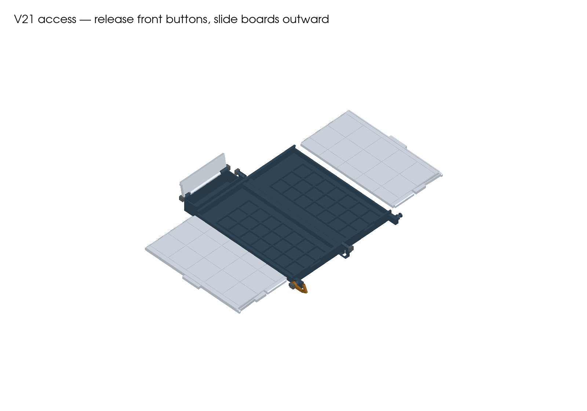
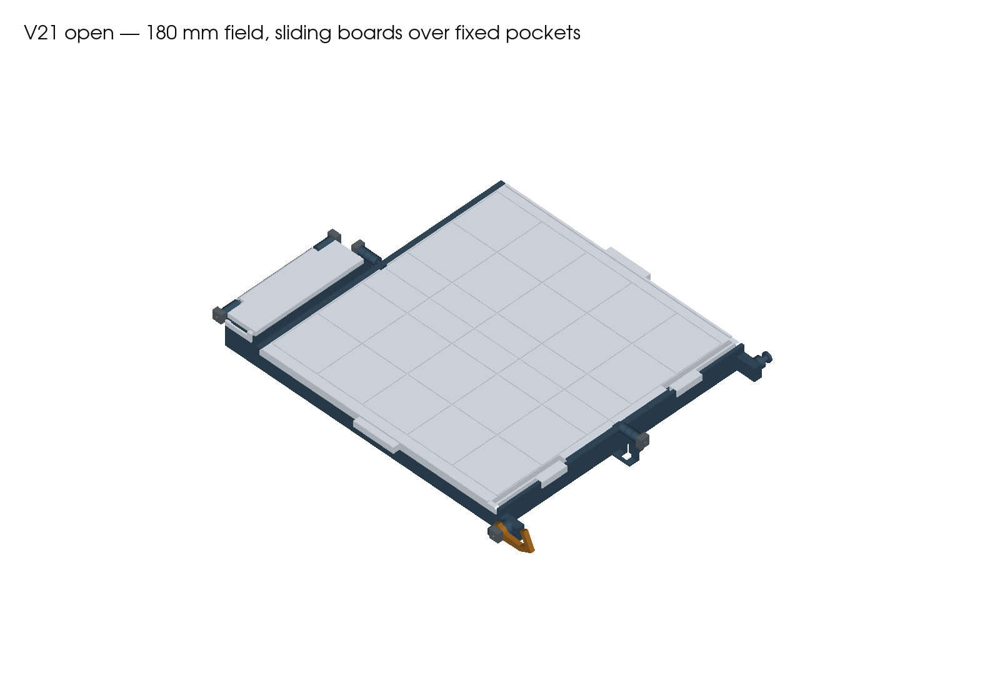
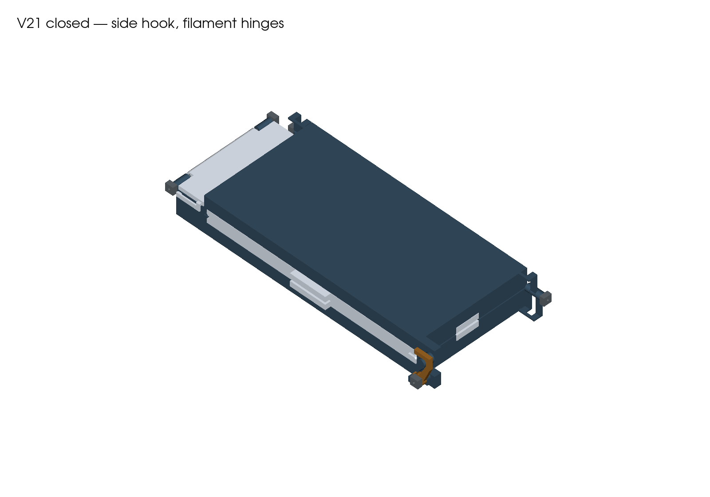

# V21 — the boards are the sliding storage lids

**Print the four projects in PRINT.** Each board half slides outward to uncover its piece pockets, then slides back and latches to become the playing surface. Only the two bases are hinged. There are no separate storage covers or board hinges.

**Full-kit estimate: 12 h 35 min / 287 g.** All parts print low and flat; tallest part **25.8 mm**. Geometry and slicing checks pass, but physical fit, release force, wear and loaded retention remain untested. No printer job has been started.

## Four print plates

| Plate | Parts | Supplied orientation |
|---|---|---|
| [01 — Left base](PRINT/01-left-housing-hook-pivot-and-cap-compartment-CC2-PLA.3mf) | Fixed pockets, board rails, front-corner hook mount and capstone compartment | Broad bottom down |
| [02 — Right base](PRINT/02-right-housing-and-hook-pin-CC2-PLA.3mf) | Fixed pockets, board rails and hook keeper | Broad bottom down |
| [03 — Sliding boards](PRINT/03-sliding-board-tops-CC2-PLA.3mf) | Both playing surfaces with front release buttons | Flat underside directly on bed; playing faces up |
| [04 — Hatch and hardware](PRINT/04-hatch-hook-and-five-axle-caps-CC2-PLA.3mf) | Capstone hatch, side hook and five axle collars | Hatch broad top down; hook flat; collar bores up |

**11 printed parts, four plates.** Geometry-only 3MFs are in plates. Reproducible source and its dependencies are in source. The inherited filenames call each base a “housing.”

## Access and play

1. Gently squeeze the closed case to unload the hook. Swing the hook **65° toward the front**, then unfold the case flat. Keep both board tops latched while unfolding.
2. With the playing surface clear, press a board's **front button toward the rear** by approximately **2.8 mm**. Pull its broad outside tab **away from the centre seam**: left board leftward, right board rightward. Keep the button pressed until it passes out of the front rail, then remove the board fully and set it beside the case. Allow about 11 cm of space beside each half and support the board as it leaves the rails.
3. Retrieve the pieces from their fixed pockets. Reverse the slide to replace the board, holding its button inward while it enters. Slide toward the centre until the inner stops seat, then release the button into its window. Give the outside tab a gentle pull to check engagement.
4. Seat and latch both boards before placing pieces on the full 5×5 playing surface. Use the separate rear hatch for capstones.
5. To repack, keep the case flat, remove one board at a time, load its pockets and relatch it. Close the capstone hatch. Fold the right half over the left, then swing the outside hook over its headed pin.

The **20×4.7 mm front buttons** block outward sliding. The rails hold the seated boards down; inner stops set their playing position. Boards are fully removable and have no captive withdrawal stop. Sliding fit, board steadiness and comfortable release still need physical checks; do not force a sticking part.

## Filament pins — new main-hinge lengths

Use straight, undamaged **1.75 mm PLA filament**, with square, deburred ends. **The V21 main pins are 14.9 mm, not V20's 24.9 mm.**

| Pin | Cut length | Printed collars |
|---|---:|---:|
| Front main hinge | **14.9 mm** | 1 |
| Rear main hinge | **14.9 mm** | 1 |
| Capstone hatch | 92.0 mm | 2 |
| Side-hook pivot | 9.6 mm | 1 |

All hinge/pivot passages retain a nominal **2.0 mm circular core**, with pointed roof reliefs for horizontal printing. Collar bores are **1.9 mm**. Printed fit must be checked without forcing.

## Assembly

1. Remove supports and brim. Clear the board flex slots and rail edges carefully. Dry-fit each board in its base before installing any pins. Paint the recessed grid with a high-contrast finish, keeping the playing surface flat and paint away from rails and buttons.
2. Interleave the two bases' three-knuckle front and rear hinges. Insert the two short main pins from the outside ends. Each collar receives about 2 mm of filament and sits approximately 0.5 mm clear of its barrel.
3. After dry rotation checks, bond the front pin only at the **left base's front outer barrel**, and the rear pin only at the **right base's rear outer barrel**. Bond the collars to the pins. Keep adhesive away from the moving base's barrels. The boards use no hinge pins.
4. Place the hatch between its rear ears. Insert its 92 mm pin and bond it at one stationary housing ear only. Bond the two collars to the pin with approximately 0.5 mm running gaps at the ears.
5. Fit the side hook at the **left front corner**, with its mouth facing the rear in the closed position. Insert the short pivot pin from outside and bond its inner end at the stationary mount. Set the outer collar to lightly contact the hook, allowing smooth thumb movement with enough friction to hold position, then bond the collar to the pin. Keep adhesive off the hook. Its friction has no detent and must be checked after wear.
6. Insert and latch both boards. Complete the [physical acceptance checks](ACCEPTANCE.md) first empty, then with the exact piece set below.

## Printer settings

Prepared for **Elegoo Centauri Carbon 2, 0.4 mm nozzle, 256 mm bed**, using the retained Generic PLA starting profile at 210 °C nozzle / 60 °C textured PEI. Use the actual tested spool preset and reslice if it differs.

0.20 mm layers, four requested walls, 20% gyroid, 6 mm outer brim. Automatic normal supports remain enabled for local features, with three upper interface layers and 0.20 mm contact gaps. Bases use 0.8 mm support side clearance; other parts use 0.35 mm. The boards contact the bed directly and no longer need the broad underside support sheet used in V20. The complete kit is not claimed support-free.

Preserve supplied orientations and scale. Estimates, warnings and exact settings are in [reports/slicing.json](reports/slicing.json). The retained PLA profile warns about a 45 °C softening entry versus the 60 °C bed; it is not a qualified spool profile.

## Optional small fit check

The complete build is ready in PRINT. [FIT-CHECK](FIT-CHECK/README.md) contains a separate **60-minute / 19 g** rail-and-button trial using sections of the actual base and board. It checks the new joint with less material and does not replace any full-case part.

## Pieces and compatibility

The target is the **original Cat/Witch set: 42 flats at 20×20×8 mm plus the original capstones**, defined in source/vendor/pieces/tak_pieces.py. The 20.7 mm fixed seats have finger openings and nominally 0.4 mm clearance above the flats beneath the board. Weighted flats and curled Fox/Cat capstones remain unverified.

The field remains **5×5, 180×180 mm, 36 mm pitch**, with a nominal 0.4 mm centre seam. Closed CAD envelope including hardware is **112.3×243.8×32.6 mm**. Printed dimensions and steadiness remain unmeasured.

V21 needs new bases, boards and shorter main pins. V20's separate lids and hinged boards are not used. The capstone hatch, side hook and collars retain their V20 shapes; the hatch and hook move to new assembly positions. Earlier clasp and filament trials do not validate this board-slider mechanism. V16, the premium pagoda and all older archives stay separate.

