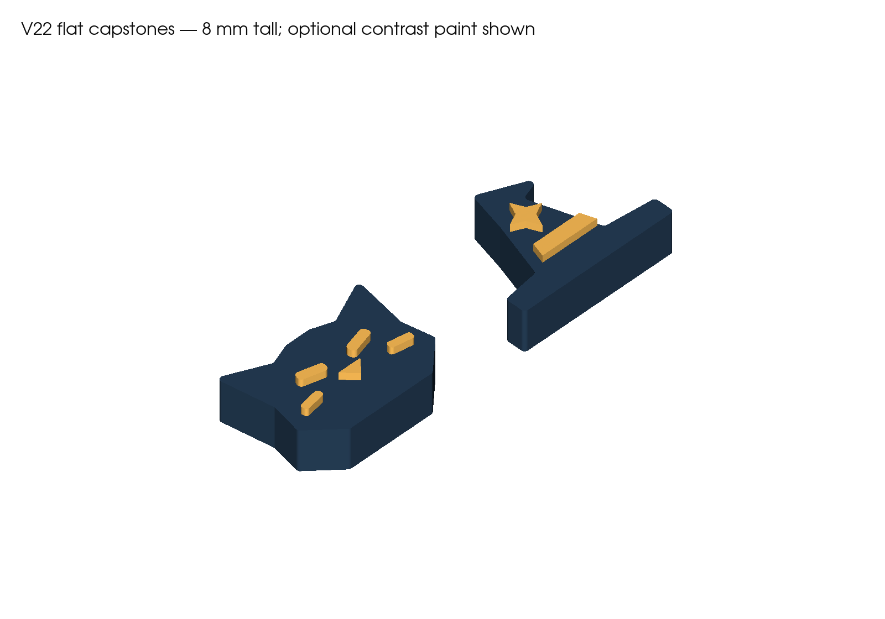
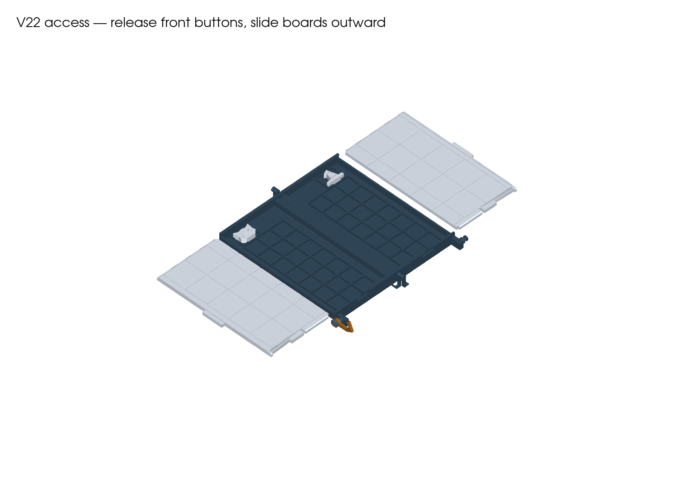

# V22 — print-in-place hinges and flat capstones

**Print the three projects in PRINT.** The paired bases print together, open flat, with captive main hinges. Each playing-board half slides outward to uncover 21 flat stones and one flat capstone. The rear compartment and its hatch are gone; the closed box stays **32.6 mm thick**.

## Three full-build plates

| Project | Contents | Orientation |
|---|---|---|
| [01 — Paired bases](PRINT/01-print-in-place-bases-CC2-PLA.3mf) | Two bases with captive main pivots, fixed pockets and capstone bays | Together, open flat, broad floors on the bed |
| [02 — Sliding boards](PRINT/02-sliding-board-tops-CC2-PLA.3mf) | Left and right playing surfaces / storage covers | Broad undersides down |
| [03 — Capstones and hook](PRINT/03-flat-capstones-hook-and-collar-CC2-PLA.3mf) | Flat Cat capstone, flat Witch capstone, side hook and one collar | Capstones broad bottom down; hook flat; collar bore up |

**Eight printed parts across three plates.** Full-kit slicer estimate: **11 h 17 min / 268 g**, including support and brims. Maximum part height is 19.3 mm. These are first-print files with digital checks; physical fit and loaded retention remain untested.

**Keep plate 01 grouped as one assembly. Do not separate, auto-arrange or reorient its two parts.** Their relative positions create the captive hinges. Supports are restricted to the build plate and brim width is zero on that assembly, to keep support and brim out of the moving gaps. The two solids remain separate inside the project.

## Pieces and capstone storage

Use **42 original Cat/Witch flat stones, 20×20×8 mm**, plus the **two new V22 flat capstones included on plate 03**. The 42 ordinary stones are not repeated on the case plates. Each new capstone has a 6.8 mm body and 1.2 mm raised detail, for 8 mm total height. Cat is approximately 24.65×17.89 mm; Witch is 26×19.27 mm. They stay flat during play as well as in storage.

Each half has a 27.2×21.2 mm capstone bay behind its seven rows of ordinary stones. Front and side openings give finger access; the capstone projects about 4.5 mm above the rim. A closed board leaves a nominal 0.4 mm gap above the 8 mm pieces. Exact CAD fit, sampled retrieval, roof containment and sliding checks pass; comfortable physical retrieval is still to be tested.

**The older sculpted and curled capstones do not fit these shallow bays.** Weighted flat-stone packages also remain unqualified. Existing pieces and archives have not been changed.

The preview below shows optional contrasting paint on the raised marks. Each capstone is a single printable part; no folding mechanism, insert or multicolour printer is required. Keep paint off the bottom and keep total finished height within the storage clearance.

## Assembly

1. Let plate 01 cool. Remove external supports and any stray strings. Work the two captive main hinges gently through their range; stop if a joint is fused rather than forcing it. **The main hinges take no added filament pins or glue.**
2. Remove brim and supports from the other parts. Clear the board catch slots and rail edges. Dry-fit each board in its base and check that it seats and latches. Use contrasting grid fill if desired, keeping paint away from sliding faces and catches.
3. Fit the side hook at the left front corner. Its pivot still uses **one 9.6 mm length of straight 1.75 mm PLA filament** and the single printed collar. Cut the filament square and deburr it. Nominal pivot bore is 2.0 mm; collar bore is 1.9 mm.
4. After dry rotation checks, bond the hook pin at the fixed mount and bond the collar to the pin. The collar should lightly contact the hook to provide friction. Keep adhesive off the moving hook and all captive main joints. The hook has no positive detent; resistance to accidental opening and wear require physical testing.
5. Dry-fit the supplied flat capstones in their rear bays. Complete the [physical acceptance checks](ACCEPTANCE.md) before relying on loaded transport.

## Open, play and repack

1. Swing the side hook toward the front end to release it. Unfold the case fully onto a flat surface with both boards latched.
2. Press a board's broad front button approximately **2.8 mm toward the rear**, then pull its outside tab away from the centre seam. Allow about **11 cm of clear space** on that side. The board is fully removable; support it as it exits.
3. Retrieve the ordinary stones and flat capstone, then slide that board inward until it stops and latches. Repeat on the other half. Keep both boards seated for play.
4. To repack, remove one board at a time while the case lies flat. Put 21 ordinary stones in its pockets and its flat capstone in the rear bay, then replace and latch the board. Repeat for the other half.
5. Fold the right half over the left and swing the hook over its headed catch. Both boards must be latched before folding.

## Printer settings and optional trial

The supplied projects target **Elegoo Centauri Carbon 2, 0.4 mm nozzle, PLA, 0.20 mm layers, four walls and 20% gyroid infill**, with the included machine/filament/process profiles. Flat bases and boards contact the bed directly. Some external hinge/hook support remains. Preserve plate 01's object-specific support/brim settings when changing filament presets.

ElegooSlicer 2.4.2 sliced all three projects successfully. The Generic PLA softening-entry/bed-temperature warning remains; the profile is an unqualified starting preset for the user's actual spool. No printer job has been started.

The separate [optional captive-hinge trial](FIT-CHECK/README.md) takes approximately **22 minutes / 3.8 g**. It checks the actual hinge cross-sections before a full base print, without replacing any full-build part. It does not qualify capstone fit, full-base warping, sliders or transport.

## Dimensions, compatibility and source

The playing field remains **5×5, 180×180 mm, 36 mm pitch**, with the retained 0.4 mm centre seam. Closed envelope including hook hardware: **111.8×220.2×32.6 mm**. This is 23.6 mm shorter than V21's recorded envelope, with unchanged thickness.

V22 requires new paired bases and the supplied flat capstones. Exported board, hook and collar shapes match V21; printed interchangeability is unobserved. The former rear hatch and the main/hatch filament axles are not used. Only the hook uses an inserted filament pivot.

The kit includes CAD sources, required dependencies, STEP/STL exports, geometry 3MFs, sliced projects with embedded Gcode, previews and reports. See [build provenance](BUILD-PROVENANCE.md). V18–V21, printed V16 parts and the separate premium pagoda are preserved.
