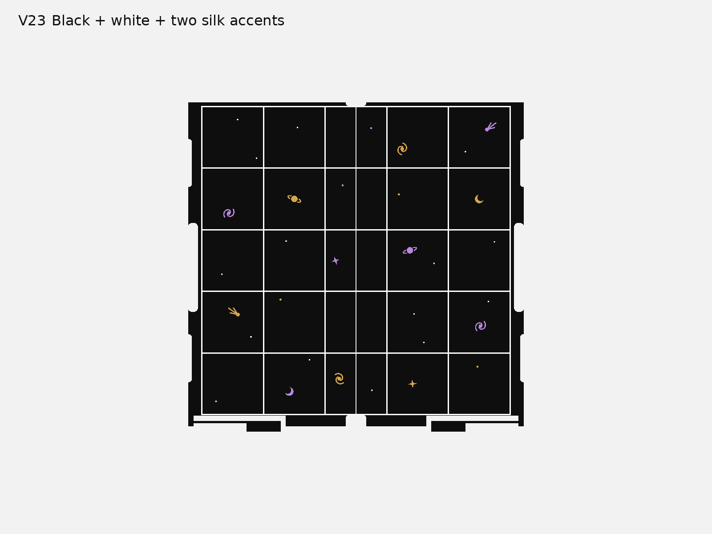
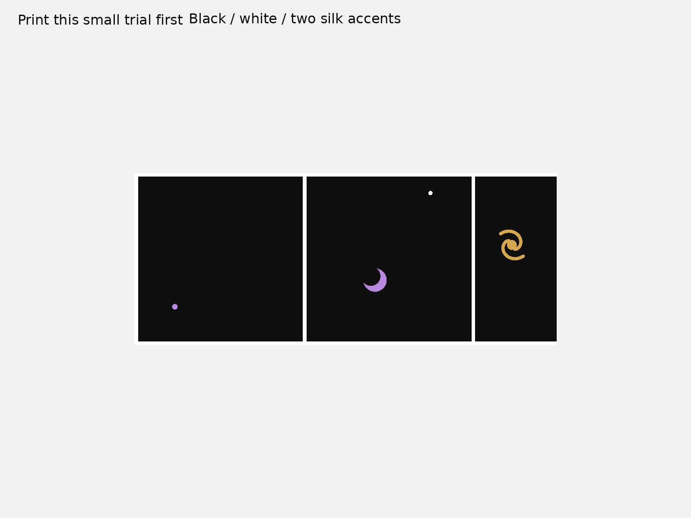

# V23 flush board inlays

**Print the small trial first.** This replacement-board option uses a black playing surface, a white 5×5 grid and white stars. Moons, ringed planets, comets, spiral galaxies and a few stars use two separately assigned silk PLA accent colours, following the original orange/purple artwork groups. The same artwork is also supplied entirely in black and white, using the two colours already loaded.



The grid is the retained v17 four-leaf grid: 0.8 mm wide, at 36 mm pitch on the full 180×180 mm field. The celestial artwork is the original v16 CAD, retained in the same cell positions and moved to the V23 face height. V17 itself has the grid but no celestial artwork. All colour solids finish flush at Z15.3 mm, with 0.6 mm inlay depth. The finish adds no raised images beneath pieces.

This is an optional **replacement for V23 plate 02 only**. It fits the retained V23 sliding-board geometry digitally. Bases, captive hinges, recessed hook, capstones and the original complete-kit ZIP remain unchanged. These boards do not fit the earlier V16 or V17 case interfaces. The supplied V23 flat Cat/Witch capstones and original 20×20×8 mm flats are the checked piece package; weighted flats and curled capstones remain unqualified.

## Files to use

| Choice | CC2 project | Colour slots |
|---|---|---|
| Small trial with loaded colours | [00 — black and white](PRINT/00-inlay-trial-black-white-CC2.3mf) | 1 black, 2 white |
| Small trial with two silk accents | [00 — optional silk](PRINT/00-inlay-trial-black-white-silk-CC2.3mf) | 1 black, 2 white, 3 accent 1, 4 accent 2 |
| Both replacement boards, loaded colours | [02 — black and white](PRINT/02-boards-black-white-CC2.3mf) | 1 black, 2 white |
| Both replacement boards, two silk accents | [02 — optional silk](PRINT/02-boards-black-white-silk-CC2.3mf) | 1 black, 2 white, 3 accent 1, 4 accent 2 |

Slicer estimates: black/white trial **43 min / 12.23 g**; four-colour trial **1 h 12 min / 19.45 g**; both black/white boards **7 h 40 min / 114.70 g**; both four-colour boards **8 h 10 min / 121.76 g**. These include supports/purge; actual silk settings can change them. Exact values are in [the fresh slicing report](reports/slicing.json).

Gold and purple in the preview are example accent colours; choose your two silk colours in ElegooSlicer. **The four-colour project contains two generic PLA placeholders limited to 6 mm³/s. Select both actual silk spool profiles and reslice before printing it.** Black/white use the retained V23 Elegoo PLA profile; match it to the spools actually loaded. These are local dry slices, with no printer job started.

Keep each board grouped as one multicolour assembly. Its body, grid, stars and artwork must remain registered. Colour is assigned by part: black body; white grid and stars; orange-group artwork in slot 3 and purple-group artwork in slot 4, or all-white artwork for the two-colour project. Arrange complete assemblies only. Do not split or independently arrange the inlays. Bare STLs under `models/` retain their shared assembly coordinates and are supplied for inspection, rather than independent printing.

The projects use a 0.4 mm nozzle, 0.10 mm layers after a 0.20 mm first layer, the retained V23 support settings and an enabled prime tower. The inlays occupy the last six 0.10 mm layers of the playing face. Both boards remain underside down in their original plate positions. Inspect the selected spool profiles, purge settings, tower and supports in ElegooSlicer after any material change.

## Small physical trial



The trial is 90.2×36.8×1.8 mm: two complete front-row cells plus the seam half-cell, cropped from the actual board. It includes the white grid, small white/accent stars, purple-group moon and orange-group spiral galaxy. Its 1.2 mm backing reduces material; it does not test V23 rail or catch fit.

- [ ] White stays distinct from black, including immediately after a colour change.
- [ ] Both accent colours print continuously and bond without lifting.
- [ ] A fingernail passes across each colour boundary without catching.
- [ ] Stones slide across the finish without rocking, scraping or snagging.
- [ ] The chosen finish and contrast remain easy to see in normal lighting.

Then print one replacement board and dry-fit its rails, release catch and grips before printing the second. Physical sliding friction, release force, colour bleed, silk bonding and loaded transport remain unobserved.

## Reproduce and inspect

From the repository root, using an isolated environment with `source/requirements.txt`:

```sh
python v23/board-inlays/source/build.py
python v23/board-inlays/source/render.py
python v23/board-inlays/source/slice.py
python v23/board-inlays/source/inspect_layers.py
python v23/board-inlays/source/package.py
```

The slice step requires `/Applications/ElegooSlicer.app/Contents/MacOS/ElegooSlicer`. It performs local dry slicing only. Source modules reuse the retained V23 case and V16 artwork in this repository; they are included with the downloadable kit's dependency sources.

[Geometry evidence](reports/geometry.json) records fresh CAD validity, STEP/STL readback, disjoint colour volumes, unchanged sliding interfaces, exact original flats/flat-capstone clearance, released sliding samples, folding samples, 25 playing-cell probes, grid probes and named/grouped 3MF readback. Motion is sampled; it is not continuous swept-volume or physical proof. [Actual colour-layer checks](reports/colour-layers.json) verify coloured deposition on the six inlay layers. [Slicing evidence](reports/slicing.json) records commands, printer/material profiles, tool use, named mesh and placement readback, estimates and limitations. Preview images are rendered from exported STEP solids, not concept artwork.

The replacement kit is [tak-v23-board-inlays.zip](release/tak-v23-board-inlays.zip). The retained full case kit remains under `v23/release/`; use its plates 01 and 03 for bases and hardware.
