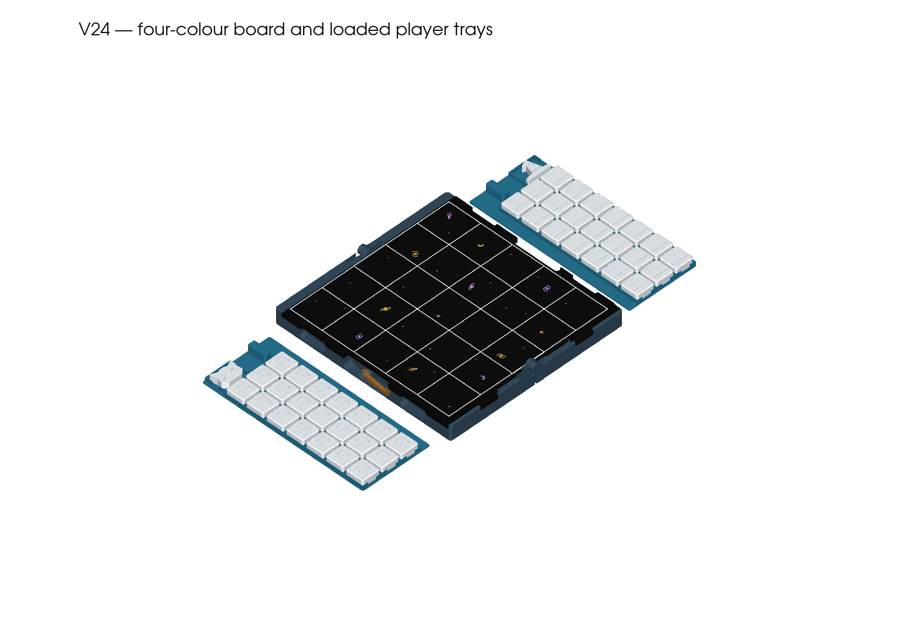

# V24 — OPEN THE FULL PRINT HERE

**The full-size inlaid board pair is file 02 in FULL-PRINT.** It contains both playing-board halves in black, white and two separate silk accent colours.

## Already have a V24 case?

Print **only file 02** for this colour upgrade. Keep your V24 bases, player trays, hook, collar and pieces.

## Printing the complete V24 case

Open these **sliced 3MF projects** in ElegooSlicer, in this order:

1. [FULL paired bases](FULL-PRINT/01-FULL-paired-bases-CC2-PLA.3mf) — both bases and their captive hinges.
2. [FULL-SIZE FOUR-COLOUR inlaid boards](FULL-PRINT/02-FULL-SIZE-FOUR-COLOUR-inlaid-boards-CC2-PLA.3mf) — **both full playing-board halves**, not the small colour trial.
3. [FULL removable player trays](FULL-PRINT/03-FULL-removable-player-trays-CC2-PLA.3mf) — one loaded tray per player.
4. [FULL flat capstones, hook and collar](FULL-PRINT/04-FULL-flat-capstones-hook-and-collar-CC2-PLA.3mf).

These four files build the case and flat capstones. Use your existing **42 original flats**. The hook also uses an **8.6 mm length of 1.75 mm PLA filament**; the main hinges print captive.

## Four colours — set these before printing file 02

| Project slot | Load or select |
| --- | --- |
| **1** | **Black PLA** — board surface |
| **2** | **White PLA** — grid and stars |
| **3** | **Your first silk PLA accent** |
| **4** | **Your second silk PLA accent** |

**Choose your actual silk profiles, map all four materials to the loaded printer slots, then reslice.** Gold and purple are preview examples. The supplied silk profiles are generic PLA placeholders, not qualified settings for your spools. Keep each board's parts grouped; open the file as a project.

The full board pair estimates at **8 h 8 min / 121 g** with placeholders. The complete case estimates at **17 h 1 min / 327 g**, excluding the 42 flats. Actual profiles change those estimates.

## Small trials — separate from the full build

All three are together in **SMALL-TRIALS**:

1. [SMALL hinge/support trial](SMALL-TRIALS/01-SMALL-hinge-support-trial-CC2-PLA.3mf).
2. [SMALL removable-tray access trial](SMALL-TRIALS/02-SMALL-removable-tray-access-trial-CC2-PLA.3mf).
3. [SMALL FOUR-COLOUR inlay trial](SMALL-TRIALS/03-SMALL-FOUR-COLOUR-inlay-trial-CC2-PLA.3mf) — about **1 h 12 min / 19 g** with placeholders. Select actual silk profiles and reslice; check bonding, colour bleed and flushness.

## Assembly and reference

[Assembly and compatibility](REFERENCE/ENGINEERING-GUIDE.md) · [Physical checks still to do](REFERENCE/ACCEPTANCE.md).

V24 retains the 180 mm, 5×5 playing field, reinforced hinges, removable loaded trays and 102.5 × 200 × 35 mm closed case. Original V23 parts have different compatibility requirements; read the assembly guide before mixing versions. Digital checks have passed; physical fit and silk bonding remain untested.

**FULL-PRINT is the folder to use for the full build.** REFERENCE holds CAD, source, profiles, evidence and engineering exports. Older extracted kits are retained under REFERENCE/HISTORY in the working folder; they are not included in this new ZIP.

