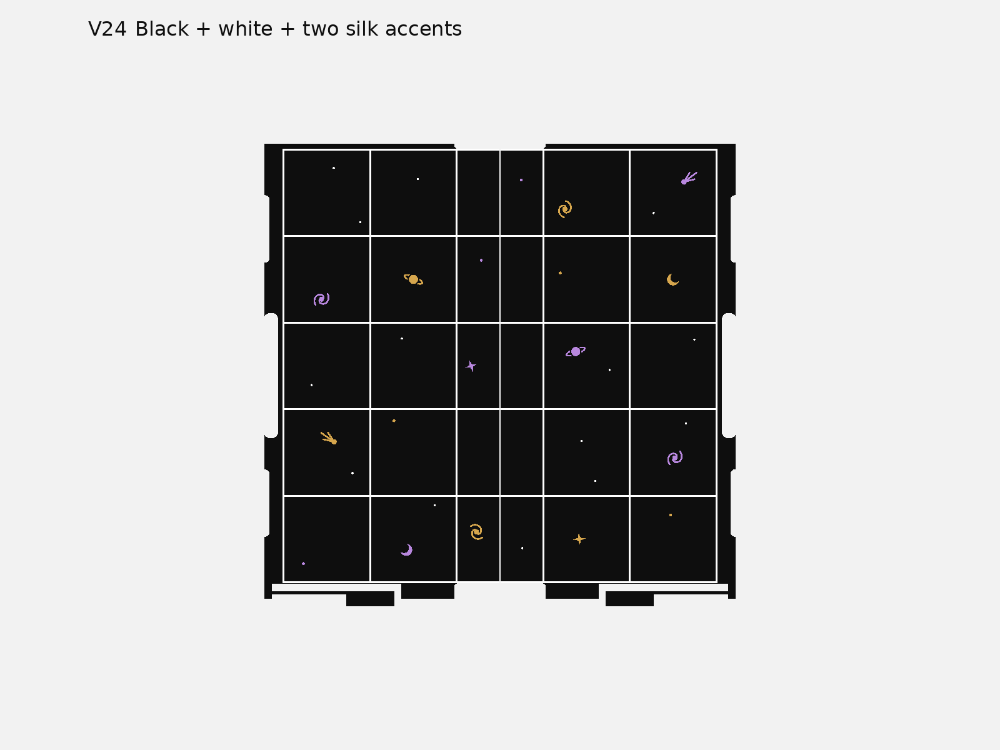

# V24 four-colour playing boards

These are V24-compatible multipart boards: **black surface, white grid/stars and two independent silk accent groups**. The 0.6 mm inlays finish flush at Z16.5. V24's wider corner reliefs, 4.7 mm board thickness, sliding catches and recessed grips are retained. The full 180 mm, 5×5 field has 36 mm cells.

Use the [default board project](../PRINT/02-sliding-board-tops-CC2-PLA.3mf) and [small colour trial](../INLAY-FIT/four-colour-inlay-trial-CC2-PLA.3mf). Open as a project, preserving each board's grouped parts; do not merge them into a single-material object.

| Project slot | Material | Geometry |
| --- | --- | --- |
| 1 | Black PLA | Board body and playing surface |
| 2 | White PLA | Grid and stars |
| 3 | Silk accent 1; gold in previews | First celestial group, retained internal role `orange` |
| 4 | Silk accent 2; purple in previews | Second celestial group, internal role `purple` |

**Slots 3 and 4 use generic PLA placeholders, not selected silk spool profiles. Choose both actual silk profiles, map all four materials to the loaded printer slots and reslice before printing.** Preview colours are examples; geometry and slot assignments are independent of spool colour. The checked process uses 0.10 mm layers, a 0.20 mm first layer, six inlay layers, four walls, 20% gyroid and a prime tower. The two silk placeholders limit volumetric speed to 6 mm³/s; this is not filament qualification.

[Actual sliced colour paths](previews/05-sliced-colour-layer.png) show white and both accents depositing on the boards, excluding the prime tower. The board pair estimates at 8 h 7 min 55 s / 121.16 g; the trial at 1 h 12 min 28 s / 19.45 g, including slicer purge estimates. Actual profiles will change these values.

The trial is a 90.2 × 36.8 × 1.8 mm crop of the actual surface with grid, stars, moon and spiral. Check flushness, colour bleed, fine-feature continuity and bonding before the full board print. It does not test full-board warping or catch fit.

The accepted celestial artwork is vendored from the retained V16 CAD. V23's four-colour split is adapted to the actual V24 mechanical board, not transplanted from old V23 solids. Individual STEP/STL parts are in `models`; registered geometry 3MFs in `plates`; verified dry-sliced projects in `PRINT`. Parent `models/board-left.step` and `board-right.step` remain monolithic mechanical references, not active colour print files.

See [build provenance](../BUILD-PROVENANCE.md) for reproduction and evidence. Physical fit, silk bonding and colour purity remain unobserved.
