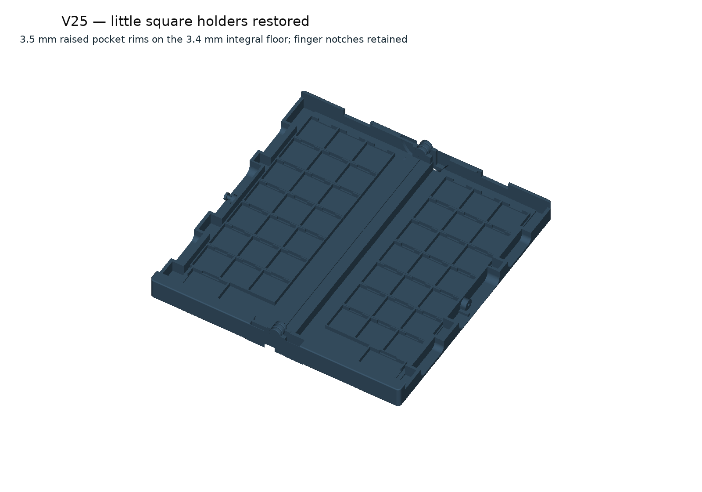

# V25 — square holders restored

Each half has **21 square stone pockets and one capstone pocket**, fixed to a **3.4 mm integral floor**. Pocket rims rise 3.5 mm above the floor and retain the original finger notches. There is no separate tray to remove.

## Captive hinge

**Fixed outer knuckle — moving centre knuckle — fixed outer knuckle.**

A **4 mm printed central post** joins both stationary outer knuckles. The moving knuckle surrounds the post and is captured between the fixed ends. This arrangement appears at both ends of the case. Nominal radial and axial running gaps are 0.4 mm; full-height roots are 8 mm wide. Both case halves print together as **one assembly**. Keep the components together in the slicer.

[Hinge detail](previews/05-PIP-hinge.png) · [Actual sliced gaps](previews/06-PIP-sliced-gaps.png)

## First print: hinge strip

Open [the full-length hinge trial](PRINT/02-V25-PIP-hinge-trial-CC2-PLA.3mf). Estimated 3 h 9 min / 47.12 g PLA. It retains both complete captive stations and the production floor/spine along the full 200 mm length. Let it cool, remove accessible external support and gently free the centre knuckles. Reject fused bearings or cracks. Check rocking, both axial pull directions and twisting; repeat at 20 and 100 cycles, then after an overnight rest. Physical release and strength have not been established.

## Replacement bodies

After a successful hinge trial, open [the complete body assembly](PRINT/01-V25-PIP-square-pockets-CC2-PLA.3mf). Estimated 9 h 22 min / 162.91 g PLA. Replace both halves as a pair. This project contains the bodies and square holders; use the current V24 sliding covers and hook as physical-fit candidates. Covers, pieces and hook are not printed on this plate. The outside size remains **102.5 × 200 × 35 mm**.

Use the **42 original Cat/Witch 20 × 20 × 8 mm flats and two supplied 8 mm flat capstones**, one piece per pocket. Slide off the covers on the table; lift pieces using the notches or tip them out. Repopulate the pockets before closing. Weighted and sculpted pieces have not been checked.

The broad lip, cover catch and remembered rounded-cover underside remain pending integration. Earlier V25 kits and V24 are preserved. Match the slicer settings to the actual PLA spool; profile changes require reslicing. No printer job has been started. [Engineering record](ENGINEERING.md).
